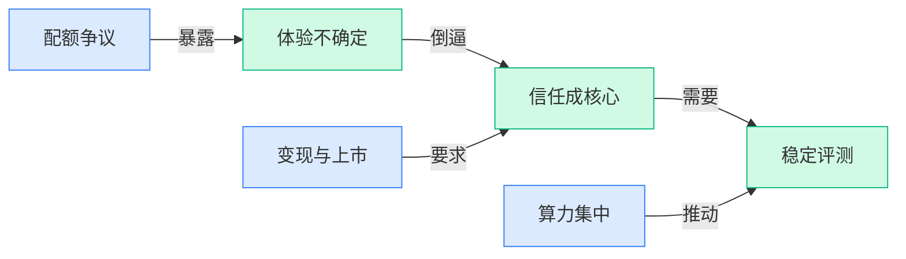

> AI 早报 · 每日早读 · 全网深度聚合

## **今日摘要**

```
OpenAI 员工回应 ChatGPT Pro 限制，Claude Code Pro Max 5倍配额1.5小时见底，AI订阅天花板被捅破
CoreWeave 靠 Meta 与 Anthropic 大单坐上 AI 房东，微软已把 AI 变成真金白银收入，算力印钞机加速成形
OpenAI 开源 codex-plugin-cc 让 Claude Code 也能调 Codex，OmniVoice 一口气开源支持600多种语言语音克隆
```

### 🔵 产品与功能更新

1. **OpenAI 员工回应新版 ChatGPT Pro 套餐的使用限制。**
OpenAI 近期对 **ChatGPT Pro** 套餐的用量规则引发了不少讨论，一名员工出面尝试解释这些**使用限制**到底怎么理解 💬。这类说明的核心，是帮助用户分清不同套餐下可用功能与调用边界，避免“明明付费了却不知道能用到哪”的困惑。对日常高频使用者来说，**配额**和**限制条件**往往比价格本身更影响体验，所以这次回应格外受关注。想看原始报道，可参考 [完整报道(briefing)](https://the-decoder.com/openai-employee-tries-to-explain-usage-limits-of-the-new-chatgpt-pro-plans/)

### 🟢 前沿研究

1. **树状稀疏前馈层瞄准 Transformer 算力瓶颈。**
这篇研究聚焦 **Transformer** 里非常耗算力的 **前馈 MLP 层**（每层里负责非线性变换的计算模块），尝试用**树结构稀疏层**来替代传统稠密计算，从而在常见上下文长度下减少开销 💡。作者强调，前馈块在典型使用场景里占据了相当大的计算预算，因此“怎么把这部分做稀疏”是很现实的问题。对关注模型效率的人来说，这属于直指核心成本项的路线，而不是只在边角处做小优化。[arXiv 论文(briefing)](https://arxiv.org/abs/2604.08565)

2. **Robust Reasoning Benchmark 拿“格式扰动”拷问大模型推理稳健性。**
论文指出，**大语言模型**在标准数学基准上分数虽高，但其推理过程可能对常见文本格式“过拟合”了 😮。为此作者提出 **Robust Reasoning Benchmark**，专门测试模型在措辞、格式等发生变化时，推理能力是否依然稳定。它想回答的不是“模型会不会做题”，而是“题目稍微换个写法后还能不能稳稳做对” 🚀。[基准测试论文(briefing)](https://arxiv.org/abs/2604.08571)

3. **RLHF 中的分布鲁棒 Token 优化，瞄准提示微小变化导致的翻车。**
这项工作关注 **RLHF**（基于人类反馈的强化学习）后的模型为什么会对细微的措辞、格式甚至语言变化变得敏感。论文指出，模型通常更擅长应对与训练和微调数据分布一致的提示，一旦分布轻微偏移，就可能出现出人意料的失误。作者提出 **Distributionally Robust Token Optimization**，核心就是让模型在**分布变化**（输入风格和形式变化）下也更稳，而不是只对“熟悉题型”表现好 ✅。[arXiv 研究论文(briefing)](https://arxiv.org/abs/2604.08577)

4. **CSAttention 用“质心打分”加速长上下文大模型推理。**
随着长上下文场景越来越多，论文认为可复用的长 **prefill prompt**（预填充提示词）会让 **注意力机制** 和 **KV-cache**（模型为加速生成而缓存的键值状态）成为解码阶段的主要瓶颈。作者提出 **CSAttention**，即 **Centroid-Scoring Attention**，试图在不直接沿用传统稀疏注意力思路的前提下，提高推理效率 ⚡。这项工作特别贴近 Agent 和专业问答等实际场景，因为这些应用往往最依赖长提示和重复上下文。[方法论文详情(briefing)](https://arxiv.org/abs/2604.08584)

5. **AlphaLab 想把“做实验”这件事交给多 Agent 研究系统。**
**AlphaLab** 被定义为一个自主研究框架，利用前沿 **LLM Agent**（能分步骤执行任务的大模型代理）能力，自动完成定量、计算密集型领域里的完整实验循环。按摘要描述，它只需接收高层目标，就尝试推进从实验设计到执行的一整套研究流程 🤖。这类工作值得关注的点在于，它不只是让模型“回答问题”，而是进一步把模型推向“真正参与研究工作”的位置。[AlphaLab 论文(briefing)](https://arxiv.org/abs/2604.08590)

6. **LMGenDrive 试图把多模态理解和生成式世界模型接到端到端自动驾驶上。**
这篇论文关注自动驾驶在**长尾场景**（少见但危险、难覆盖的情况）和**开放世界场景**中的泛化难题。作者提出 **LMGenDrive**，目标是打通 **多模态理解**（同时处理图像、文本等信息）与**生成式世界模型**（能预测或构建环境变化的模型），用于端到端驾驶 🚗。从方向上看，它试图让系统不仅“看懂当前路况”，还更好地建模和推演外部世界，从而应对更复杂环境。[自动驾驶论文(briefing)](https://arxiv.org/abs/2604.08719)

7. **医疗推理综述加 MR-Bench，提醒“考试高分”不等于临床可靠。**
这篇综述指出，**大语言模型**在医疗考试式任务上表现不错，因此越来越多人开始讨论其真实临床落地价值；但论文同时强调，**临床决策**并不等同于答考试题 🩺。作者给出了关于医疗推理的系统梳理，并提出 **MR-Bench** 作为相关评测基准，帮助更具体地衡量模型在医疗推理上的能力与局限。对非技术读者来说，这篇文章的重要提醒很直接：医疗场景看重的不只是答对，更是推理过程是否可靠。[综述与基准论文(briefing)](https://arxiv.org/abs/2604.08559)

8. **大规模通用缺陷生成，想用基础模型和数据集补上工业视觉短板。**
论文指出，现有**缺陷/异常生成**方法常依赖 **few-shot learning**（少样本学习），但由于缺少大规模成对的缺陷编辑数据，模型很容易对特定缺陷类别过拟合。为解决这个问题，作者把重点放在 **基础模型** 与 **大规模数据集** 上，希望推动更通用的缺陷生成能力 🏭。这对工业质检、异常检测等方向尤其关键，因为真实世界里的瑕疵类型往往复杂又分散，不可能靠少量样本全覆盖。[缺陷生成论文(briefing)](https://arxiv.org/abs/2604.08915)

### 🟡 行业展望与社会影响

1. **CoreWeave 靠 Meta 和 Anthropic 大单，坐上 AI“房东”位置。**
这条消息的核心不是新模型，而是 **AI 基础设施** 正在变成一门更清晰的生意：谁握有算力和数据中心，谁就更像行业里的“收租人” 🏢。Forbes 用 Meta 和 Anthropic 的合作来说明，CoreWeave 正通过大客户订单强化自己在 **GPU 租赁**（把高性能 AI 芯片按需提供给别人使用）上的角色。对行业来说，这也提醒大家，AI 竞争不只看谁会做模型，还要看谁能稳定提供底层资源。[Forbes 报道原文(briefing)](https://news.google.com/rss/articles/CBMitAFBVV95cUxQdDBkT0J3eDBWR3dfdjFBVW1waUYyTnRnbjF2TERxOW4zZTMxNjMzT2pseXVHZjZyM0UwcTNscVFxUU5qUHlsaHVZeFN3OU4ta2xNbGdXcFpZX054NWxFdWNJaW8wRFB6dzBCX0ktbmF1TEM1MjNYVDdYUjV6YjZIdWhsaFhXRW1udTRjYlRmcC1qVk5INnpTVVhyTW1Zd1pOaFhYNHZWaTA1Qjd2cHlwQUhNWnE?oc=5)

2. **英伟达与 Cadence 加深合作，AI 芯片设计链条继续抱团。**
Yahoo Finance 关注的是 **英伟达** 和 **Cadence**（电子设计自动化软件公司，帮助芯片设计与验证）之间更紧密的协同关系 🤝。这说明 AI 热潮已经不只是拼成品芯片，也在带动上游的 **芯片设计工具** 和研发流程一起升温。投资者之所以盯着这类合作看，本质上是在判断：AI 红利会不会从芯片本身，进一步扩散到设计软件和整条供应链。 [Yahoo 财经报道(briefing)](https://news.google.com/rss/articles/CBMimgFBVV95cUxNUnU4QnhGdGhTRnVUVndkTHZMdUZ3SUszdGxMMzNFcUw2Ykc2YVNIQjBxTVpsTTltNmFaVlZrZ2x3NllGQUphTDZ2OUNDaG1TWkw2Z2lGR1lOYVhvLTF4RVFvZWVHQ3hWUkxSMk8tQlJQVW5CQ0xWRHhmYTlnM3NFUEdwcWFRVk4wQWVWZkpldW5PWWphZUU0V1Nn?oc=5)

3. **Palantir CEO 直言：AI“将摧毁”文科类岗位。**
Fortune 报道里，Palantir CEO 对 **文科相关工作** 的前景给出了非常尖锐的判断，直接把 AI 对就业的冲击摆上台面 ⚠️。这种说法未必是行业共识，但它反映出一个越来越难回避的问题：当生成式 AI（能自动生成文本、图片等内容的 AI）更擅长处理写作、总结、沟通类任务时，部分岗位的价值结构可能会被重写。对企业管理者来说，这类表态的意义不在于“是否绝对正确”，而在于它加速了大家对 **岗位替代** 与 **技能重塑** 的讨论。[Fortune 完整报道(briefing)](https://news.google.com/rss/articles/CBMilAFBVV95cUxPYUpnTUFwQWpmQURZdzYxblotNzJjMFZROU1TQ2hZdXp5bkFNdGdnYUh6TWk3M2FETUJmQVRWRG91MU9hRHpUNnJVYllybGt3NkZQWFExdjJZR0FlUC1fX0FjdVVXR1FQTXR2azNfY2NUcjR6WHVtNjM2eU5JUTVqWG44M2FQbkFOdUh0eEo3T0pIZ25h?oc=5)

4. **微软已经在把 AI 变成真金白银的收入。**
这篇 Yahoo Finance 报道的重点很直接：市场不再只问“AI 强不强”，而是开始追问 **AI 什么时候赚钱、靠什么赚钱** 💰。微软之所以被拿来分析，是因为它正被视作少数能把 AI 能力嵌进现有商业体系里的大厂之一，也就是把技术热度转成现实营收。对行业观察者来说，这是一种风向变化：AI 叙事正从“未来潜力”逐步转向 **商业兑现**。[微软 AI 变现报道(briefing)](https://news.google.com/rss/articles/CBMinwFBVV95cUxQSDRSdXVnTmVJV0dRVjY5OXNiMTNuUmpxWHI2WmFxSWl4dmpFWHhwXzZ0elpWU3pEUlZaenVxVXNJclBLWWtqRlU2RVlZNWxoVFBUQ1VkbkZKTW5SUEpXLUphWmxqUWlOTlNSV3A1V0Zrb0tmQ3ZtNjhmRlhaZkRTVUxDVFhWbkppcjdXbFMzYUFRdXcwWmtQdVk2d0FvOUk?oc=5)

5. **中国 AI 创企 StepFun 拟拆除离岸架构，为 IPO 铺路。**
路透社援引消息称，**阶跃星辰 StepFun** 正考虑调整 **离岸架构**（公司注册和持股安排放在境外的结构），为后续 **IPO**（首次公开募股）做准备 📈。这类动作通常不只是财务安排，也往往意味着公司发展重心开始从“技术冲刺”转向“资本市场可进入性”和治理结构规范化。放在更大背景里看，AI 创业公司正在进入一个新阶段：不仅要讲模型和产品，也要开始回答 **怎么融资、怎么上市** 的现实问题。[路透社独家消息(briefing)](https://news.google.com/rss/articles/CBMiwwFBVV95cUxPdldCcU9ZUl9aZmplZ29ZRnU4NXJFWm9wVWZwcEpVNnJUNVZkOFNwNk5pTmU2UU5Sb2p3ZWFtdC1HT3ZDRENfbjVaa0ZrVVZkY3ZWWjdCNmFuT3dvR05aZ0thN0tDZW8zWm1Ca3A3LWVNbTRPemxHVzZxYzhpTDNjNHItS3hBanppME1FbF9XQUpCVkxSdTR2RUFOUmo1UUtKd000cXpVUUxoOUltTG9uNDFiSG9GcnhmRFFiQWtXWHZMR2s?oc=5)

6. **研究者给“世界模型”下定义：文生视频并不算。**
The Decoder 报道称，研究人员试图更明确地区分什么才算 **世界模型**（能在内部表示和预测环境变化的模型），并指出 **文生视频模型** 不能直接归入这一类 🧠。这件事的重要性在于，它给当前热闹的 AI 概念做了一次“术语纠偏”：会生成逼真视频，不等于真的理解世界如何运转。对外行读者也很好理解——看起来像“会想象”，不一定代表它具备可用于规划和推演的 **内部世界表征**（模型内部对现实结构的抽象表示）。[研究解读原文(briefing)](https://the-decoder.com/researchers-define-what-counts-as-a-world-model-and-text-to-video-generators-do-not/)

7. **Sam Altman 回应《纽约客》争议报道，并提到住所遭袭事件。**
TechCrunch 报道称，OpenAI CEO **Sam Altman** 通过最新博客回应了一篇被他称为带有煽动性的《纽约客》文章，同时也回应了其住所疑似遭到袭击一事。这里折射出的不只是个人公关风波，而是 AI 头部人物正在承受越来越高的 **舆论压力** 与公众情绪投射 🌪️。当 AI 公司影响力急速扩大，围绕创始人 **可信度**、权力和个人安全的讨论，也在成为行业社会影响的一部分。[TechCrunch 报道(briefing)](https://techcrunch.com/2026/04/11/sam-altman-responds-to-incendiary-new-yorker-article-after-attack-on-his-home/)

### 🟣 开源TOP项目

1. **OmniVoice：支持 600 多种语言的高质量语音克隆 TTS 开源了。**
这个项目主打**语音克隆**和 **TTS**（文本转语音），并且覆盖 **600+ 语言**，对多语种语音合成场景很有吸引力 🎙️。从仓库描述看，它聚焦在**高质量语音生成**，适合关注跨语言配音、语音助手和内容本地化的团队留意。对于开源社区来说，这类同时兼顾**多语言**与**声音复刻**能力的项目，本身就很有讨论度。[GitHub 仓库(briefing)](https://github.com/k2-fsa/OmniVoice)

2. **caveman：用“原始人说话法”帮 Claude Code 省下 75% Token。**
这个项目的思路很直接：把提示词写得更短、更“原始人风格”，来减少 **Token**（模型处理文本时的最小计量单位）消耗 🪨。仓库给出的核心卖点是，在 Claude Code 场景里可将 token 使用量**降低 75%**，非常适合精打细算控制调用成本的开发者。它不是在改模型本身，而是在优化人与模型的沟通方式，属于很实用的“轻量技巧型”开源项目 💡。[项目仓库说明(briefing)](https://github.com/JuliusBrussee/caveman)

3. **OpenAI 开源 codex-plugin-cc，让 Claude Code 也能调用 Codex。**
这个插件项目的定位很清晰：可以在 **Claude Code** 中调用 **Codex**，用于**代码审查**或**任务委派** 🤝。也就是说，开发者能把部分编程工作交给另一个代码模型处理，形成更灵活的协作流。对正在尝试多模型协同开发的团队来说，这类插件的价值在于把工具链真正串起来，而不是各用各的。[GitHub 插件仓库(briefing)](https://github.com/openai/codex-plugin-cc)

4. **JoyAI-Image：京东开源统一多模态图像基础模型。**
**JoyAI-Image** 覆盖了**图像理解**、**文生图**和**指令编辑图像**三类能力，相当于把多种视觉任务整合到一个统一模型里 🖼️。从仓库摘要看，它强调的是**统一多模态基础模型**，适合关注视觉 AI 底座能力的团队参考。对于企业来说，这种“一套模型做多件事”的路线，往往比拆成多个单点模型更方便落地。[官方仓库页面(briefing)](https://github.com/jd-opensource/JoyAI-Image)

5. **AirLLM：单张 4GB 显卡也能跑 70B 大模型推理。**
这个项目最抓眼球的点就是资源门槛够低：**70B**（700 亿参数）模型推理，号称只需**单张 4GB GPU**（显卡）🚀。如果这一能力符合你的使用场景，那意味着本地运行超大模型的硬件压力有机会进一步下降。对开发者和中小团队来说，这类项目的意义在于把“大模型推理”从高配机器往更普及的设备上推进了一步。[GitHub 仓库(briefing)](https://github.com/lyogavin/airllm)

6. **Claude Code 用户反馈：Pro Max 5 倍配额在 1.5 小时内就被用完。**
这条不是新模型，而是一则在 GitHub 上引发关注的**使用反馈**：有用户表示即便只是**中等强度使用**，**Pro Max 5x quota**（5 倍配额）也在 **1.5 小时**内耗尽 😮。它反映出开发者对 Claude Code **配额消耗**和**计费体验**的敏感度，也说明实际使用中的资源管理仍是热点问题。对于经常高频调用 AI 编程工具的团队，这类反馈很值得持续观察。[GitHub 问题页(briefing)](https://github.com/anthropics/claude-code/issues/45756)

### 🔴 社媒分享

1. **Google TurboQuant 会削弱 AI 对内存芯片的需求吗？**
这则讨论聚焦 **KV Cache 压缩**（大模型生成时保存上下文的缓存）是否会改变硬件需求格局 🤔。帖中提到，Google 的 **TurboQuant** 据称可把 KV Cache 压缩到最高 **6 倍**，同时“几乎不明显影响准确率”，并通过运行时重建来换取更低内存占用。讨论核心不是官宣结论，而是社区在追问：这种压缩幅度是否现实、能否规模化，以及会不会进一步缓解 AI 对 **显存/内存芯片** 的压力。[Reddit 讨论帖(briefing)](https://www.reddit.com/r/MachineLearning/comments/1sj5hsx/d_will_googles_turboquant_algorithm_hurt_ai/)

2. **开发者把 Gemma 4 作为本地模型跑进 Codex CLI。**
这篇分享记录了作者如何将 **Gemma 4** 以**本地模型**形式接入 **Codex CLI**（命令行编程助手）💻。亮点不在“谁家模型更强”，而在于一种更贴近开发者日常的使用方式：把模型放到本地工作流里，直接服务代码任务。对于关心 **本地部署**、**命令行 AI 编程** 和模型可替代性的读者，这类实操经验很有参考价值。[作者实测文章(briefing)](https://blog.danielvaughan.com/i-ran-gemma-4-as-a-local-model-in-codex-cli-7fda754dc0d4)

3. **Gary Marcus 点评 Claude Code 泄露：像“经典符号 AI”而不只是神经网络。**
这条社媒讨论引用了 Gary Marcus 对 **Claude Code 泄露**内容的看法 🧠。他认为，Anthropic 构建的某个 **kernel**（这里可理解为关键控制逻辑）很像 **符号 AI**（基于明确规则与条件分支的人工智能方法），例如包含大量 **IF-THEN 条件判断**、多层嵌套，并运行在确定性系统中。讨论因此转向一个有意思的问题：当代 AI 产品背后，是否仍大量依赖传统规则系统与大模型结合，而不是“全靠端到端神经网络”。[Reddit 讨论串(briefing)](https://www.reddit.com/r/MachineLearning/comments/1sjb0qi/gary_marcus_on_the_claude_code_leak_d/)

4. **有人对比 ICLR 2025 与 2026 评分后，发现审稿一致性可能更低。**
这则帖子围绕 **ICLR**（国际学习表征会议，AI 顶会之一）审稿分数做了横向分析 📊。发帖者提到，参考 paperreview.ai 给出的 2025 年两位人工审稿人的分数相关性约为 **0.41**，而自己在 2026 年项目中观察到的相关性似乎更低，因此进一步计算了两年的指标。它反映出的不是最终定论，而是社区对 **审稿稳定性**、**评分一致性** 是否下滑的担忧与讨论。[分析讨论帖(briefing)](https://www.reddit.com/r/MachineLearning/comments/1sj76a2/just_did_an_analysis_on_iclr_2025_vs_2026_scores/)

5. **从零实现 PyTorch 分布式训练的教育型仓库发布。**
有开发者整理了一套 **PyTorch 分布式训练** 教学仓库，主打“从零实现”而不是只会调用封装接口 🛠️。内容覆盖 **DP**（数据并行）、**FSDP**（全分片数据并行，把模型参数拆分到多卡）、**TP**（张量并行）、**FSDP+TP** 以及 **PP**（流水线并行）等常见方案，适合想真正搞懂大模型训练底层机制的人。对团队来说，这类资源的价值在于把抽象概念拆成可运行代码，学习门槛会低不少。[Reddit 发布帖(briefing)](https://www.reddit.com/r/MachineLearning/comments/1sjglrn/educational_pytorch_repo_for_distributed_training/) [GitHub 仓库(briefing)](https://github.com/shreyansh26/pytorch-distributed-training-from-scratch)

---

### 📊 行业洞察（今日 4 条）

1. OpenAI回应 ChatGPT Pro 限额，Claude Code 也被用户吐槽 5 倍配额 1.5 小时就烧完
  【洞察】AI产品竞争已经不只是“强不强”，而是“付费后到底能稳定用多久”；配额说不清，用户信任就先掉一半

2. 微软被市场视为少数已把 AI 变成真实收入的大厂，StepFun 也开始为 IPO 调整公司架构
  【洞察】行业叙事正从“谁最会讲未来”切到“谁先赚到钱、谁能进资本市场”；不能自证商业化，估值会越来越虚

3. CoreWeave 靠 Meta 和 Anthropic 大单坐上 AI“房东”位，多篇论文也都在想办法省算力省内存
  【洞察】一边是算力资源继续集中到少数大玩家手里，一边是全行业都在拼命降成本；贵和省会同时存在，不矛盾

4. 新基准显示模型换个措辞和格式就可能明显掉分，医疗论文也提醒“考试高分”不等于真实可靠
  【洞察】现在最大的问题不是模型不会答，而是看着会、实际不稳；凡是要交付结果的场景，可靠性比炫技更值钱

### 💭 对我们的启发（今日 3 条）

1. OpenAI 和 Claude Code 的配额争议说明，用户买的不是“模型资格”，而是“稳定完成任务的确定性”；我们产品设计上要把消耗、限额、失败原因讲明白。

2. 多篇研究都在打“换个说法就翻车”这个点，这很贴合我们的方向：平台不能只比谁第一次答得漂亮，更要测谁在不同表达下都稳定完成任务。

3. CoreWeave 吃到大客户算力红利、微软开始兑现收入，提醒我们别把价值建立在“调用模型”本身；更该做选择、调度、评估和信任这一层。

🗺️ 今日关系图




---

> 本周周报：[第16周综合分析](/blog/weekly/2026-w16/)
