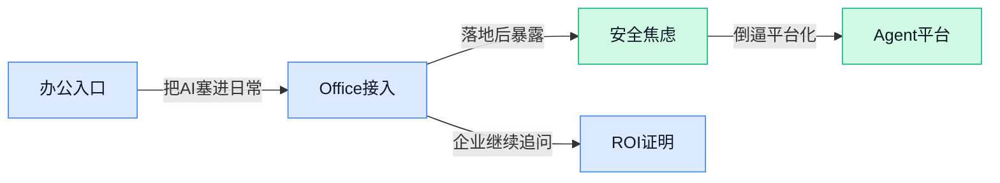

> AI 早报 · 每日早读 · 全网深度聚合

## **今日摘要**

```
Claude 已打通三大 Office 办公应用，Anthropic“Project Glasswing”又引安全圈警觉，助手与风险同步升级
中国 AI 在无人监督下攻克十年数学难题，AI 系统通过同行评审，科研边界被再次推到台前
AirLLM 让单张4GB显卡跑70B大模型，KIV 让 RTX 4070 冲上100万token上下文，推理门槛骤降
```

### 🔵 产品与功能更新

1. **Claude 已打通三大 Office 办公应用。**
Anthropic 把 **Claude** 的能力进一步接入主流 **Office 办公套件**，意味着用户可以在更熟悉的文档、表格和演示场景里直接调用 AI 来处理工作内容 💼。这类更新的重点，不只是“能聊天”，而是让模型更自然地嵌进日常办公流程，减少来回复制粘贴的麻烦。对企业用户来说，**跨应用协作** 往往比单点功能更有价值，因为信息能在不同文件形态之间更顺畅地流动。[完整报道(briefing)](https://the-decoder.com/claude-now-works-across-all-three-major-office-apps/)


2. **“Claude Mythos / Project Glasswing”引发安全圈警觉。**
这篇报道聚焦一个被称为 **AI 超级黑客** 的话题，讨论 **Claude Mythos** 与 **Project Glasswing** 为何让科技行业提高警惕 🔐。从标题和摘要信息看，核心不是新功能发布，而是围绕 **网络安全**（保护系统与数据不被攻击）风险的公共讨论，提醒大家关注 AI 能力增强后可能带来的攻防变化。对普通读者来说，这类内容的意义在于：AI 产品升级不只看效率，也要同步看 **安全边界** 和潜在滥用问题。[报道入口(briefing)](https://news.google.com/rss/articles/CBMivAFBVV95cUxOSFNoWV8yVXdkX0JTMWotbnA0azM1WGlIR0w2N0t6dXNQQW1TNkxxUjBiR1J1dHpaUkd2dk95eXhJNnJVYVozdEJKMk9ydDg2azFpNGJGeGZkZHExTTJOWGhSRGpQREdOWlZnTERwS1BselpOdjBXeGZwMWN4RlhsTFZHTUg0LW1DUFNDVVJVOUE0T2pSZHhjbGI3WGFtNmRIb2JLU1JxU2RKSFNURGxWREQ4WlFzVWhMaFMyTg?oc=5)

### 🟢 前沿研究

1. **Nexus：预训练损失不变，也能换来更好的下游泛化。**
这篇论文盯上了一个很现实的问题：**大语言模型预训练**吃掉了绝大多数算力和数据预算，但“训练损失差不多”并不代表后续任务表现也一样 💡。作者提出 **Nexus**，核心在于寻找**共同极小值**（可理解为多种训练轨迹都能收敛到的“更稳妥解”），试图在不改变预训练损失的前提下提升**下游泛化**能力。对做模型训练的人来说，这意味着不一定非要把预训练目标继续压得更低，优化“落点”本身也可能很关键。[arXiv 论文摘要(briefing)](https://arxiv.org/abs/2604.09258)

2. **Experience Replay 被重新带回 LLM 强化学习训练。**
**Experience Replay**（经验回放，指把历史交互结果存起来反复利用）在传统**强化学习**里很常见，但在 **LLM 后训练**里还少有人系统探索。这篇工作聚焦如何把回放机制用到大模型训练中，以减少每次都重新采样带来的成本 🚀。如果方法成立，价值很直接：同样的训练数据能被更高效复用，可能帮助降低后训练阶段的算力开销。[arXiv 论文摘要(briefing)](https://arxiv.org/abs/2604.08706)

3. **LottaLoRA：随机骨架配上低秩适配，也许就够了。**
这篇论文问了一个很有意思的问题：神经网络里到底有多少参数真正承载了**任务相关信息**？作者提出 **LottaLoRA**，让主干网络权重保持**随机初始化**，只训练 **LoRA**（低秩适配，一种低成本微调方法）适配器，来测试“小改动”究竟能走多远 😮。如果这一思路成立，会进一步强化一个趋势：并不是每次适配任务都要大规模改模型主体，少量可训练参数也可能带来可观效果。[arXiv 论文摘要(briefing)](https://arxiv.org/abs/2604.08749)

4. **U-Cast：用更简单、更省算力的方式做前沿 AI 天气预测。**
论文指出，如今 **AI 天气预报**已经能和传统**物理集成预报**（基于物理方程、多个模型联合预测）竞争，但许多最先进方案依赖专用架构和巨量算力，门槛并不低。**U-Cast**主打“出人意料地简单且高效”，想在保持前沿表现的同时，把实现复杂度和计算成本压下来 ☁️。这类工作很重要，因为天气预测不是只拼极限精度，**可部署性**和**资源效率**同样决定实际价值。[arXiv 论文摘要(briefing)](https://arxiv.org/abs/2604.09041)

5. **更多数据到底值不值？这篇论文用小型解码器重看数据扩展规律。**
大家都知道训练 **Transformer** 往往是“数据越多越强”，但数据和算力的投入并不是无限划算。这项研究在一个**仅含注意力机制的小型解码器**上分析**数据集扩展规律**，试图回答“额外数据带来的收益是否对得起成本” 📉。它的意义在于把常见的大模型扩展定律，拉回到更可控、更易实验的小规模设置里重新审视，有助于理解什么时候该继续堆数据，什么时候该及时止损。[arXiv 论文摘要(briefing)](https://arxiv.org/abs/2604.09389)

6. **$p1$：用更少提示词，做更高效的 Prompt 优化。**
**Prompt Optimization**（提示词优化）是不改模型权重、只通过寻找更好系统提示来提升表现的方法，但它并不是对所有任务都同样有效。论文提出 **$p1$**，目标是用**更少的提示词样本**完成更有效的优化，并进一步分析什么样的任务更适合这种路线 🧠。对企业应用来说，这很实用：如果能减少试错提示的数量，就能更低成本地把现有模型“调顺手”。[arXiv 论文摘要(briefing)](https://arxiv.org/abs/2604.08801)

7. **一步采样的强化学习策略：Truncated Rectified Flow Policy。**
这篇工作瞄准的是 **最大熵强化学习**（鼓励策略保留多样性的一类强化学习框架）里常见的**高斯策略**限制：它天然更像单峰分布，不利于表达复杂决策。作者提出 **Truncated Rectified Flow Policy**，希望通过**一步采样**实现更灵活的策略表示，同时保持采样效率 ⚙️。简单说，就是想让强化学习策略既“想法更多”，又别因为生成过程太复杂而拖慢训练和推理。[arXiv 论文摘要(briefing)](https://arxiv.org/abs/2604.09159)

8. **MoE Transformer 的泛化与扩展规律，被单独拆开讲清楚了。**
**MoE**（Mixture-of-Experts，混合专家）Transformer 的关键特点，是每次输入只激活部分“专家”模块，因此它的容量和效率很难用传统模型直觉直接判断。这篇论文尝试建立一套关于 **泛化** 与 **扩展规律** 的理论，把每个输入真正用到的**有效容量**，和路由机制带来的组合复杂性区分开来 📚。这类研究的价值不在“立刻变成产品功能”，而在于帮助行业更清楚地理解：MoE 为什么能扩展、什么时候扩展是有效的。[arXiv 论文摘要(briefing)](https://arxiv.org/abs/2604.09175)

### 🟡 行业展望与社会影响

1. **贝恩提出 Agentic AI 平台的三层架构。**
贝恩认为，真正落地 **Agentic AI**（具备一定自主执行能力的 AI 代理）不能只看单个模型，而要搭好从能力到底座再到业务应用的分层平台 🧩。这类观点对企业很重要，因为它把“怎么从试点走向规模化”说得更清楚：不是简单接一个大模型就完事，而是要系统设计。对于正在规划 AI 路线图的公司，这篇内容更像是一份框架化参考 💡。[贝恩文章解读(briefing)](https://news.google.com/rss/articles/CBMifkFVX3lxTFBucGQzdjd6V0h0R0ZUcUdNU21GN3RESnFrVzF2MldTUW12Tkw4Tkw3RnhXTW9DSndHanEyZnhmTm1hX2JkYklrZi1oVVc3YWlGVDBGMWNBdHZyRVRqX0dXSTVKNmZ1ZUlHYjFnNExIcnlHckFNdlRId1lRaXJzUQ?oc=5)

2. **AI 检测器正在误伤诚实学生，学校应谨慎使用。**
《华盛顿邮报》这篇评论把焦点放在 **AI 检测器**（判断作业是否由 AI 生成的工具）可能带来的误判风险上 🎓。文章核心观点很明确：当学校把这类工具当成执法依据时，最容易受伤的反而可能是本来就没作弊的学生。对教育行业来说，这不只是技术准不准的问题，更牵涉到 **公平性** 与申诉机制是否健全。[评论原文入口(briefing)](https://news.google.com/rss/articles/CBMifkFVX3lxTFBiREJDWkduNURTOERVY254NENBajliOTd2eHI3SDhYaGNBZVc2RG9pN0hsNzE5Vkw3RVRTU09LQ1lxWDl5bTNyRnFidHctbDJOU2RjZ05EME5rbU1vM29qQkhadjA2S0lncXh6cm8xQnlnZXZxR3V5eENuSk9CQQ?oc=5)

3. **中国 AI 在无人监督下攻克十年数学难题，引发科研边界讨论。**
这则报道的看点在于，AI 被描述为在 **没有人工监督** 的情况下解决了一道存在十年之久的数学问题 🤖。如果属实，这意味着 AI 在科研探索中的角色，可能正从“辅助工具”继续往前走到“独立发现”层面。它带来的不只是技术惊喜，也让外界开始重新思考：未来科研成果该如何验证、归因与使用。[完整报道入口(briefing)](https://news.google.com/rss/articles/CBMigwFBVV95cUxNR25rSjI5UlZvSTNCSmpESkRLaUk0T3N1ZHc0c0dFTUxBaFNFWHBmYjB0Y2M0bzZTQ0UzZVhTWlZWQlM0UTlYSzdTbzNLSXNRblRJOHRodXR6SE5PRVJDVnpQcDZRUExyTEZZdG9paTgxbG56cjZEVk5XQ1BCNHliOEFucw?oc=5)

4. **AI 系统通过同行评审，科学界却还没准备好。**
Forbes 这篇文章讨论的不是 AI 会不会写论文，而是它已经开始触碰 **同行评审**（学术论文发表前的专家审核）这样的核心学术流程 🔬。标题本身就点出张力：系统通过了评审，但科研共同体在规则、伦理与接受度上仍明显滞后。换句话说，技术进展已经跑到前面，制度和共识还在追赶中。[Forbes 文章入口(briefing)](https://news.google.com/rss/articles/CBMiugFBVV95cUxPNHFWNHhialp1Sy1PaHRQcjVXM1VnMlA5NzJFNWdocHlwSHhPcjc3clZBUWpRMjJGQUkwUGIxMlpLaGdaUlhnaFEzVzN4V09NekdSVVZwNWE1TkhVWU1sQkgwc2FiY04tdkQyaXVxbFhpZUxvaVdYM2NUdzRkci1DWHdjajBHTTFSanNlZGt5SWVGYTJ5Vko5a1BuNjQwQ0t4elZhbXdWeG5KN19iTGlQN2ZxRU1CRXEzRFE?oc=5)

5. **Gallup：AI 采用率上升，正推动劳动力市场变化。**
Gallup 的观察把视角拉回职场现实：随着 **AI 采用** 持续提升，企业里的岗位分工、工作方式和员工体验都在发生变化 📈。这类变化未必都是“替代”，也可能体现为任务重组、技能要求改变，以及不同岗位受影响程度分化。对管理层来说，重点已经不只是要不要上 AI，而是怎么处理随之而来的 **组织变革**。[Gallup 调查文章(briefing)](https://news.google.com/rss/articles/CBMijAFBVV95cUxNaHAxY0ZZN0dqOHVDOThtTklmdjB0bkg0TTZJUUVPaU5OOW1FLVp1bWEwRjJrOEhsTDJPeWozbUlHZkpjQmlGSTVkaDRBRkk1d0tndWxZUWVsU1dBbGE2N3h5Yjd4dmIxQ09Ra0U3UFJRVl91b09rQXZwNW1WRUlLMXlncHNGZWUyRk8yeA?oc=5)

6. **PwC 试图回答：企业到底该如何衡量 AI 的 ROI。**
很多公司都在上 AI，但真正难的是解释 **ROI**（投资回报率）到底从哪里来、怎么量化 💰。PwC 这篇内容聚焦的正是这个管理层最关心的问题：不是停留在“AI 很重要”，而是进一步拆解其业务收益应如何被识别与评估。对于还在试点期的企业，这类讨论能帮助团队从技术热情转向更务实的价值判断。[PwC 观点原文(briefing)](https://news.google.com/rss/articles/CBMicEFVX3lxTFBSSXJwUFBKOEVZcndadWEzVVNHc1BJZmItUEdkMTdNakRiZzc3WXJPeDQtSUtURmhPZGYxdjNSeUhtWUZsY0p4cm9DZUctYjNfXzBnenc1QXgxQk94SmV5X2tZVXVRWWx6Mzg0alNYWHk?oc=5)

### 🟣 开源TOP项目

1. **AirLLM：单张 4GB 显卡也能跑 70B 大模型推理。**
这个项目主打一个**低显存推理**，目标是让 **70B（700亿参数）大语言模型** 在仅有 **4GB GPU 显存** 的设备上也能运行，门槛一下就降下来了 💡。对于本地部署条件有限、但又想尝试超大模型能力的团队来说，这类方案很有吸引力。项目定位非常明确，就是围绕大模型推理资源占用做优化，适合关注**本地运行**和**成本控制**的人重点看看。[GitHub 项目页(briefing)](https://github.com/lyogavin/airllm)


2. **ppt-master：把任意文档生成可编辑的精美 PPTX。**
**ppt-master** 想解决的是“内容有了，但 PPT 不会做”的老问题 🚀。它支持从**任意文档**生成**可编辑**、且设计感较强的 **PPTX 演示文稿格式文件**，强调不需要设计技能也能快速出稿。仓库里还给出了 **15 个示例、229 页内容**，说明项目更偏向实际可用，而不只是概念演示。对需要高频做汇报材料的人来说，这类开源工具很接地气。[项目仓库说明(briefing)](https://github.com/hugohe3/ppt-master)


3. **Goose：不只会提建议，还能安装、执行、修改和测试的开源 Agent。**
Block 开源的 **Goose** 把 AI 从“只会给代码建议”往前推了一步，它支持在接入**任意 LLM（大语言模型）**后，进一步完成**安装、执行、编辑、测试**等动作 🤖。这意味着它更像一个可扩展的**智能代理（Agent，能自主分步完成任务的系统）**，而不只是聊天助手。项目亮点在于“**开源**”和“**可扩展**”，适合想把 AI 真正接入开发流程的团队关注。[官方仓库页(briefing)](https://github.com/block/goose)


4. **Hermes Agent Self Evolution：让 Agent 自我进化优化技能、提示词和代码。**
这个项目聚焦 **Agent 自我改进**，核心思路是通过**进化式优化**，持续调整 Hermes Agent 的**技能、提示词和代码** ✨。仓库说明里明确提到使用 **DSPy** 和 **GEPA**，前者可理解为帮助系统化编排与优化提示/程序的方法，后者则是相关的优化机制。对做 Agent 的团队来说，这类“让系统自己迭代自己”的方向很值得看，因为它瞄准的是长期性能提升，而不是一次性调参。[GitHub 仓库(briefing)](https://github.com/NousResearch/hermes-agent-self-evolution)

5. **OpenMontage：把 AI 编码助手变成完整视频制作工作室。**
**OpenMontage** 自称是全球首个开源的**Agentic（代理式）视频制作系统**，目标非常直接：把 AI 助手从“会写代码”扩展到“能做整套视频生产” 🎬。项目列出了 **11 条流水线、49 个工具、400 多项 Agent 技能**，覆盖面相当大，说明它强调的是完整生产链路而不是单点功能。对于想探索 AI 内容生产、自动化剪辑或多步骤媒体工作流的人来说，这个项目的想象空间不小。[开源项目主页(briefing)](https://github.com/calesthio/OpenMontage)

6. **TradingAgents：面向金融交易的多 Agent 大模型框架。**
**TradingAgents** 是一个聚焦**金融交易**场景的 **多 Agent（多个智能代理协同）LLM 框架** 📈。从仓库摘要来看，它的核心定位不是通用聊天，而是把多代理协作机制用于交易相关任务。对于关注量化研究、金融分析或智能决策流程的人来说，这类框架提供了一个比较清晰的开源起点。不过从当前给出的信息看，项目摘要主要强调的是框架定位，具体能力还需结合仓库内容进一步判断。[项目仓库页(briefing)](https://github.com/TauricResearch/TradingAgents)

### 🔴 社媒分享

1. **KIV 让 RTX 4070 也能跑出 100 万 token 上下文。**
这条 Reddit 分享介绍了 **KIV**（一种替换传统 **KV cache**，即模型生成时用于记忆上下文的缓存机制的中间层），号称在 **12GB 显存** 的 RTX 4070 上，不重训模型就能把上下文窗口拉到 **100 万 token** 🚀。它的思路是把常用内容留在显存里，不常用内容放到分层检索系统中，再作为 **HuggingFace** 的缓存替代方案直接接入，适配所有使用 **DynamicCache** 的模型。对本地部署玩家来说，这类“**即插即用**扩上下文”的方案很有吸引力，门槛也比重新训练模型低不少。[Reddit 原帖说明(briefing)](https://www.reddit.com/r/MachineLearning/comments/1sjkmwz/kiv_1m_token_context_window_on_a_rtx_4070_12gb/)

2. **AMD 用 ROCm 一步步挑战 CUDA 生态。**
这篇 EE Times 报道聚焦 **ROCm**（AMD 的开源 GPU 计算软件栈）如何与 **CUDA**（英伟达主导的 GPU 开发平台）正面竞争 💡。标题里的 “One Step After Another” 也很直白：AMD 并不是想一口气颠覆现状，而是在开发工具、兼容性和生态支持上持续推进。对企业和开发者来说，这场竞争的意义在于，**AI 基础设施** 不再只有单一路线，未来在硬件和软件选择上可能会更灵活。[EE Times 报道(briefing)](https://www.eetimes.com/taking-on-cuda-with-rocm-one-step-after-another/)

3. **18 岁开发者把纯脉冲神经网络硬拉到 10.88 亿参数。**
一位独立开发者在 Reddit 分享，自己从零开始把 **SNN**（Spiking Neural Network，脉冲神经网络）扩展到 **10.88 亿参数**，虽然最后因为预算不足中止，但过程中的观察很有研究味道 🧪。他提到，很多论文认为这类模型从随机初始化直接训练到 **10 亿级** 容易失败，尤其会碰到 **梯度消失**（训练时信号越来越弱，模型学不动）问题；而这次实践正是围绕这些难点展开。虽然还不是成熟产品，但这类“用真金白银试出来”的分享，能让社区更具体地看到 **SNN 做语言建模** 到底卡在哪儿。[Reddit 实验分享(briefing)](https://www.reddit.com/r/LocalLLaMA/comments/1sk4ebm/i_scaled_a_pure_spiking_neural_network_snn_to/)

4. **MiniMax-M2.7 的“MIT 风格许可”被质疑误导开源认知。**
这条社区讨论直指 **MiniMax-M2.7** 的许可证命名方式，认为它虽然写成 “**MIT-Style License**”，但实际上包含 **禁止商业使用** 的限制，因此不符合自由软件标准 ⚖️。发帖者引用了 gnu.support 的前序批评，核心观点是：如果存在商业限制，就不应再用容易让人联想到宽松开源协议的表述。对开发者和企业来说，这提醒很现实——看见“像 MIT”并不等于真能放心商用，还是得逐条读清授权边界。[Reddit 讨论原帖(briefing)](https://www.reddit.com/r/LocalLLaMA/comments/1sk4nyx/minimaxm27s_mitstyle_license_is_a_misleading/)

5. **GLM 5.1 在社交推理基准里贴近前沿模型。**
有社区作者表示，在自己搭建的 **社交推理基准** 中，**GLM 5.1** 目前表现得很有竞争力，和一线前沿模型坐上了同一桌 🤝。这个基准不是传统问答，而是让大模型在 **Blood on the Clocktower** 这类复杂社交推理游戏中进行自主对局，更强调策略、博弈与“读心”能力。作者也特别说明，目前还需要更多对局样本才能让结论更稳，但现阶段结果已经足够引发关注。[Reddit 基准测试帖(briefing)](https://www.reddit.com/r/LocalLLaMA/comments/1sjm407/glm_51_sits_alongside_frontier_models_in_my/)

6. **mtmd 已支持 Qwen3 音频：Qwen3-Omni 和 Qwen3-ASR 都能跑。**
这条帖子更新了 **mtmd** 对 **Qwen3 音频能力** 的支持情况，其中 **Qwen3-Omni-MoE**（MoE，混合专家模型）已可用 **视觉+音频输入**，**Qwen3-ASR**（自动语音识别）也已跑通 🎧。发帖者同时给出了对应模型链接，说明相关适配已经进入可实际尝试的阶段。对本地多模态玩家来说，这意味着围绕 **Qwen3** 的音频玩法正在补齐，离“直接上手”又近了一步。[Reddit 适配说明(briefing)](https://www.reddit.com/r/LocalLLaMA/comments/1sjssyx/mtmd_qwen3_audio_support_qwen3omni_and_qwen3asr/) [HuggingFace 模型页(briefing)](https://huggingface.co/ggml-org/Qwen3-Omni-30B-A3B-Thinking-GGUF)

---



### 📊 行业洞察（今日 4 条）

1. Anthropic把Claude补齐到Word、Excel、PowerPoint三大Office应用里
  【洞察】AI竞争正在从“谁更聪明”转向“谁先进入现成工作流”，因为少一次复制粘贴，比多一点模型分数更容易让企业真用起来

2. Claude一边扩大办公接入，一边又因“Claude Mythos / Project Glasswing”引发安全圈警觉
  【洞察】Agent越接近真实工作权限，安全就越不是附属话题；能干活会带来价值，也会放大滥用和误操作风险，这是一体两面

3. 贝恩讲Agent平台三层架构，PwC讲AI投资回报率，Gallup讲AI正在改造岗位分工
  【洞察】企业讨论重点已经不再是“要不要上AI”，而是“怎么规模化、怎么算账、怎么改组织”，行业进入更务实阶段

4. Goose（Block开源的可执行Agent）能安装、执行、修改和测试，Hermes Agent Self Evolution还能让Agent自我进化
  【洞察】开源Agent正在从演示玩具变成可复用底座，但真正稀缺的不是又一个Agent，而是怎么评估、选择和持续优化它们

### 💭 对我们的启发（今日 3 条）

1. Claude接入Office说明用户不会专门为AI换工作习惯，我们的平台入口设计要尽量贴着现有场景，而不是先教育用户学一套新流程。

2. Claude的安全争议提醒我们，Agent调度平台不能只比谁完成率高，还得让用户看见过程、权限和可中断点，不然信任做不起来。

3. 贝恩、PwC都在讲平台化和ROI，说明我们后面若要做成生意，核心不是“聚合很多Agent”，而是证明“为什么这次调度结果更值、更稳”。


---

> 本周周报：[第16周综合分析](/blog/weekly/2026-w16/)
