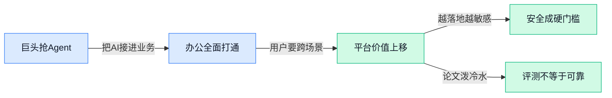

> AI 早报 · 每日早读 · 全网深度聚合

## **今日摘要**

```
OpenAI 联手 Cloudflare 把 GPT-5.4 和 Codex 接入 Agent Cloud，企业级 Agent 入口战骤然升温
Claude 一口气打通 Word、Excel、PowerPoint，Anthropic 再推 Project Glasswing 直插 AI 软件安全
特朗普政府官员据称推动银行测试 Anthropic Mythos，斯坦福《2026 AI Index》同步抛出 12 条观察
```

### 🔵 产品与功能更新

1. **OpenAI 联手 Cloudflare，把 GPT-5.4 和 Codex 接入 Agent Cloud。**
这次更新瞄准的是企业级 **AI Agent**（可自动执行任务的智能代理）工作流：企业可以在 Cloudflare 的 **Agent Cloud** 上更快地构建、部署和扩展面向真实业务场景的智能代理 🚀。官方信息明确提到，**GPT-5.4** 和 **Codex** 已被引入这一平台，重点突出 **速度** 与 **安全性** 两个企业最关心的能力。对想把 AI 从“聊天”推进到“实际干活”的团队来说，这属于很务实的一步 💡。[OpenAI 官方发布页(briefing)](https://openai.com/index/cloudflare-openai-agent-cloud)


2. **微软据称正在开发类似 OpenClaw 的企业 Agent。**
根据报道，微软正在推进一款类似 **OpenClaw** 的新型智能代理产品，不过这次更明显地偏向 **企业客户** 场景。和以“风险较高”著称的开源 OpenClaw 相比，新功能会强调更强的 **安全控制**，这对需要权限管理和合规保障的公司尤其关键 🛡️。现阶段公开信息聚焦在产品方向与安全定位上，核心看点就是微软想把更可控的 Agent 能力带进企业环境。[TechCrunch 报道原文(briefing)](https://techcrunch.com/2026/04/13/microsoft-is-working-on-yet-another-openclaw-like-agent/)


3. **Claude 现已打通三大 Office 应用。**
Anthropic 的 **Claude** 现在可以跨三款主要 **Office 应用** 协同工作，这意味着它在办公场景里的可用范围进一步扩大 📎。从产品意义上看，这不只是“能接一个软件”，而是朝着覆盖完整办公流程又迈进了一步，让用户在常见文档、表格、演示环境中更自然地调用 AI。对企业用户来说，真正有价值的点在于 **跨应用协作**，而不是只在单一窗口里聊天 🤝。[The Decoder 报道(briefing)](https://the-decoder.com/claude-now-works-across-all-three-major-office-apps/)

4. **Anthropic 推出 Project Glasswing，面向 AI 时代的软件安全。**
Anthropic 发布了 **Project Glasswing**，主题直指 **关键软件安全**，强调在 AI 时代如何更好地保护重要软件系统 🔐。从标题和摘要可见，这一项目聚焦的是“为 AI 时代加固关键软件”，重点不是单一模型功能，而是更底层的软件安全问题。对正在大规模引入 AI 的企业来说，这类更新的意义在于：AI 能力越强，基础软件的安全保障就越不能掉链子 ⚙️。[项目相关报道(briefing)](https://news.google.com/rss/articles/CBMiS0FVX3lxTFBfQUdtMDZYaEtZV0JMSk1ZSzdqTl9mV3dQTnZYcVEzaHo4cV8yUEl2a25QMWRXenFTYUQ3NF9WakR5WXVwaDRTZC1ZYw?oc=5)

### 🟢 前沿研究

1. **AlphaLab 用前沿大模型把“做实验”这件事自动化了。**
这篇论文提出 **AlphaLab**，目标是利用前沿 **LLM Agent**（大语言模型智能体）能力，自动完成**定量、计算密集型领域**里的完整实验循环，不再只停留在“写点代码”或“回答问题”层面 🤖。摘要强调，它在只给出高层目标的情况下，就能推进研究流程，核心看点是把**自主研究**从单步辅助扩展到端到端实验执行。对科研自动化来说，这类框架的意义在于：模型不只是“会说”，而是开始参与**优化、试验、迭代**这些更硬核的工作流。可查看 [arXiv 论文摘要(briefing)](https://arxiv.org/abs/2604.08590) 💡

2. **医疗推理综述 + MR-Bench，开始认真拷问大模型能否进临床。**
这项工作一边系统梳理 **大语言模型医疗推理** 研究，一边提出 **MR-Bench** 基准，用来评估模型在更贴近真实临床决策场景中的表现 🩺。论文指出，LLM 在医疗考试题上成绩不错，确实带来了落地期待，但**临床决策**比答题复杂得多，不能简单类比。换句话说，这篇研究的价值不只是“盘点进展”，更是在提醒行业：从考试高分到真实医疗应用，中间还有一大段严肃的评测鸿沟。详见 [医疗推理论文页(briefing)](https://arxiv.org/abs/2604.08559)

3. **VOLTA 发现：为提升校准性加辅助损失，可能没想象中那么有用。**
这篇论文聚焦 **不确定性量化**（让模型知道自己“有多不确定”）和 **校准**（模型置信度是否靠谱）问题，结论颇有点反直觉：常见的**辅助损失**方法，未必能稳定提升深度学习模型的校准效果 📉。摘要提到，在**安全关键场景**里，不确定性评估非常重要，但不同数据模态和任务上，究竟哪种方法最好，目前仍没有共识。VOLTA 的贡献就在于给这类“看起来应该有效”的做法泼了盆冷水，提醒大家重新审视校准方法的真实收益。可参考 [VOLTA 论文摘要(briefing)](https://arxiv.org/abs/2604.08639)

4. **Robust Reasoning Benchmark：大模型数学推理高分，可能只是“格式熟练工”。**
这项研究指出，很多 **LLM** 在标准数学基准上表现亮眼，但其底层推理过程可能对**标准文本格式**过度拟合，一旦换个表达方式，能力就未必稳得住 🧠。为此，作者提出 **Robust Reasoning Benchmark**，就是要测试模型的推理是否真的稳健，而不是只会适应熟悉题型和排版。这个方向很关键，因为它把关注点从“能不能做对”进一步推进到“是不是靠真正理解做对”。更多信息见 [推理鲁棒性论文页(briefing)](https://arxiv.org/abs/2604.08571)

5. **3D-VCD 试图减少 3D 智能体的“幻觉式决策”。**
这篇论文面向 **3D-LLM embodied agents**（在三维环境中行动的多模态智能体），关注它们在推理和执行中容易出现的**幻觉**问题，也就是基于不真实或未被环境支持的信息做决定 ⚠️。作者提出 **Visual Contrastive Decoding**（视觉对比解码）方法，希望降低这类不安全、无依据的输出。随着大模型越来越多地被当作机器人或虚拟代理的“大脑”，这类研究的重要性很高，因为一旦幻觉进入行动环节，后果往往比聊天答错更严重。详情可看 [3D-VCD 论文摘要(briefing)](https://arxiv.org/abs/2604.08645)

6. **PyTorch 编译器里的“静默正确性 Bug”，被这篇论文专门挖出来了。**
这项研究关注 **PyTorch Compiler（torch.compile）** 在性能优化中的一个棘手问题：有些 **correctness bug**（正确性错误）不会直接报错，而是悄悄产出错误结果，因此更难被发现 🛠️。摘要强调，AI 基础设施性能优化对大模型落地很关键，而编译器作为核心加速工具，一旦存在这种“静默”错误，风险就不只是速度问题，还会影响结果可信度。论文的价值在于把一个常被忽视、却非常工程化的底层问题单独拎出来系统分析。可查看 [PyTorch 编译器论文页(briefing)](https://arxiv.org/abs/2604.08720)

7. **单次正常请求也能“拆碎”多智能体系统意图，SIF 攻击值得警惕。**
这篇论文提出 **Semantic Intent Fragmentation（SIF）**，一种针对 **多智能体编排系统**（由多个模型或代理协同完成任务的系统）的攻击方式 😮。它的特别之处在于：攻击者不一定需要明显恶意提示，只靠一个表面合法的请求，就可能诱导编排器把任务拆成多个子任务，最终产生原本不该发生的危险行为。这个发现说明，多智能体系统的风险不只来自单模型越狱，还来自**任务分解与协作链路**本身的脆弱性。详见 [SIF 攻击论文摘要(briefing)](https://arxiv.org/abs/2604.08608)

8. **LMGenDrive 想把多模态理解和生成式世界模型结合起来，做端到端自动驾驶。**
这项研究聚焦 **端到端自动驾驶**，尝试用 **多模态理解** 加上 **生成式世界模型**（能预测和模拟环境变化的模型）来提升系统在**长尾场景**和**开放世界**中的泛化能力 🚗。论文摘要指出，自动驾驶这些年进步很快，但一遇到不常见、变化大的真实场景，部署仍然受限。LMGenDrive 的方向很明确：不是只看当前画面做反应，而是让系统更像“理解并推演这个世界”，从而应对更复杂的驾驶环境。更多内容见 [自动驾驶论文页(briefing)](https://arxiv.org/abs/2604.08719)

### 🟡 行业展望与社会影响

1. **特朗普政府官员据称正推动银行测试 Anthropic 的 Mythos 模型。**
这条消息之所以格外耐人寻味，是因为报道同时提到，美国**国防部**此前刚把 Anthropic 认定为**供应链风险** 😮。也就是说，同一家公司一边被部分政府部门视为潜在风险，另一边又可能被鼓励进入**金融行业测试**，背后的政策信号并不一致。对行业来说，这反映出 **AI 监管** 与 **实际落地需求** 之间仍在拉扯：安全审查很严，但机构又不想错过新模型的应用窗口。[TechCrunch 报道原文(briefing)](https://techcrunch.com/2026/04/12/trump-officials-may-be-encouraging-banks-to-test-anthropics-mythos-model/)


2. **斯坦福《2026 AI Index》给出 12 条年度观察。**
这份报告来自斯坦福 HAI（**以人为本人工智能研究院**），属于行业里很受关注的年度风向标 📊。题目强调“12 个关键信号”，说明它更像是把过去一年的 **AI 发展趋势**、**产业变化** 与 **社会影响** 做了浓缩梳理，方便外界快速把握全局。对于不想埋头看长报告的人，这类总结尤其有价值：它往往决定今年大家讨论 AI 时，参考的“基本盘”是什么。[斯坦福报告解读(briefing)](https://news.google.com/rss/articles/CBMiiwFBVV95cUxNVGxZRERhMDlvSW91MG1td1hzeGNvZFRHTzRMWjhOczR2dmlTSU5fQzhfT1U2YW4wUUJlVHYycDZfME4xUHFkdDFkOUpKWVl1U1RDenVkSkFZZzIzWWJnZkhDQW10MEZUdVg5NUFJeXRhZXVBRHdhb09ZdnAxMGw0cHk5ZWVfbnNCRTVJ?oc=5)

3. **科技岗位低迷确有其事，但《经济学人》提醒别急着全怪 AI。**
这篇文章的核心判断很克制：**科技就业降温** 是真实存在的，但现阶段还不能简单归因于 **AI 抢工作** 🤔。换句话说，岗位波动背后可能还有更复杂的经济与行业因素，而不是一句“AI 替代人类”就能解释完。这样的视角很重要，因为它提醒企业和管理者在讨论人才策略时，别被单一叙事带偏，先把原因拆清楚再行动。[《经济学人》完整报道(briefing)](https://news.google.com/rss/articles/CBMipgFBVV95cUxObXhidk1OLUwwQnE2THJFZzk4eUtxQ3d0V0ZIa05fREZfM1NsS3pFcC1EM3UyMXFuZlpKc1dSUDJVVGVHYVlJZE5IRHFfdV9oUnFjTmljcXJTWDB4VzlhOVZyMmdIMU5ZdkJyWUJ0eTFIOGpzc3Z1NFM4dVhJMW9qNGVWbkZnYWNYWWxuWWNqa2d1SkRlQ0FwcTVMM2xXZkJ4dEdMNmpR?oc=5)

4. **Google 研究聚焦：生成式 AI 时代如何培养“面向未来”的技能。**
Google Research 把讨论重点放在一个越来越现实的问题上：有了 **生成式 AI** 之后，人到底该补哪些能力，才能在工作里持续有竞争力 💡。相比只谈模型多强，这类研究更关注 **技能升级**、**教育适配** 和 **人机协作**（人和 AI 一起完成任务）的长期影响。对企业来说，这也是个直接信号：AI 转型不只是上工具，更要同步重构培训和能力体系。[Google 研究文章(briefing)](https://news.google.com/rss/articles/CBMikAFBVV95cUxNb29iT0FZNV82azA4eW5VNXpsZWhaVjZiNUw0R0VUUFB0TWtraFRkaC0tWFMwTGg2LUc3ckZKUXlsSDQ2a2FZZ1pKLWJOSFQzQ2RwYU5oM1dHSFVDbUlMQXRNS0NCZGViR0ZWSm9uenZlRmpuVTNlcjdrZk1iZENWbjZTcTVhc012eXRUdzJNajI?oc=5)

### 🟣 开源TOP项目

### 🔴 社媒分享

---



### 📊 行业洞察（今日 4 条）

1. OpenAI联手 Cloudflare 把 GPT-5.4 和 Codex 接入 Agent Cloud，微软也被曝在做更强调安全控制的企业 Agent
  【洞察】巨头已不再卷“谁更聪明”，而是卷“谁能进真实业务且更可控”，说明 Agent 竞争正式从模型层转到交付层

2. Claude 现已打通 Word、Excel、PowerPoint 三大 Office 应用
  【洞察】用户真正买单的不是单点聊天，而是跨软件连续干活；谁能少切换窗口、少复制粘贴，谁就更接近日常工作入口

3. Anthropic 一边推出 Project Glasswing 强调 AI 时代的软件安全，另一边又被曝政府内部对其风险态度不一致
  【洞察】安全正在从“加分项”变成“准入证”，但行业标准仍很混乱；这意味着大公司会继续边上车边补规则，不会等监管先定完

4. 医疗推理综述+MR-Bench、Robust Reasoning Benchmark 都在提醒：高分不等于真会推理
  【洞察】行业开始从“会不会做题”转向“换个说法还稳不稳”，这对所有 Agent 产品都是坏消息，也是筛出真能力的好事

### 💭 对我们的启发（今日 3 条）

1. OpenAI+Cloudflare、微软都在押注“可控的企业 Agent”，说明我们不能把平台只做成 Agent 商店，得把权限、过程可见、结果追踪当成基础能力。

2. Claude 打通三大 Office 说明用户要的是“跨场景完成任务”，对我们的方向参考很强：调度价值应体现在串起多个工具，而不是只替换一个聊天框。

3. SIF 攻击论文和多篇“高分不等于可靠”的研究都在提醒我们：平台不能只展示模型分数，得验证任务拆解过程是否跑偏，并给用户明确风险提示。


---

> 本周周报：[第16周综合分析](/blog/weekly/2026-w16/)
