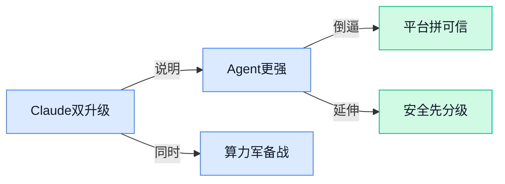

> AI 早报 · 每日早读 · 全网深度聚合

## **今日摘要**

```
Anthropic 连发 Claude Sonnet 4.6、Opus 4.6，1 亿美元砸伙伴网络，还锁定吉瓦级下一代算力
OpenAI 扩大可信访问计划引入 GPT-5.4-Cyber，又收购 Hiro，ChatGPT 或突袭个人理财
英伟达开源 Ising 押注量子提速，Qwen Code 把 Agent 装进终端，Claude Code Routines 同步补位
```

### 🔵 产品与功能更新

1. **Claude Sonnet 4.6 发布，主打编码、Agent 和专业工作全面升级。**
Anthropic 表示，**Claude Sonnet 4.6**在**编程**、**Agent** 和**专业场景**上带来前沿表现，重点是把高性能能力做得更适合大规模使用 💡。这意味着它不只是“更聪明一点”，而是瞄准企业日常最常见的高频任务，比如写代码、执行流程和处理复杂文档。对业务团队来说，Sonnet 4.6 更像是一款兼顾**能力**与**落地效率**的主力模型 🚀。[Claude Sonnet 4.6 发布页(briefing)](https://www.anthropic.com/news/claude-sonnet-4-6)

2. **Claude Opus 4.6 升级登场，Anthropic 押注最高端模型能力。**
Anthropic 将 **Claude Opus 4.6**定义为自家“最聪明”的升级版，覆盖**Agent 式编程**、**电脑操作**、**工具调用**、**搜索**和**金融**等多个方向。官方描述中，它在这些任务上属于行业领先，且不少场景领先幅度还不小 📈。如果说 Sonnet 更偏通用主力，那 Opus 4.6 就更像面向高难度任务的旗舰款，适合对推理和复杂执行要求更高的团队。[Claude Opus 4.6 发布页(briefing)](https://www.anthropic.com/news/claude-opus-4-6)

3. **英伟达发布 Ising 开源模型，想为实用量子计算“提速”。**
英伟达宣布推出 **Ising**，并称其为全球首个面向加速实用**量子计算**路径的开源 AI 模型。这个更新的重点，不只是“又发了个模型”，而是把 AI 与量子计算这条更前沿的技术路线绑得更紧 🔬。对非技术同事可以简单理解为：英伟达在尝试用 AI 帮助更快解决量子计算落地过程中的关键问题。[英伟达新闻报道(briefing)](https://news.google.com/rss/articles/CBMi1AFBVV95cUxNTUpOczZMZ2dSY1ZLS01kYy05UWlwOEl4bzBYZy1hSExta1BBaGlTa012YU45SUV5ZklzXzg2dFoyc0FSZmg4c2YtNWVvbjNCbkdGWE0zamRuU255UWtwczBHOV90NU9POExjME1NcnZnMlU0Z1hTLWlVU3oxZmFIV0xTRUVPX1lvZWF4R2Q5N1NmSUltU3VEc29MTERnYVNETTJQQWs3T0QxMlJvY3VlYWcwODdBbW9hRTJyZGM3ZFA5MnhMR2p5N0w1NFlRVGZsUVlWWQ?oc=5)

4. **Gemini Robotics ER-1.6 升级推理能力，瞄准机器人真实世界任务。**
Google 这次更新的核心，是让 **Gemini Robotics ER-1.6**在“看环境、做判断、完成动作”这条链路上更强，也就是更能应对现实世界里的机器人任务 🤖。标题里提到的 **embodied reasoning（具身推理，让 AI 结合身体动作和环境理解来思考）**，可以理解为机器人不只是会“算”，还要会“在现实里做”。这类升级对仓储、服务、制造等实体场景尤其关键，因为机器人真正难的地方，往往不是答题，而是动手完成任务。[Google 博客介绍(briefing)](https://news.google.com/rss/articles/CBMingFBVV95cUxPbjlVYWNYdmUzVGYtSWJMX0NvTlU5b0txcERDaUFVN3VFbnItdWFra3RkRXJrNVNjU3J5NTF4OUt3d2xHdndCeTZsbjk1UHNzU2ZLQ3psU1A2V0daZWVHbzBacVFSQlZ6dGVNY3ZDRkRMQWIyVHY5amlWNzc3Y2xHNmdvUHM4eTlzXzR2NDExdGluQzY3QWVzeVFSaEh2dw?oc=5) [DeepMind 说明页(briefing)](https://news.google.com/rss/articles/CBMiYkFVX3lxTFBvamVJdHA3WGsyT3k1OE9ObllKbTBPVjlfVEFnMm94ZjZTNnRxUnh4RVh5azhHeE9TUEw4X0ZnX3NMN2sxWFJFNU80bURsdVBYTm1LOG1oa1UtMlBRZWprT2hn?oc=5)

5. **新模型可用一张照片生成 45 分钟对口型视频，还能实时运行。**
The Decoder 报道称，一款新 **AI 视频生成模型**可以仅凭一张照片生成最长 **45 分钟**的对口型视频，而且支持**实时运行**，这对数字人、虚拟主播和视频本地化都很有想象空间 🎬。它的亮点不只是“能生成”，而是把**时长**和**速度**同时往前推了一步。对内容团队来说，这类能力意味着低成本批量生成讲解、播报和虚拟出镜内容的门槛可能继续下降。[完整报道(briefing)](https://the-decoder.com/new-ai-model-generates-45-minute-lip-synced-video-from-one-photo-and-runs-in-real-time/)

6. **OpenAI 扩大网络安全可信访问计划，并引入 GPT-5.4-Cyber。**
OpenAI 宣布扩展其面向网络防御方的 **Trusted Access for Cyber** 项目，并把 **GPT-5.4-Cyber**提供给经过审核的安全团队使用 🔐。官方同时强调，随着 AI 在网络安全上的能力增强，也会同步强化**安全护栏**。这说明 OpenAI 的思路并不是全面放开，而是优先让可信机构把更强模型用于防御场景。[OpenAI 官方说明(briefing)](https://openai.com/index/scaling-trusted-access-for-cyber-defense)

7. **Anthropic 推出 Project Glasswing，聚焦 AI 时代的关键软件安全。**
Anthropic 发布 **Project Glasswing**，主题非常明确：为 **AI 时代的关键软件**提供更强安全保障。光从项目定位就能看出，这不是单纯讲模型能力，而是在回应“AI 越强，基础软件和关键系统怎么更安全”这个现实问题 🛡️。对于企业来说，这类项目释放的信号很重要——AI 竞争已经不只是拼效果，也开始拼安全与可信落地。[项目介绍页面(briefing)](https://news.google.com/rss/articles/CBMiS0FVX3lxTFBfQUdtMDZYaEtZV0JMSk1ZSzdqTl9mV3dQTnZYcVEzaHo4cV8yUEl2a25QMWRXenFTYUQ3NF9WakR5WXVwaDRTZC1ZYw?oc=5)

### 🟢 前沿研究

1. **AI 开始挑战物理奥赛题，靠模拟器做强化学习。**
这篇研究把**强化学习**和**物理模拟器**结合起来，目标是让模型学会求解**物理竞赛**级别的问题 🧠。通俗理解，就是不只让 AI“背公式”，而是让它在模拟环境里反复试错，逐步形成解题策略。对教育、科研辅助和更强的科学推理能力来说，这类方向很值得关注。[论文摘要页(briefing)](https://huggingface.co/papers/2604.11805)

2. **Audio Flamingo Next 瞄准下一代开源音频语言模型。**
这项工作聚焦**语音、环境声音和音乐**三类音频理解，试图打造更通用的**开源**音频语言模型 🎧。如果说文字模型擅长“读和写”，这类模型更像是在补上“听和说”的能力版图。对语音助手、音频内容分析和多模态交互（让 AI 同时理解文字、图像、声音）都有潜在价值。[模型论文页(briefing)](https://huggingface.co/papers/2604.10905)

3. **SciPredict 追问：大模型能不能预测科学实验结果？**
这篇论文讨论一个很有意思的问题：**大模型**是否能在**自然科学实验**里提前判断结果会怎样 🔬。如果这个方向成立，AI 就不只是回答问题，还可能成为实验设计前的“预测顾问”。当然，这类能力最终是否可靠，仍要回到真实科学场景中验证；而这篇研究正是在系统性地提出和检验这个问题。[论文摘要页(briefing)](https://huggingface.co/papers/2604.10718)

4. **研究者开始“定位”模型里的对齐路径，尝试控制 AI 决策电路。**
这项研究聚焦**对齐**（让模型行为更符合人类目标）在语言模型内部到底是怎么起作用的，并尝试去**定位、放大和控制**相关的“策略电路” ⚙️。这里的**策略电路**可以理解为模型内部影响其回答方式的一组关键计算路径。对行业来说，这意味着未来可能不仅能看模型“说了什么”，还更有机会理解它“为什么这么说”。[论文摘要页(briefing)](https://huggingface.co/papers/2604.04385)

5. **IceCache 想解决长上下文模型最烧内存的问题。**
这篇论文关注**KV-cache**（大模型记住前文内容时缓存的中间信息），目标是让处理**长序列**时更省内存、更高效 💾。对普通用户来说，这直接关系到模型能否稳定处理超长文档、复杂对话和长流程任务。假如这类方法成熟，未来大模型在“长记忆”场景下的成本和性能都有望进一步优化。[论文摘要页(briefing)](https://huggingface.co/papers/2604.10539)

6. **QuanBench+ 评测大模型写量子代码，到底有多靠谱。**
这项研究提出一个统一基准，用来衡量**大模型生成量子代码**的能力表现 🧪。这里的量子代码，指的是面向**量子计算**任务编写的程序，不同于我们日常软件开发的代码。论文强调“多框架”评测，也就是尽量避免只在单一工具或环境下得出片面结论。[基准论文页(briefing)](https://huggingface.co/papers/2604.08570)

7. **“过去经验”不该被忘掉：新方法让强化学习更会用记忆。**
这篇研究提出一种**记忆增强**的**动态奖励塑形**方法，想办法让模型把过去经历更好地用于当前决策 📈。其中**奖励塑形**可以理解为：研究者调整“奖励规则”，帮助 AI 更快学会正确行为。简单说，它想解决的是“AI 每一步都别只顾眼前，也要学会参考过去发生过什么”。[论文摘要页(briefing)](https://huggingface.co/papers/2604.11297)

### 🟡 行业展望与社会影响

1. **澳大利亚政府与 Anthropic 签署 AI 安全与研究合作备忘录。**
这次合作的核心是**AI 安全**与**联合研究**，说明各国政府开始更系统地和头部模型公司建立正式协作 🤝。对企业读者来说，这类 **MOU（谅解备忘录，一种正式合作意向文件）** 往往意味着后续会在政策、评估标准和研究项目上持续推进，而不只是一次性表态。Anthropic 把这件事放在官方公告中，也释放出一个清晰信号：**AI 治理**正在从讨论阶段走向落地。可查看 [Anthropic 官方公告(briefing)](https://www.anthropic.com/news/australia-MOU) 💡


2. **OpenAI 收购 AI 个人理财初创公司 Hiro，ChatGPT 或加码金融规划能力。**
TechCrunch 指出，这笔收购传递出的关键信号是：OpenAI 正在为 ChatGPT 补强**财务规划**能力 💰。这意味着 AI 的应用边界，正在从写作、搜索、办公进一步延伸到更高决策门槛的个人金融场景。对普通用户和企业而言，这类动作值得关注，因为一旦整合进主产品，AI 可能会更深入地参与预算、理财建议等日常决策流程。详情可见 [TechCrunch 完整报道(briefing)](https://techcrunch.com/2026/04/13/openai-has-bought-ai-personal-finance-startup-hiro/) 🚀

3. **Anthropic 扩大与 Google、Broadcom 合作，锁定多个吉瓦级下一代算力。**
Anthropic 宣布与 **Google** 和 **Broadcom** 进一步扩大合作，重点是获取**下一代算力**，而且规模直接上到“**多个吉瓦**”级别 ⚡。简单说，这反映出 AI 竞争正在越来越依赖底层基础设施，不只是拼模型能力，也要拼谁能拿到足够多的芯片、电力和数据中心资源。对行业来说，这类合作也在提醒大家：未来领先模型的门槛，可能越来越不只是算法，而是**算力供应链**本身。更多可看 [Anthropic 官方发布页(briefing)](https://www.anthropic.com/news/google-broadcom-partnership-compute) 💡

4. **Anthropic 向 Claude Partner Network 投入 1 亿美元，押注生态伙伴扩张。**
Anthropic 宣布向 **Claude Partner Network** 投资 **1 亿美元**，重点显然不只是卖模型，而是加速建设围绕 Claude 的**合作伙伴生态** 🌐。这类投入通常意味着公司希望通过咨询、集成、行业方案等多种渠道，把模型能力更快送进企业真实业务中。对不同行业的公司来说，生态做大后，接入 AI 的门槛往往会下降，能找到的服务商和落地路径也会更多。官方信息见 [Claude 伙伴网络公告(briefing)](https://www.anthropic.com/news/claude-partner-network) 🚀

### 🟣 开源TOP项目

1. **Qwen Code：把 AI Agent 直接装进终端。**
这是阿里 QwenLM 开源的一个**终端型 AI Agent**，主打“住在你的命令行里”，更适合开发者一边写代码一边直接调用 🤖。它的定位很清晰：不是单纯聊天，而是贴近日常开发流程的**命令行助手**。对业务同学来说，可以把它理解成“开发者版的桌面副驾驶”，只是工作场景搬到了终端这个纯文本操作界面里。[GitHub 项目主页(briefing)](https://github.com/QwenLM/qwen-code)


2. **OpenAI 开源 Codex 插件，可在 Claude Code 里调用 Codex。**
这个项目做的事很直接：让用户能**从 Claude Code 调用 Codex**，用于**代码审查**或把部分任务委派出去 🔄。换句话说，它像是在不同 AI 编程助手之间搭了一座桥，让协作方式更灵活。对团队来说，这类插件的意义在于减少工具切换，把不同模型的能力接进同一个工作流里。[插件仓库说明(briefing)](https://github.com/openai/codex-plugin-cc)


3. **微软 VibeVoice：开源前沿语音 AI 项目。**
微软把 **VibeVoice** 定位为一个**前沿语音 AI** 开源项目，核心方向就是语音能力本身 🎙️。从仓库简介来看，它主打的是更先进的声音智能，而不是普通的文字对话。对非技术同学可以简单理解为：这是微软在“让 AI 更会听、更会说”这条线上的一个开源代表项目。[官方仓库主页(briefing)](https://github.com/microsoft/VibeVoice)

4. **Google Magika：用 AI 快速识别文件真实类型。**
**Magika** 是 Google 开源的一个文件识别工具，强调**又快又准**地判断文件内容类型 📁。它不是只看文件后缀名，而是靠 AI 去识别文件“里面到底是什么”，这在安全、内容处理和自动化流程里都很实用。对公司场景来说，这类能力能帮助系统更稳地处理上传文件，减少误判和风险。[Google 开源仓库(briefing)](https://github.com/google/magika)

5. **Anthropic 开源 Claude Cookbook，整理出一套实用玩法。**
这个仓库本质上是一组 **Claude 使用手册 + 示例配方**，用 notebook（交互式代码笔记本）整理了不少“好玩又有效”的用法 💡。它的价值不在于发布新模型，而在于把 Claude 的应用方式讲得更具体、更容易上手。对想快速试业务场景的人来说，这类 cookbook（配方式案例集）往往比纯文档更有参考价值。[示例配方仓库(briefing)](https://github.com/anthropics/claude-cookbooks)

6. **agent-skills：给 AI 编程 Agent 补上“工程化技能包”。**
这个项目聚焦 **AI 编程 Agent 的生产级工程能力**，也就是让它们不只是会写几段代码，而是更像真正能进团队流程的助手 🛠️。仓库名称里的 skills，可以理解成一套可复用的“专业技能模块”，帮助 Agent 在真实开发环境里表现更稳。对企业来说，这类项目的信号很明确：AI 编程正在从“演示可用”走向“工程可用”。[项目仓库介绍(briefing)](https://github.com/addyosmani/agent-skills)

### 🔴 社媒分享

1. **Chrome 把 AI 提示词做成一键小工具。**
Google 这次想把大家平时积累的**prompt**直接变成 Chrome 里的**一键技能**，让常用操作不必每次重复输入，日常办公会更顺手一点 ✨。从官方表述看，核心就是把“会写提示词的人”的经验，包装成更容易复用的小工具，降低团队内部传播门槛。对不懂技术的同事来说，这类能力的意义很直接：把“高手经验”变成“人人可点”的按钮，更像是在浏览器里做轻量自动化 🚀。[Chrome 官方介绍(briefing)](https://blog.google/products-and-platforms/products/chrome/skills-in-chrome/)


2. **网络安全越来越像“工作量证明”。**
Simon Willison 转引并讨论了一个很有意思的判断：如今的**网络安全**，越来越像 **Proof of Work（工作量证明，一种通过消耗计算资源来提高攻击成本的机制）** 💡。文章提到，英国 **AI Safety Institute（英国 AI 安全研究机构）** 最近发布了 EVA 项目相关内容，由此引出一个更大的趋势：防御方需要通过更系统、更持续的投入，来应对 AI 时代不断变化的攻击方式。对企业管理者来说，这个比喻很形象——安全不再只是“装个防火墙就完事”，而更像一场需要持续投入资源的长期赛跑 🔐。[作者完整解读(briefing)](https://simonwillison.net/2026/Apr/14/cybersecurity-proof-of-work/#atom-everything)


3. **Stratechery 拆解 OpenAI 内部备忘录：企业市场对决 Anthropic。**
这篇分析围绕 OpenAI 一份内部备忘录展开，重点讨论它如何在**企业市场**上正面应对 **Anthropic**，以及这背后和 **Amazon**、**Frontier** 的关系脉络。对非技术读者来说，可以把它理解为：AI 竞争已经不只是模型谁更强，而是比谁更能打进大公司采购体系、工作流和预算池里 🧭。文章的价值在于，它不是单看某个产品发布，而是在解释几家关键玩家的商业位置和战略取舍，对 CEO、业务负责人尤其有参考意义。[Stratechery 分析原文(briefing)](https://stratechery.com/2026/openais-memos-frontier-amazon-and-anthropic/)

4. **OpenAI 推出面向下一代网络防御的“可信访问”。**
OpenAI 这篇官方文章聚焦一个关键词：**trusted access（可信访问）**，面向的是下一阶段的**网络安全防御**需求。直白说，就是在更敏感、更高风险的安全场景里，怎样让合适的人和机构能安全地使用更强的 AI 能力，同时尽量控制滥用风险 ⚖️。这类动作也说明，AI 公司开始更认真地区分“谁可以用、在什么条件下用、能用到什么程度”，安全治理正在从原则讨论走向具体机制。[OpenAI 官方说明(briefing)](https://openai.com/index/scaling-trusted-access-for-cyber-defense/)

5. **Claude Code Routines 让重复开发任务可模板化。**
Anthropic 为 **Claude Code** 推出的 **Routines（预设流程模板，把常见任务固定成可重复执行的步骤）**，本质上是在帮开发者把高频操作沉淀成标准流程 🛠️。这意味着一些反复出现的工作，比如固定格式的检查、生成或整理，可以不必每次从头描述，而是直接调用既有套路。虽然它主要面向程序员，但对管理层也有一个清晰信号：AI 编程工具正在从“单次问答”升级到“流程化协作”，效率提升会更稳定。[Claude Code 官方文档(briefing)](https://code.claude.com/docs/en/routines)

---



### 📊 行业洞察（今日 4 条）

1. Anthropic 一天连发 Claude Sonnet 4.6 和 Opus 4.6，重点都压在编程、Agent、工具调用和专业工作
  【洞察】头部模型竞争已从“聊天更聪明”转向“能不能直接干活”，因为两款更新都在强调执行任务而不是单轮回答

2. Anthropic 一边升级 Claude，一边又拿下 Google、Broadcom 的多吉瓦级下一代算力合作
  【洞察】模型优势越来越像资源优势，谁能长期拿到芯片、电力和数据中心，谁才更可能持续领先，后来者补课会更难

3. OpenAI 扩大网络安全可信访问计划，并只向审核过的防御团队开放 GPT-5.4-Cyber
  【洞察】更强 AI 不会全面开放，而会先按人群分级发放，因为高风险能力一旦放开，商业机会和滥用风险会一起爆炸

4. Google 推出 Chrome 一键 AI 技能，Anthropic 又上了 Claude Code Routines（预设流程模板，把常见任务固定成可重复步骤）
  【洞察】AI 正从“每次重说一遍需求”走向“把经验封装成按钮和模板”，真正的产品价值会越来越靠流程复用，而不是提示词技巧

### 💭 对我们的启发（今日 3 条）

1. Claude 4.6 双升级说明底层模型会越来越强，我们的平台不能把价值押在“接很多模型”上，而要押在“帮用户选对方案、看懂差异”。

2. OpenAI 的可信访问验证了一个现实：高能力 Agent 不能默认人人同权。我们产品设计要预留分级权限、过程可见和人工接管，不然后面补会很痛。

3. Chrome 一键技能和 Claude Code Routines 说明，用户真正会留下来的不是最强 Agent，而是最好复用的现成流程；我们应重视“可沉淀、可评分、可复用”的方案层。

🗺️ 今日关系图


---

> 本周周报：[第16周综合分析](/blog/weekly/2026-w16/)
