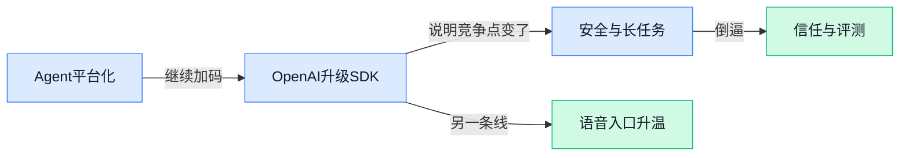

> AI 早报 · 每日早读 · 全网深度聚合

## **今日摘要**

```
Anthropic 连开源 Skills 又放出 Claude Cookbooks，Claude Agent 技能复用与落地教程一起补齐
Google 一天三连发，Gemini Mac 原生 App 上线、3.1 Flash TTS 发布、Robotics-ER 1.6 再推机器人
OpenAI 更新 Agents SDK 强攻企业级安全 Agent，Adobe Firefly 助手已能直接调用 Creative Cloud 干活
```

### 🔵 产品与功能更新

1. **Gemini 3.1 Flash TTS: the next generation of expressive AI speech - blog.google。**
[查看原文(briefing)](https://news.google.com/rss/articles/CBMimAFBVV95cUxNTUZiLWhCT3lpZ19xY2NsQl83VDBPWlFJTDczdktDZ1ItUUc2UVRlQTZVZW1PRC1ldEw4X1lkZG95N3pqekNELTdjSlB6TnNEYndFdGE2ZUUzVmZsTVZrdlM2X2FYQ25GUHBPeU43UW9OQ1ZwLXZqWmJyalJrazVzRVVyVlRlM0dkNDcyZGExdGQ2MUF1MkxJVQ?oc=5)


2. **Adobe’s new Firefly AI assistant can use Creative Cloud apps to complete tasks。**
Adobe says the assistant can work across apps like Firefly, Photoshop, Premiere, Lightroom, Express,  Illustrator and its other apps to do tasks for you.
[查看原文(briefing)](https://techcrunch.com/2026/04/15/adobes-new-firefly-ai-assistant-can-use-creative-cloud-apps-to-complete-tasks/)


3. **Google rolls out a native Gemini app for Mac。**
You can share anything on their screen with Gemini to get help with what they're looking at in the moment, including local files.
[查看原文(briefing)](https://techcrunch.com/2026/04/15/google-rolls-out-a-native-gemini-app-for-mac/)

4. **Turn your best AI prompts into one-click tools in Chrome。**

Skills in Chrome let you discover, save and remix AI workflows —...
[查看原文(briefing)](https://blog.google/products-and-platforms/products/chrome/skills-in-chrome/)

5. **Project Think: building the next generation of AI agents on Cloudflare - The Cloudflare Blog。**
[查看原文(briefing)](https://news.google.com/rss/articles/CBMiVEFVX3lxTE5BWkJnX0FvTGRPcjItbmpsWnZBLTdXd1ZYTDFTYlM2NnlPemdaS2VQTU9KS29mT05uUjN2STNzRk5wNDh0WnBHeS13VDhZUnRJY015cg?oc=5)

6. **OpenAI updates its Agents SDK to help enterprises build safer, more capable agents。**
OpenAI has expanded the capabilities of its agent-building toolkit, as agentic AI continues to grow in popularity.
[查看原文(briefing)](https://techcrunch.com/2026/04/15/openai-updates-its-agents-sdk-to-help-enterprises-build-safer-more-capable-agents/)

7. **The next evolution of the Agents SDK。**
OpenAI updates the Agents SDK with native sandbox execution and a model-native harness, helping developers build secure, long-running agents across files and tools.
[查看原文(briefing)](https://openai.com/index/the-next-evolution-of-the-agents-sdk)

8. **Project Provenance - Microsoft。**
[查看原文(briefing)](https://news.google.com/rss/articles/CBMihgFBVV95cUxOUkJOcFFtVVRQX2pZVlMtVTdMQWZQWWhNRzM2TzluYlNDNjI0WmNodENvc21XZFI0MmNzNll6TUJ1b3RvZi1UOTAtd3FleFFIdXZobmpEcF9ldWY2MmxiMTF0Ynd1WHpZNGRQLTN2eFdEM3pNeERlR011eFctbmhUa1hIM3h6QQ?oc=5)

### 🟢 前沿研究

1. **ClawGUI 想把 GUI Agent 训练、评测、部署统一到一个框架里。**
这篇论文聚焦 **GUI Agent**（能像人一样操作软件界面的 AI 代理）全流程问题，试图把**训练、评估、上线部署**放进同一套框架里，减少各环节割裂带来的效率损失 💡。对企业来说，这类研究的意义在于：未来做“让 AI 帮你点按钮、填表单、跑流程”的产品，可能不必从零拼装整套工具链。它更像是在为 **电脑操作型 Agent** 搭“操作系统级底座”，方便后续研究和落地加速 🚀。[论文页面(briefing)](https://huggingface.co/papers/2604.11784)

2. **Block Diffusion Draft Trees 试图进一步加速推理里的 speculative decoding。**
这项研究围绕 **speculative decoding**（推测解码，让模型先快速猜一版、再由大模型验证，从而提升生成速度）展开，提出了 **Block Diffusion Draft Trees** 这种新方法。核心看点是继续压缩大模型生成文本时的等待时间，让回答更快出来 ⚡。如果这类方法成熟，最直接的价值就是让聊天机器人、代码助手等应用在**响应速度**上再上一个台阶。[论文介绍页(briefing)](https://huggingface.co/papers/2604.12989)

3. **Habitat-GS 用动态 Gaussian Splatting 做更高保真的导航模拟器。**
这篇论文提出 **Habitat-GS**，目标是打造一个更高逼真度的**导航模拟器**，用于训练和测试会在空间中移动的 AI 系统。其关键技术是 **Gaussian Splatting**（一种用大量高斯点快速重建逼真 3D 场景的方法），而且是**动态**版本，意味着场景表达更贴近真实世界 🧭。对机器人、空间智能、自动导航研究来说，这种更“像真的”虚拟环境很重要，因为它能降低真实世界试错成本。[论文页面(briefing)](https://huggingface.co/papers/2604.12626)

4. **Nemotron 3 Super 主打开源、高效的 MoE 混合架构，用于 Agent 推理。**
这项工作发布了 **Nemotron 3 Super**，强调它是一种**开源**、**高效率**的模型架构，面向 **Agentic Reasoning**（更偏自主规划与执行的 AI 推理能力）。论文标题点出其采用 **MoE**（混合专家模型，多个小模型分工协作）以及 **Mamba-Transformer** 混合设计：前者追求更高性价比，后者是在不同建模机制之间找平衡 🤖。对行业观察者来说，这代表学界和产业界仍在积极探索“怎样让 Agent 更聪明，同时推理成本别太高”这条主线。[论文详情页(briefing)](https://huggingface.co/papers/2604.12374)

5. **Lyra 2.0 瞄准可探索的生成式 3D 世界。**
**Lyra 2.0** 的重点不是单个 3D 物体，而是能让人“走进去探索”的**生成式 3D 世界** 🌍。这类研究如果持续推进，意味着未来 AI 不只是生成图片和视频，还可能直接生成可交互、可漫游的三维环境。无论是游戏、虚拟内容制作，还是数字孪生（现实世界的数字映射）相关方向，这种能力都很有想象空间。[论文页面(briefing)](https://huggingface.co/papers/2604.13036)

6. **一项新研究提醒：看似无害的指令，也可能戳中电脑操作 Agent 的安全盲区。**
这篇论文把焦点放在 **Agent 安全** 上，特别是会直接操作电脑的 **computer-use agents**（电脑使用型 Agent）。作者指出，哪怕用户给出的指令表面上很正常、很无害，也可能暴露出系统中的**关键漏洞**，这说明安全问题不只来自明显恶意攻击 🛡️。对企业应用来说，这个结论很现实：当 AI 被允许点击、输入、执行操作时，安全评估必须覆盖“正常任务里的异常后果”，不能只防传统意义上的黑客式输入。[论文介绍页(briefing)](https://huggingface.co/papers/2604.10577)

7. **You Only Judge Once：一次前向计算，评多个回答。**
这项研究讨论的是 **Reward Modeling**（奖励建模，用来判断模型回答优劣的评分机制）怎么做得更高效。论文提出 **Multi-response Reward Modeling in a Single Forward Pass**，意思是模型只跑一次，就能同时评估多个候选回答，而不是一个个单独打分 ⏱️。这类优化虽然听起来偏底层，但它会直接影响模型训练和对齐（让模型更符合人类偏好）的成本与效率，因此对大模型迭代很关键。[论文页面(briefing)](https://huggingface.co/papers/2604.10966)

8. **研究者开始瞄准“长周期自主工程”，想让 AI 参与机器学习研究本身。**
这篇论文讨论 **Autonomous Long-Horizon Engineering**，也就是让 AI 能在更长时间尺度上，持续完成复杂工程任务，而不只是回答一个短问题。场景被明确放在 **ML Research**（机器学习研究）里，意味着目标是让 AI 不只当助手，还能更深度参与研究流程 🔬。如果这条路线走通，未来 AI 在科研中的角色可能从“写段代码、答个问题”，逐渐升级为能跨多个步骤持续推进任务的协作伙伴。[论文详情页(briefing)](https://huggingface.co/papers/2604.13018)

### 🟡 行业展望与社会影响

1. **微软：AI 事件响应和传统安全还是同一场火，只是“燃料”变了。**
微软这篇文章的核心判断很直白：面对 **AI 安全事件**，企业并不是要推翻原有的应急体系，而是要意识到攻击面和风险来源已经发生变化 🔥。也就是说，流程上仍是发现、处置、复盘，但在 **模型、提示词、训练数据** 等新环节上要补上专门能力，不能再只盯着传统 IT 系统。对公司管理层来说，这提醒大家把 AI 纳入现有 **安全治理**，而不是把它当成一个“技术团队自己会处理”的小问题。[微软观点解读(briefing)](https://news.google.com/rss/articles/CBMiqwFBVV95cUxQQlJJVW15TnZYQjBiM0VTNWNodzQzUzNqcFpvZEZvbl9UR0prUk1mNVczTEF3T1REcDB3MGxRZUdlY2Z2YzBuWjNmMDZGUkZhV3VaUW9HbXE0UXd5WVVRSVEzZ1pXSkYzUzQ0VnFoZVRtSWxsZEhXcUt6S0VXTWNOUmwzTTBQWFhWV3RFTlVIbEpZS1RxWFp4eUhaNnZ4dEZlNl90TVEycG9lbVE?oc=5)

2. **Cadence 与英伟达联手，要把 AI 更深地带进机器人开发。**
路透这则消息显示，**Cadence** 与 **英伟达** 正在合作推进面向 **机器人** 的 AI 能力 🤖。这类合作的行业信号很明确：AI 的价值正从“会聊天、会写文案”进一步走向 **真实物理世界**，开始影响机器人设计、开发和落地节奏。对制造、供应链和自动化相关企业来说，这意味着未来竞争不只是硬件本身，还包括背后的 **AI 软件能力** 和生态协同。[路透完整报道(briefing)](https://news.google.com/rss/articles/CBMiowFBVV95cUxPcW9FTG1SQ2ZEZVE0RzI0OU9vcUZLcFlWRG5ucHFiWkxnMlRVRVR5U3FnU0dLcWVSd2hjT0FaSE5HQ0kwQS05MHM0Smt4dnAtQTcwUWp4ck1jUUk5TklmYlBRTWY5QWdDenE1SFpaWV9WZjhtX3J1TWpSVWFsblNjdno2ZGlNb29RVjBlSUk3cklpcW5qZXMyb1ZmUlY3Y0lzZDQw?oc=5)

3. **CFR：Claude Mythos 可能是 AI 与全球安全格局的一个转折点。**
美国外交关系协会（Council on Foreign Relations，研究国际关系与安全政策的智库）这篇文章提出，**Claude Mythos** 不只是一次模型进展，更可能牵动 **全球安全** 讨论的方向 🌍。作者用“六个理由”来论证它为何值得政策圈和企业高层重视，重点不在单一产品功能，而在 AI 能力提升后对国际竞争、治理和风险认知带来的连锁反应。对非技术岗位来说，可以把它理解成：AI 现在已经不只是效率工具，而是越来越接近会影响国家安全与产业规则的 **战略变量**。[智库文章原文(briefing)](https://news.google.com/rss/articles/CBMipwFBVV95cUxPemJRcUdOLTM4ZWUxcGs0NVZfd1VYYV9fTkxzcHZDZldBS0N2WjRkRGJfMW5FNE1SXzVHWktnb3hzR1VrSW51dzk3ZE1BckVkaEtLMW12WDhKWjZiSklkRDZzNjlJV3FnNFYxLWdYR2tjV2NTMnVZWjhEZUZrV0t2U09EQlBSSlFhcU5IY2g0WU42ZVJCb0dTUGY1R1M5TjEzVWdOdHYzRQ?oc=5)

### 🟣 开源TOP项目

1. **Anthropic 开源 Skills，给 Agent 装上可复用“技能包”。**
这是 Anthropic 发布的一个公开仓库，核心定位就是 **Agent Skills**（可被 AI 助手反复调用的任务能力模块）📦。对业务同学来说，可以把它理解成给 Agent 准备的一套“现成动作模板”，方便后续复用和组合。虽然仓库首页介绍很简短，但方向非常明确：让 **Agent 开发**更模块化、更好复用 💡。[GitHub 技能仓库(briefing)](https://github.com/anthropics/skills)


2. **Karpathy 的 AutoResearch：让 AI agent 自动跑单卡研究实验。**
这个项目主打用 **AI agents** 自动完成围绕 **single-GPU**（单张显卡）和 **nanochat training**（轻量聊天模型训练）的研究流程 🔬。从摘要看，它更像一个“自动化研究员”雏形，目标是把原本需要人手推进的实验探索交给 Agent 去跑。对关注 AI 研发效率的人来说，这类项目很有代表性：不是直接做新模型，而是提升“做研究”本身的自动化程度 🚀。[AutoResearch 项目页(briefing)](https://github.com/karpathy/autoresearch)


3. **Anthropic 放出 Claude Cookbooks，展示 Claude 的实用玩法。**
这是一个由 Anthropic 提供的 **notebooks**（可交互运行的示例文档）和 **recipes**（使用范式/配方）合集，主打分享一些“好玩又有效”的 Claude 用法 🧠。对非技术同学也很好理解：它相当于官方把不同场景的最佳实践整理成案例，方便大家照着学、照着试。相比只给文档，这种“示例 + 配方”的形式更利于快速上手 Claude 的实际能力 ✨。[Claude 示例合集(briefing)](https://github.com/anthropics/claude-cookbooks)


4. **微软开源 VibeVoice，瞄准前沿语音 AI。**
VibeVoice 是微软开源的一个 **Voice AI** 项目，仓库给出的定位是 **Open-Source Frontier Voice AI** 🎙️。从命名和摘要来看，它面向的是更前沿的语音生成与交互方向，属于开源语音赛道里值得关注的新项目。对企业场景来说，语音 AI 一直和客服、陪伴、数字人等应用强相关，因此这类底层能力项目的热度通常不低 📈。[微软开源项目页(briefing)](https://github.com/microsoft/VibeVoice)

5. **OpenBMB 发布 VoxCPM2：无需 tokenizer 的多语种 TTS。**
VoxCPM2 的亮点很集中：它是一套 **Tokenizer-Free**（不依赖传统文本切分器）的 **TTS**（文本转语音）方案，支持 **多语种语音生成**、**创意音色设计** 和 **高拟真声音克隆** 🎧。对不懂技术的同学来说，可以把它理解成“从文字到声音”的一整套更灵活的语音生成能力，而且还能做个性化音色。摘要里强调“真实感克隆”，说明项目重点不只是能说出来，还追求声音像真人、像指定对象 🗣️。[VoxCPM2 项目仓库(briefing)](https://github.com/OpenBMB/VoxCPM)

6. **Google Research 开源 TimesFM，想把时间序列预测做成基础模型。**
TimesFM 全称是 **Time Series Foundation Model**（时间序列基础模型），由 Google Research 开发，并且已经过 **预训练**，主要用于 **时间序列预测** ⏱️。时间序列可以理解为按时间连续记录的数据，比如销量、流量、库存、股价等，所以它和很多业务分析场景都直接相关。相比传统按单一任务建模的方式，这类“基础模型”路线更像是先学通用规律，再迁移到不同预测任务里，想象空间不小 📊。[Google 项目仓库(briefing)](https://github.com/google-research/timesfm)

### 🔴 社媒分享

1. **IBM 拆解 VAKRA：Agent 的推理、工具使用与常见翻车点。**
这篇分析聚焦 **VAKRA 基准**，专门拿来观察 Agent 在**推理**、**调用工具**和**失败模式**上的真实表现，很适合想了解“AI 到底卡在哪”的同事快速入门 💡。VAKRA 来自 HuggingFace（全球最大 AI 模型共享社区）博客上的 IBM 研究解读，核心价值不是单纯比谁分数高，而是看 Agent 为什么会做对、又为什么会做错。对业务侧来说，这类内容能帮助判断：哪些任务适合交给 Agent，哪些环节还需要人工兜底 🚀。[VAKRA 分析原文(briefing)](https://huggingface.co/blog/ibm-research/vakra-benchmark-analysis)


2. **Gemini App 正式登陆 Mac。**
Google 宣布 **Gemini App** 现在已经可以在 **Mac** 上使用，意味着苹果电脑用户能更直接地把 Gemini 放进日常工作流里 ✨。这类“原生上桌面”的动作看似简单，其实很关键：它通常意味着产品正从“你偶尔打开网页用一下”，走向“随手就能调用的常驻助手”。对办公场景来说，无论是写作、整理信息还是日常问答，使用门槛都进一步降低了 📱💻。[Google 官方发布页(briefing)](https://blog.google/innovation-and-ai/products/gemini-app/gemini-app-now-on-mac-os/)


3. **Gemini Robotics-ER 1.6 更新，Google 继续推进机器人智能。**
Google DeepMind 发布了 **Gemini Robotics-ER 1.6**，延续其把 **Gemini** 能力进一步带入机器人场景的路线 🤖。从名字就能看出，这不是普通聊天模型更新，而是更偏向**机器人推理与执行**相关方向的版本演进。对非技术同事来说，可以把它理解为：AI 不只是会“说”，也在继续朝着“看懂环境、做出动作”推进，这也是具身智能（让 AI 进入真实物理世界执行任务）的重要一步 🚀。[DeepMind 官方文章(briefing)](https://deepmind.google/blog/gemini-robotics-er-1-6/)

4. **Gemini 3.1 Flash TTS 发布，文字转语音也能被“指挥风格”。**
Google 推出了 **Gemini 3.1 Flash TTS**，这是一款新的 **TTS**（Text-to-Speech，文字转语音）模型，亮点在于不仅能把文字念出来，还能通过指令控制说话方式和风格 🎙️。Simon Willison 的整理提到，这次更新来自 Google 官方发布，重点就是让语音生成更可控，而不是只有“标准播音腔”。这对内容生产、客服语音和 AI 语音助手都很有想象空间：以后不只是“能说”，而是“按你想要的方式说” 💬。[解读整理文章(briefing)](https://simonwillison.net/2026/Apr/15/gemini-31-flash-tts/#atom-everything)

---



### 📊 行业洞察（今日 4 条）

1. OpenAI 更新 Agents SDK，主打更安全、可长时间运行；Anthropic 同时开源 Skills 技能仓库
  【洞察】大厂在把 Agent 从“单次对话”推向“可复用的平台能力”，竞争点正从模型本身转向谁更容易搭、谁更可信

2. 一篇新研究说正常指令也可能触发电脑操作 Agent 漏洞；微软又强调 AI 安全要纳入原有应急体系
  【洞察】Agent 真正难的不是会不会点按钮，而是出事后怎么防、怎么查、怎么兜底，安全已成落地前提而不是加分项

3. Google 发布 Gemini 3.1 Flash TTS，可用指令控制说话风格；OpenBMB 的 VoxCPM2 和微软 VibeVoice 也都押注开源语音
  【洞察】语音正在从“把字念出来”升级成“按场景表达”，但底层能力迅速普及后，真正稀缺的是体验设计和使用场景

4. Nemotron 3 Super 主打开源高效、服务 Agent 推理；另一篇研究则想把多个回答一次性评完
  【洞察】行业在同时压两件事：让 Agent 更便宜地跑、也更快地挑出更好方案，这说明“规模化调度”开始比单次聪明更重要

### 💭 对我们的启发（今日 3 条）

1. OpenAI 升级 Agents SDK、Anthropic 开源 Skills，说明“搭 Agent”会越来越容易；我们不能只做接入层，得把重点放在选择、评测和信任展示上。

2. “正常指令也会出事”这类研究很关键，提醒我们平台以后若做电脑操作 Agent，默认就要有人工确认、过程可见和风险分级，别把安全当后补功能。

3. 一次评多个回答的研究，正好验证我们的方向：平台价值不只是调用 Agent，而是高效比较多个方案、帮用户选出更靠谱的那个。


---

> 本周周报：[第16周综合分析](/blog/weekly/2026-w16/)
