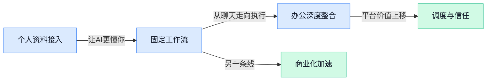

> AI 早报 · 每日早读 · 全网深度聚合

## **今日摘要**

```
OpenAI 估值冲上8520亿美元、酝酿ChatGPT新定价和广告，上市前商业化突然提速
Anthropic 估值上升逼得OpenAI投资人重排座次，还与美国政府深谈Mythos治理路线
Google 把Gemini“个人智能”推向印度南非，Chrome再塞AI Skills，微软Copilot杀入Word改批注
```

### 🔵 产品与功能更新

1. **Google 将 Gemini“个人智能”带到印度和南非。**  
这项 **Personal Intelligence（个人智能，让 Gemini 结合你的 Google 账户内容提供更贴身回答）** 功能，允许用户连接 **Gmail**、**Google Photos** 等账号，让 AI 基于个人邮件、照片等信息来回答问题 💡。对普通用户来说，这意味着以后问 Gemini，不只是“网上有什么”，还可以变成“我自己的资料里有什么”。这类能力本质上更接近 **个性化助手**，也让 AI 从通用聊天进一步走向“懂你”的日常工具。[TechCrunch 报道(briefing)](https://techcrunch.com/2026/04/14/google-brings-its-gemini-personal-intelligence-feature-to-india/) [Google 官方动态(briefing)](https://news.google.com/rss/articles/CBMiqwFBVV95cUxPU0J5eGhMb1RGTDZBQmkyamhEU28waTJfMXJjRk0wTklyQlEwZ3RxSnc2VGpqQmtoT3kwNXhTU1k3Ui0wcmFmak5va1oxNWZUMDk0MWs4bGVsZW1sMmFxZExvbXJMOUYwUHItRHlqTmR0M3RMaDF0Qm1Sc1ptZS1PQ0pUN3dSZ0Jta0QxUWE3QjdXc0JuT19FRWhMQlpSaFA3MHJxb3djMEhUWnc?oc=5)


2. **Microsoft Copilot 现在能在 Word 里追踪修订和管理评论。**  
这次更新把 Copilot 更深地接入了 Word 的日常协作流程：它可以处理 **track changes（修订追踪，记录文档里每一处改动方便多人审阅）**，也能管理 **comments（批注/评论，团队一起改稿时最常用的沟通区）** 🚀。对经常写方案、合同、汇报材料的人来说，这不是“多一个聊天框”，而是直接进入改稿现场，帮你省掉不少来回整理意见的时间。AI 办公正在从“帮你写初稿”走向“帮你把多人协作改稿也接住”。[完整报道(briefing)](https://the-decoder.com/microsoft-copilot-in-word-can-now-track-changes-and-manage-comments/)


3. **Google 给 Chrome 加入 AI Skills，可保存常用工作流。**  
Google 正在为 Chrome 增加 **AI Skills（AI 技能，相当于把常用提示词和操作步骤打包成可重复使用的快捷模板）**，让用户能把自己常用的 AI 用法保存下来，并在不同网站上重复调用 ⚡。这项功能建立在 Gemini 与浏览器整合的基础上，核心价值不是“再多一次提问”，而是把零散的 prompt 变成稳定可复用的流程。对运营、客服、内容、行政等经常重复处理网页任务的人来说，这会让浏览器更像一个会记住你习惯的助手，而不只是一个上网入口。[TechCrunch 详细报道(briefing)](https://techcrunch.com/2026/04/14/google-adds-ai-skills-to-chrome-to-help-you-save-favorite-workflows/)

### 🟢 前沿研究

1. **TREX：让大模型微调从“手工调参”走向 Agent 自动探索。**
这篇工作提出 **TREX**，核心是用 **Agent（能自动拆解任务并执行步骤的智能体）** 配合 **tree-based exploration（树状探索，像走迷宫一样分叉尝试多种方案）**，自动寻找更合适的 **fine-tuning（用特定数据继续训练，让模型更适合某类任务）** 路径 💡。对企业来说，这类研究的意义在于：未来训练一个更懂业务的大模型，可能不再高度依赖资深算法工程师反复试错，而是把“试验”流程更系统地自动化。它关注的不是单次回答更聪明，而是让模型“怎么被调好”这件事更高效、更可复制。[论文详情页(briefing)](https://huggingface.co/papers/2604.14116)

2. **UI-Zoomer：让 AI 在复杂界面里学会“先放大再定位”。**
**UI-Zoomer** 研究的是 **GUI grounding（图形界面定位，让 AI 在按钮、输入框、菜单里准确找到目标位置）** 问题，方法是依据 **uncertainty（不确定性，即模型自己也知道“我看不太准”）** 动态进行 **zoom-in（局部放大查看）** 🔍。这很像人找手机小图标时，会先盯整体，再放大看细节；论文想解决的正是 AI 在密集、复杂页面中容易点错位置的问题。对做办公软件、自动化流程、智能客服后台的人来说，这类能力是 GUI 自动操作 Agent 能否真正稳定落地的关键。[论文介绍页(briefing)](https://huggingface.co/papers/2604.14113)

3. **Sema Code：把 AI 编程 Agent 拆成可编排、可嵌入的基础设施。**
**Sema Code** 的关注点不是“再做一个会写代码的助手”，而是把 **AI coding agents（AI 编程智能体）** 拆解成更容易组合的基础能力，形成 **programmable（可编程，开发者能按规则自由拼装）**、**embeddable infrastructure（可嵌入基础设施，能塞进其他产品或系统里复用）** 🧩。这意味着企业以后不一定非得买一个完整成品，也可能把“代码理解、任务分解、执行反馈”等能力像积木一样接入自己的平台。对管理者来说，这类研究更像在铺“水电煤”——短期未必直接可见，长期却决定 AI 开发能力能否规模化复用。[论文详情页(briefing)](https://huggingface.co/papers/2604.11045)

4. **TIP：蒸馏大模型时，不同 token 的“轻重缓急”可能该区别对待。**
这篇论文讨论 **Token Importance（词元重要性，token 就是模型处理文本时切分出的最小单位）** 在 **on-policy distillation（按当前模型自己生成的数据来蒸馏，相当于边做边学的压缩训练）** 里的作用 ⚙️。说白了，它在问：模型学老师模型时，是不是有些字词、步骤、关键位置应该更重视，而不是一视同仁。对行业的启发在于，未来做小模型压缩和部署时，可能不只是“把大模型缩小”，而是更聪明地保留真正影响效果的部分，从而降低成本又尽量少掉能力。[论文介绍页(briefing)](https://huggingface.co/papers/2604.14084)

5. **这篇研究指出：语言模型 Agent 的“多探索”和“少探索”错误都可以被量化。**
论文聚焦 **exploration（探索，尝试新路径找更优解）** 与 **exploitation（利用，沿用当前看起来最靠谱的做法）** 之间的失衡，并提出这些错误其实是**可测量**的 📏。这很重要，因为过去大家常觉得 Agent 做错事只是“模型不稳定”，但如果能具体区分它到底是“试得太少”还是“乱试太多”，就更容易诊断和优化。对实际产品而言，这类研究有助于把 Agent 从“看运气”推进到“可评估、可改进”的阶段。[论文详情页(briefing)](https://huggingface.co/papers/2604.13151)

6. **ReconPhys：只靠一段单视频，也想还原物体外观和物理属性。**
**ReconPhys** 想解决的是：从 **single video（单段视频）** 中同时重建物体的 **appearance（外观，比如颜色和纹理）** 与 **physical attributes（物理属性，比如材质、形变或运动相关特征）** 🎥。这比单纯做 3D 外形重建更进一步，因为它试图让系统不仅“看起来像”，还更懂这个东西“是什么状态、怎么运动”。如果这类方向成熟，未来在电商展示、数字人、影视制作、工业仿真等场景里，低门槛从视频生成可交互内容的能力会更实用。[论文介绍页(briefing)](https://huggingface.co/papers/2604.07882)

7. **MERRIN：给“嘈杂网页环境”里的多模态检索与推理做了一把统一尺子。**
**MERRIN** 是一个 **benchmark（基准测试，用来统一比较不同模型水平的评测集）**，专门考察模型在 **multimodal evidence retrieval and reasoning（多模态证据检索与推理，既要找文字也要看图片再综合判断）**、且网页信息充满噪声时的表现 🌐。现实世界的互联网内容往往并不“干净”：广告、排版干扰、无关图片、碎片化信息都会影响判断，这正是很多演示效果一到真实场景就掉链子的原因。这个基准的价值，在于把“会不会查资料、会不会综合判断”放进更接近真实网络环境的测试里。[论文详情页(briefing)](https://huggingface.co/papers/2604.13418)

8. **Free Geometry：用“更长版本的自己”反过来优化 3D 重建。**
**Free Geometry** 关注 **3D reconstruction（3D 重建，把二维图像或视频还原成立体结构）**，提出从“更长版本的自身结果”中继续提炼，来改进几何质量 🧱。可以把它理解成一种“自我迭代”：先得到一个版本，再利用更丰富、更延展的结果去反向修正原本不够准的部分。对内容制作、三维设计、数字孪生（给真实物体或场景做一个可计算的数字副本）等方向来说，这类方法有助于降低 3D 内容生成中常见的缺面、变形和细节不稳问题。[论文介绍页(briefing)](https://huggingface.co/papers/2604.14048)

### 🟡 行业展望与社会影响

1. **OpenAI 新融资估值达 8520 亿美元，上市前身价再被抬高。**
这条消息最值得关注的，不只是数字大，而是它说明资本市场仍在把 **OpenAI** 当作最核心的 **AI 平台型公司** 来定价 💰。对行业来说，这意味着大家对 ChatGPT 母公司的预期，已经不只是“做一个聊天产品”，而是押注它未来在企业服务、基础模型和更广泛商业化上的持续扩张。估值越高，外界对其收入增长和后续 **IPO（首次公开募股，指公司正式上市向公众卖股票）** 的要求也会越高，压力和机会是一起放大的。[融资估值报道(briefing)](https://news.google.com/rss/articles/CBMiwwFBVV95cUxPX0ZMeGZnbzZlOEtqR25yX3pNUlg2ZzNacTQ0WVVaMm54TWYtcEtTZllTUDdySEZzdFNkMmQ1bzRqTXlKcDlwXzBaVXNGSld1VXAyRWJhU01YSzhfV1pqWm1ZankyamlVTFB2ckFEa0FFSjI4YVB2VGRCNDdtSHVHdXM0ai16QTFQR092QnpnZHdYWFFldlliSWJpQXh5Zjl3eEp6MkZLY1g3eEhTN0FHYjVtQ25tbUpTV2Z3TlQxV1IyVjg?oc=5)

2. **OpenAI 正在研究 ChatGPT 新定价和广告方案，商业化节奏明显加快。**
如果报道属实，这说明 ChatGPT 接下来可能不只靠会员订阅赚钱，而会探索更细分的 **pricing（定价机制，决定不同用户怎么收费）** 和 **ads（广告业务，靠品牌投放获得收入）** 路线 📈。这对普通用户和企业客户都很重要，因为产品体验、免费与付费边界、以及企业采购预算，都可能随之变化。对整个行业来说，头部 AI 产品开始认真算商业账，也意味着“先圈用户、后找收入”的阶段正在进入更精细的运营期。[ChatGPT 商业化报道(briefing)](https://news.google.com/rss/articles/CBMimgFBVV95cUxQbUt4ZkU2RjhXVUk2OWpCUWZ4WjR4dHNJbk5WV1BDaHpqVkZ6eHNpMVVORFJzYklxRkVzem5ZUE05enNMbVlCeEFFemNTTFllUFZZT0FlaE1PRU5meFNhejd5cHdka1FDdWJpTXVrMzJtb0cwaGdITjdVRWJrMUdUemp6Vjc4cGdtS2h2eDJXVGtoeUphTjlaRnhR?oc=5)

3. **OpenAI 总裁称：只要买得起算力，小团队也能做出大团队的产出。**
Greg Brockman 的判断很有代表性：AI 正在把“人多力量大”逐步改写成“工具和 **compute（算力，指显卡和服务器提供的计算能力）** 更重要” ⚙️。意思不是组织不重要了，而是当重复性写作、分析、编码等工作能被模型分担后，小团队也可能做出过去只有大公司才做得起的成果。这对创业公司、内部创新小组、甚至非技术部门都很有启发——未来的竞争力，可能越来越取决于谁更会组织人与 AI 协作，而不只是拼人数。[观点原文解读(briefing)](https://the-decoder.com/greg-brockman-predicts-ai-will-let-small-teams-match-the-output-of-large-ones-if-they-can-afford-the-compute/)

4. **Anthropic 估值上升，已让部分 OpenAI 投资人开始重新比较两家公司。**
TechCrunch 援引英国《金融时报》信息称，有同时投资两家的投资人开始觉得，OpenAI 最新融资想讲通，可能需要市场未来接受更高的 **IPO（首次公开募股）** 估值；相比之下，Anthropic 当前估值反而显得更“划算” 🤔。这反映出资本市场不再只看“谁最出名”，而是开始横向比较增长空间、价格是否合理、以及谁更可能兑现商业承诺。对行业来说，这种对比会加速头部模型公司的竞争，也会影响后续融资、合作和人才流向。[投资人比较报道(briefing)](https://techcrunch.com/2026/04/14/anthropics-rise-is-giving-some-openai-investors-second-thoughts/)

5. **Anthropic 长期利益信托新增董事，继续强化“为长期社会利益负责”的治理路线。**
Anthropic 宣布其 **Long-Term Benefit Trust（长期利益信托，一种用来监督公司是否坚持长期公共目标的治理安排）** 任命 Vas Narasimhan 进入董事会 🧭。这类设计和普通公司只追求短期利润不同，重点是给公司加上一层“刹车和校准”，防止 AI 发展只被商业速度牵着走。对外界来说，这释放的信号是：随着模型能力越来越强，AI 公司的竞争已经不只是产品竞争，也包括治理结构、社会责任和可信度竞争。[Anthropic 官方公告(briefing)](https://www.anthropic.com/news/narasimhan-board)

6. **Anthropic 与美国政府沟通 Mythos，AI 公司和政策制定者的互动正在变深。**
Anthropic 联合创始人确认，公司曾向特朗普政府介绍 **Mythos**；虽然摘要没有展开它的具体内容，但这件事本身已经说明，头部 AI 公司正在主动参与政策讨论 🏛️。这很关键，因为当 AI 影响就业、教育、国家安全和信息传播时，企业不可能只做产品、不碰监管。对普通职场人来说，未来 AI 工具怎么上线、哪些能力能开放、企业怎么合规使用，都会越来越受这类政企沟通影响。[TechCrunch 完整报道(briefing)](https://techcrunch.com/2026/04/14/anthropic-co-founder-confirms-the-company-briefed-the-trump-administration-on-mythos/)

7. **“Vibe Coding 像钓鱼”这篇文章提醒我们：AI 也在重塑人的工作情绪和独处方式。**
这不是一篇硬科技新闻，但它抓住了一个很真实的社会变化：所谓 **Vibe Coding（氛围式编程，指借助 AI 边想边做、靠感觉快速生成代码或作品）**，对一些人来说已经不只是提高效率，更像一种体面、可投入、能独处的精神活动 🎣。它点出的重点是，AI 不只是替代工作流程，也在改变人们如何获得掌控感、成就感和个人空间。对企业管理者来说，这类变化值得重视，因为未来员工使用 AI 的动机，未必只有“更快完成 KPI”，也包括自我表达和工作体验。[原文随笔(briefing)](https://baoyu.io/blog/2026-04-14/vibe-coding-and-fishing)

8. **《经济学人》提醒：AI 黑客将改写网络安全攻防节奏。**
这条判断的核心是，AI 会同时增强攻击者和防守者的能力，使网络安全进入更高频、更自动化的对抗阶段 🔐。所谓 **cyber-security（网络安全，保护公司系统、账号和数据不被入侵或泄露）**，过去很多环节依赖人工排查；而 AI 加入后，漏洞发现、钓鱼信息生成、风险响应都可能被大幅提速。对公司来说，这意味着安全不再只是 IT 部门的事，财务、人事、行政、运营同样会因为邮件欺诈、账号权限和数据泄露而更直接地暴露在风险里。[经济学人相关报道(briefing)](https://news.google.com/rss/articles/CBMipgFBVV95cUxQLWREakkxaHNReTVXMW5HaGpfSU5TaDRpcWhMM1ZfZHc0ek05dGl0ZWxxNkctQWZCRHRUZnZvaHJCNUVpWV9FcGxsaXRCVzJ3WFhCV0ljQzVfcHAySWZNRktGNk50cVVyQTR5SlNlWXl5cUViYjZBSXNsLXVPZjk3VEVoYzdVaG9xVGEwNnFfaTE3ZUhxc0xxOGxSSlNBVndrd2xEd2Jn?oc=5)

### 🟣 开源TOP项目

1. **Multica 想把编程 Agent 变成真正的“同事”。**
这个开源项目的核心思路很直白：不是把 AI 当聊天助手，而是像分配任务给同事一样，直接把问题单交给它处理 🤝。它会自主接手工作、编写代码、汇报卡点，还会更新任务状态，让 **Agent** 更像能协作的团队成员，而不只是“回答问题的机器人”。对研发团队来说，这类工具的价值在于把零散的跟进、汇报和执行串成完整流程，减少人工盯进度的负担。[GitHub 项目页(briefing)](https://github.com/multica-ai/multica)

2. **Google 开源 Magika，用 AI 快速识别文件真实类型。**
**Magika** 的作用是判断一个文件“到底是什么”，而且看的是文件内容，不只是后缀名 📁。这很实用，因为很多文件会改名、伪装，单看扩展名并不可靠；而“内容类型检测”能更准确地帮助系统识别风险、分发处理流程。对企业场景来说，不管是安全扫描、文件归档还是自动化处理，先把文件认准，后面的流程才不会跑偏。[Google 开源仓库(briefing)](https://github.com/google/magika)

3. **agent-skills 想给 AI 编程助手补上“工程化技能包”。**
这个项目聚焦的不是单次写代码，而是给 AI coding agents（AI 编程代理，能按目标连续执行开发任务的助手）提供更偏生产环境的工程能力 🧰。所谓 production-grade（可用于正式业务环境的级别），意思是它强调稳定性、规范性和可复用性，而不是只做演示效果。对团队来说，这类“技能库”有点像给新人准备标准作业手册，让 **Agent** 不只是会写代码，还更懂真实开发流程。[GitHub 仓库(briefing)](https://github.com/addyosmani/agent-skills)


4. **Hermes Agent 主打“会跟着你一起成长”的 Agent。**
NousResearch 开源的 **hermes-agent**，从简介看强调的是陪伴式、可持续演进的使用体验 🌱。它不是一次性完成固定任务的工具，更像会随着你的需求、习惯和工作方式逐步适配的 **Agent**。这类产品思路对个人开发者和长期使用 AI 的团队尤其有吸引力，因为大家真正需要的，往往不是“今天聪明一次”，而是“越用越顺手”。[项目主页(briefing)](https://github.com/NousResearch/hermes-agent)

5. **CLI-Anything 试图让“所有软件都变成 Agent-Native”。**
这个项目的目标很大：通过 **CLI**（命令行界面，用文字命令操作软件的方式）把各种软件接入 Agent 工作流，让工具天生就更适合被 AI 调用 ⚙️。所谓 Agent-Native（为智能代理原生设计），可以理解为软件不是等人点按钮，而是能更自然地被 AI 理解、操作和串联。对企业自动化来说，这意味着未来很多系统可能不必重做界面，只要能被命令行统一调用，就有机会更快接入 AI 助手体系。[GitHub 项目页(briefing)](https://github.com/HKUDS/CLI-Anything) [CLI-Hub 介绍页(briefing)](https://clianything.cc/)

6. **rtk 用一个命令行代理，想把大模型 token 开销压低 60% 到 90%。**
**rtk** 是一个 CLI proxy（命令行代理，夹在你和大模型之间帮你转发与优化请求的工具），主打在常见开发命令里显著减少 **token**（大模型处理文本时的最小计量单位，基本决定调用成本）消耗 💸。项目介绍里提到它是单个 **Rust** 二进制文件（Rust 是一种强调性能和安全性的编程语言；二进制文件指下载后几乎可直接运行的程序），而且 zero dependencies（零额外依赖，不用先装一堆环境）。对高频使用 AI 编程工具的团队来说，省下来的不只是费用，也包括部署和维护成本。[GitHub 仓库(briefing)](https://github.com/rtk-ai/rtk)

### 🔴 社媒分享

1. **OpenAI 推出“可信访问”计划，想把先进模型优先给网络防御团队。**
这条分享聚焦的是 OpenAI 最新的 **Trusted access（可信访问，一套给特定安全研究者和防御机构优先开放模型能力的机制）**。核心意思不是“谁都能更强地用模型”，而是让做 **cyber defense（网络防御，帮助发现和阻止攻击）** 的组织，更容易在真实攻防场景里测试和使用前沿能力 💡。这也回应了外界对大模型既能帮防守、也可能被拿去进攻的长期争议：平台方开始更明确地区分“谁在用、为什么用”。想看原文梳理可读 [博文解读(briefing)](https://simonwillison.net/2026/Apr/14/trusted-access-openai/#atom-everything) 和 [OpenAI 官方说明(briefing)](https://openai.com/index/scaling-trusted-access-for-cyber-defense/) 🚀


2. **一篇长文拆解：OpenAI 正在企业市场正面迎战 Anthropic，背后还牵出 Amazon。**
这篇分析围绕 OpenAI 的一份内部 **memo（内部备忘录，给员工或管理层传达判断和策略的文件）** 展开，重点是它如何看待和 Anthropic 在 **enterprise（企业客户市场，面向公司采购而不是个人订阅）** 的竞争。文章还把 **Frontier（前沿技术投资基金/机构，关注高增长科技方向）**、Amazon 与 Anthropic 的关系放进同一张图里看，帮助读者理解：如今 AI 比拼的不只是模型效果，还有渠道、合作伙伴和大客户落地能力。对公司里的业务、采购、管理同事来说，这类内容很有参考价值——未来大家选 AI 工具，可能越来越像选“长期合作平台”而不只是选一个聊天机器人。可看 [完整分析文章(briefing)](https://stratechery.com/2026/openais-memos-frontier-amazon-and-anthropic/)


3. **Sam Altman 出现“二次反思”，AI 行业的社会阻力正在变成现实问题。**
这篇报道讲的是 Sam Altman 对 AI 发展外部反弹的重新审视，也就是行业常说的 **backlash（反弹，指公众、机构或舆论对某项技术快速扩张产生抵触）**。如果说过去大家更担心“技术能不能做出来”，现在越来越多讨论已经转向“社会是否愿意接受、规则怎么跟上” 🧭。这对企业也很实际：AI 推进不再只是产品团队的事，还牵涉品牌、公关、合规和员工感受。想了解这轮态度变化的背景，可读 [报道原文(briefing)](https://www.platformer.news/sam-altman-ai-backlash/)

4. **“网络安全现在像工作量证明”——防守方正被迫用更高成本证明自己没问题。**
这篇文章借用 **proof of work（工作量证明，一种通过消耗计算资源来证明“我确实做了事”的机制，常见于区块链）** 来形容今天的网络安全处境：防守者越来越需要投入大量时间、人力和流程，来证明系统是安全的。文中还提到英国 **AI Safety Institute（AI 安全研究机构，负责评估先进模型风险）** 的最新评估背景，说明随着 AI 进入攻防场景，安全不再只是“装好防火墙”这么简单，而更像持续不断的审计和验证 📌。对企业来说，这意味着未来安全预算、合规流程和供应商评估可能都会更重。可先看 [博文转引解读(briefing)](https://simonwillison.net/2026/Apr/14/cybersecurity-proof-of-work/#atom-everything) ，再参考 [原始评论文章(briefing)](https://www.dbreunig.com/2026/04/14/cybersecurity-is-proof-of-work-now.html)

---



### 📊 行业洞察（今日 4 条）

1. Google把 Gemini“个人智能”（让 AI 读取你的 Gmail、Google Photos 等个人资料后回答）推到印度和南非，还在 Chrome 加入 AI Skills（把常用提示词和步骤存成可复用模板）
  【洞察】头部公司在押注“懂你”和“记住你怎么做事”比单次回答更重要，AI 正从聊天工具变成个人操作系统

2. Microsoft Copilot 进入 Word 的修订追踪和批注区，不再只帮写初稿，而是直接参与多人改稿流程
  【洞察】AI 办公竞争点已经从“会不会写”转向“能不能嵌进真实协作现场”，谁离工作流更近，谁更容易留下来

3. OpenAI 一边被曝估值升到 8520 亿美元，一边研究 ChatGPT 新定价和广告方案
  【洞察】资本还在追捧头部玩家，但高估值也逼着它更快赚钱；行业接下来比的不是热度，而是商业化效率和用户忍耐度

4. 从“多探索和少探索都可量化”的研究，到 MERRIN（在嘈杂网页里测试 AI 查资料和判断能力的评测集），再到 UI-Zoomer（让 AI 在复杂页面先放大再找准位置）
  【洞察】行业开始认真补 Agent 的“稳定性短板”，重点不再是演示多惊艳，而是能不能被测量、诊断和持续优化

### 💭 对我们的启发（今日 3 条）

1. Google 同时做“个人资料接入”和“工作流保存”，说明用户真正要的不是更聪明一次，而是长期记住我、替我稳定做事；这验证了我们做 Agent 调度平台的方向，但前提是隐私边界要先讲清楚。

2. Microsoft 把 AI 塞进 Word 改稿现场，提醒我们平台不能只展示一堆 Agent 名单，得进入真实任务流；用户最终会为“少返工、可接手、可追责”买单，不会为热闹的能力广场买单。

3. OpenAI 估值走高又加速研究定价和广告，说明上游平台未来大概率更贵也更强势；我们不能把命运押在单一模型上，得提前做好多模型选择、切换和成本透明，否则毛利会很被动。


---

> 本周周报：[第16周综合分析](/blog/weekly/2026-w16/)
