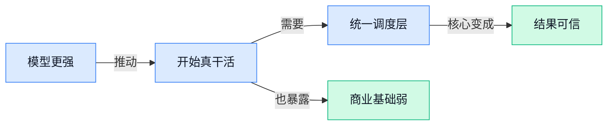

> AI 早报 · 每日早读 · 全网深度聚合

## **今日摘要**

```
OpenAI 推 GPT-Rosalind 杀入生命科学，ChatGPT 女性用户反超男性，广告变现也加速试水
Anthropic 连发 Claude Opus 4.7 与 Codex 桌面新版，编码视觉推理电脑操作记忆插件一起卷
Chrome AI Mode（AI 搜索交互模式）支持与网页并排浏览，Cloudflare AI Platform 要做 Agent 统一推理层
```

### 🔵 产品与功能更新

1. **OpenAI 推出 GPT-Rosalind（面向生命科学研究的推理模型）。**
OpenAI 发布了 **GPT-Rosalind**，主打帮助科研人员加速**药物发现**、**基因组分析**、**蛋白质推理**等任务 🧬。这里的基因组（生物体全部遗传信息的总和）和蛋白质推理（让模型理解蛋白质结构与功能关系）都属于门槛很高的生命科学工作，过去往往需要大量人工分析。对企业来说，这说明大模型正从“会聊天、会写稿”进一步走向**垂直专业场景**，尤其是高价值科研流程。更多信息可看 [OpenAI 官方发布页(briefing)](https://openai.com/index/introducing-gpt-rosalind) 💡


2. **Chrome 的 AI Mode（AI 搜索交互模式）支持与网页并排浏览。**
Google 给 Chrome 桌面端的 **AI Mode** 加了一个很实用的更新：用户点开链接后，网页会和 AI 窗口**并排显示**，不用来回切页面 🔍。这类 side-by-side（并排双栏浏览，让你一边看网页一边让 AI 解释）的设计，本质上是在降低“查资料 + 问 AI”之间的切换成本。对日常办公同事来说，这意味着以后做竞品调研、查政策、看长文档时，可能能更顺手地边读边问，效率会更高。详情可参考 [Google 官方介绍(briefing)](https://blog.google/products-and-platforms/products/search/ai-mode-chrome/) 和 [媒体完整报道(briefing)](https://techcrunch.com/2026/04/16/google-now-lets-you-explore-the-web-side-by-side-with-ai-mode/)

3. **Claude Opus 4.7（Anthropic 新一代旗舰模型）提升编码、视觉推理和多步任务能力。**
Anthropic 发布 **Claude Opus 4.7**，强调在**编码**、**视觉推理**、**多步骤任务**和 **Agent** 场景上表现更强，也更稳定、更细致 ⚙️。其中视觉推理（让模型“看懂”图片并进行分析）和多步骤任务（把复杂工作拆成连续步骤逐步完成）对企业办公特别关键，因为很多真实工作并不是一句话就能做完。简单说，这次更新更像是在补齐“复杂工作可靠完成度”这块短板，而不只是单纯追求跑分。可查看 [Anthropic 官方发布页(briefing)](https://www.anthropic.com/news/claude-opus-4-7)

4. **Codex 新版桌面应用加入电脑操作、应用内浏览、记忆和插件。**
OpenAI 更新了 **Codex** 应用的 macOS 和 Windows 版本，新增**computer use（电脑操作能力，让 AI 直接代你点按和执行桌面任务）**、应用内浏览、**image generation（图像生成，让 AI 直接生成图片内容）**、**memory（记忆功能，让工具记住你的偏好和上下文）**以及插件等能力 💻。虽然 Codex 主要面向开发者，但这次升级的方向很明确：AI 不再只是在对话框里给建议，而是开始真正“动手做事”。这也说明桌面级 **Agent** 正在变成各家竞争焦点，未来类似能力很可能会扩展到更多办公软件场景。详细可见 [OpenAI 官方更新页(briefing)](https://openai.com/index/codex-for-almost-everything) 和 [TechCrunch 解读报道(briefing)](https://techcrunch.com/2026/04/16/openai-takes-aim-at-anthropic-with-beefed-up-codex-that-gives-it-more-power-over-your-desktop/)

### 🟢 前沿研究

1. **LangFlow（一种把“扩散模型”思路用于文本生成的新语言模型）证明连续扩散也能和主流离散模型掰手腕。**
这篇研究想解决一个老问题：**扩散模型**（一种通过“逐步去噪”来生成内容的模型，常见于 AI 画图）在图像里很强，但到了**语言建模**（让模型按上下文生成下一段文字）里，过去一直不如主流路线。作者提出的 **LangFlow** 表明，**连续扩散**（不是一个字一个字离散选择，而是在连续表示空间里逐步生成）也能在语言任务上实现有竞争力的效果 💡。如果这个方向继续成立，未来文本模型的技术路线可能不再只盯着“下一个词预测”一条路，对生成质量、可控性和推理步数都有潜在影响。可先看 [arxiv 论文原文(briefing)](https://arxiv.org/abs/2604.11748) 或 [HuggingFace 论文页(briefing)](https://huggingface.co/papers/2604.11748) 了解原始内容。


2. **Self-Distillation Zero（一种让模型靠自我修订把粗奖励变细反馈的训练方法）尝试把“只知道对错”变成“知道哪里该改”。**
这项工作聚焦模型训练里很关键的一步：很多时候系统只能拿到**二元奖励**（只有“答对/答错”这种简单反馈），但这种信号太粗，难以指导模型精细提升。作者提出 **Self-Revision**（自我修订，让模型先自己检查再修改答案）的思路，把原本稀疏的反馈转成更密集的监督，相当于把“这题错了”升级成“错在第几步、该怎么改” 🚀。对企业来说，这类方法的意义在于，它可能帮助模型在更少人工标注下学得更稳，尤其适合那些很难逐条精细打分的场景。[HuggingFace 论文页(briefing)](https://huggingface.co/papers/2604.12002)


### 🟡 行业展望与社会影响

1. **OpenAI 称 ChatGPT 女性用户已超过男性，彻底扭转上线初期“男多女少”格局。**
OpenAI 表示，ChatGPT 刚推出时用户性别结构大约是 **80% 男性、20% 女性**，而现在已经变成**女性多于男性**，这说明生成式 AI（能直接生成文字、图片等内容的人工智能）正在从“技术爱好者工具”走向更广泛的大众日常工具 📈。这类变化对企业很重要：当用户群体更均衡，产品设计、内容表达、客服、教育、招聘等场景的需求也会变得更丰富，不再只是偏“技术圈”的使用方式。对做业务和运营的同事来说，这也意味着未来面向普通用户的 **AI 产品体验**、**沟通语气** 和 **功能入口**，都要更考虑不同人群的真实使用习惯。[完整报道(briefing)](https://the-decoder.com/openai-says-more-women-than-men-now-use-chatgpt-flipping-an-80-20-male-split-at-launch/)


2. **OpenAI 想在 ChatGPT 里卖更多广告，但广告主连基础投放工具都还嫌不够用。**
报道指出，OpenAI 正考虑在 ChatGPT 中拓展**广告业务**，但广告主目前更现实的痛点是：现有工具还不够成熟，连最基础的投放、衡量和品牌控制能力都存在短板 😅。这里的广告工具，通常涉及 **定位能力**（把内容展示给更合适的人）、**效果归因**（判断一条广告到底有没有带来下单或留资）和 **品牌安全**（避免广告出现在不合适内容旁边）—— 这些都是成熟广告平台的基本功。对行业来说，这说明 **AI 搜索/AI 助手商业化** 虽然前景很大，但要真正吃到广告预算，不能只靠流量和热度，还得先补齐面向企业客户的基础设施。[完整报道(briefing)](https://the-decoder.com/openai-wants-to-sell-more-ads-in-chatgpt-but-advertisers-are-struggling-with-basic-tools/)


### 🟣 开源TOP项目

1. **marketingskills（面向 Claude Code 的营销能力包）让 AI 代理也能做增长工作。**
这个开源项目把 **CRO（转化率优化，让更多访客变成下单或留资用户）**、**SEO（搜索引擎优化，提升网页在搜索结果里的曝光）**、文案写作、数据分析和增长工程整理成可复用的技能模块，目标是让 Claude Code 和其他 AI 代理直接调用 💡。对运营、市场甚至产品同事来说，这类项目的价值在于：以后不只是“问 AI 写文案”，而是让它按更完整的营销流程给出方案。它也反映出一个趋势：AI 工具开始从聊天助手，走向更像“会干活的数字同事” 🚀。[GitHub 项目页(briefing)](https://github.com/coreyhaines31/marketingskills)


2. **impeccable（帮助 AI 做出更好设计的设计语言）瞄准“AI 审美不稳定”这个痛点。**
这个项目主打一套给 AI 使用的 **design language（设计语言，一套统一的视觉规则和表达规范）**，帮助 AI 在生成界面、版式和视觉方案时更一致、更靠谱 🎨。对设计和产品团队来说，它的意义在于把“让 AI 产出更像专业设计稿”这件事，往标准化推进了一步，而不是每次都靠 prompt 碰运气。简单说，它像是给 AI 一份更清晰的“品牌视觉手册”，减少生成结果忽好忽坏的问题。[GitHub 仓库(briefing)](https://github.com/pbakaus/impeccable)


3. **antigravity-awesome-skills（超 800 个 AI 代理技能合集）成了 Claude Code 生态的大型工具箱。**
这个仓库收集了 **800+ Agentic Skills（让 AI 代理按步骤执行具体任务的能力模板）**，覆盖 Claude Code、Antigravity 和 Cursor，可理解为一整套“现成可装的 AI 工作技能包” 🧰。摘要还提到其中包含 Anthropic 和 Vercel 的官方技能，说明它不只是民间拼盘，也吸收了主流团队的实践经验。对企业用户来说，这类项目的价值很直接：比起从零教 AI 做事，不如先拿成熟模板快速落地，提高稳定性和效率。[项目合集页面(briefing)](https://github.com/sickn33/antigravity-awesome-skills)


4. **daily_stock_analysis（大模型驱动的多市场股票分析系统）把行情、新闻和 AI 判断放到一个盘里。**
这个项目面向 **A/H/美股** 市场，整合多数据源行情、实时新闻、**LLM（大语言模型，能理解和生成文字的 AI 模型）** 决策仪表盘以及多渠道推送，主打低成本定时运行 📈。对非技术同事也很好理解：它不是单纯给你一堆数据，而是试图把“看盘、看新闻、做总结、发提醒”串成一条自动化流程。对于金融、投资研究或信息跟踪场景，这类开源项目很有参考价值，因为它展示了 AI 如何把分散信息变成更可执行的日常分析结果。[GitHub 项目说明(briefing)](https://github.com/ZhuLinsen/daily_stock_analysis)

5. **last30days-skill（追踪过去 30 天全网话题的 AI 技能）适合做舆情、选题和趋势扫描。**
这个技能会跨 Reddit、X、YouTube、HN（Hacker News，海外知名科技社区）、Polymarket（一个预测市场平台，用户会用下注方式表达对事件结果的判断）以及网页资料搜集信息，然后输出一份 **grounded summary（有来源依据的总结，不是凭空生成）** 🧠。它最适合内容、市场、品牌和战略同事使用，因为很多工作本质上就是“快速看清最近一个月大家在讨论什么”。相比只问 AI “最近有什么趋势”，这种做法更强调先搜集再归纳，结果通常也更扎实。[GitHub 技能页(briefing)](https://github.com/mvanhorn/last30days-skill)

6. **awesome-claude-code（Claude Code 生态资源清单）帮用户一站式找技能、命令和插件。**
这是一个面向 Claude Code 的精选资源库，整理了 **skills（技能包，让 AI 会做特定任务）**、**hooks（钩子，在特定时机自动触发的扩展机制）**、**slash-commands（斜杠命令，用简短指令快速调用功能）**、代理编排器和各类应用插件 📚。对刚进入 Claude Code 生态的人来说，这类“导航型仓库”非常实用，因为它能大幅降低上手门槛，不用自己到处零散搜索。换句话说，它像一份不断更新的“Claude Code 工具地图”，特别适合想系统了解生态的人。[精选仓库列表(briefing)](https://github.com/hesreallyhim/awesome-claude-code)

### 🔴 社媒分享

1. **Qwen3.6-35B-A3B（阿里通义千问的新模型版本）在笔记本上画出的鹈鹕，竟比 Claude Opus 4.7 更好。**
这条分享来自 Simon Willison 用一个有点“玩梗”的画图测试做对比：让模型画“骑自行车的鹈鹕”，结果他觉得本地运行的 **Qwen** 版本比 **Claude Opus 4.7** 更出彩 😄。有意思的点不只是“谁画得更好”，而是它提醒大家：一些能在个人电脑上跑的模型，已经能在特定任务上和顶级闭源模型掰手腕。这里的 **35B** 指 350 亿参数规模，**A3B** 是该模型版本命名的一部分；而“本地运行”意味着数据不用上传云端，对重视隐私和成本的团队很有吸引力。想看作者放出的对比图和原话，可以读 [作者完整博文(briefing)](https://simonwillison.net/2026/Apr/16/qwen-beats-opus/#atom-everything) 💡


2. **Cloudflare AI Platform（Cloudflare 推出的 AI 应用基础平台）想做 Agent 的统一推理层。**
Cloudflare 这次强调的不是单个模型，而是一整套给 **Agent** 用的底层能力：把模型调用、工具连接和运行环境尽量整合到一起，让开发者少折腾基础设施 🚀。这里的 **inference layer（推理层，让训练好的模型真正开始回答问题的运行层）**，可以理解成“AI 干活时的操作系统”；而 Agent 场景往往还要接数据库、网页、企业系统，链路比普通聊天机器人复杂得多。对企业来说，这类平台化思路的意义在于：未来做客服、内部助手、自动化流程时，可能更像搭积木，而不是从零搭一套 AI 后台。[官方发布文章(briefing)](https://blog.cloudflare.com/ai-platform/) 里讲了它面向 Agent 的定位与设计思路。


3. **Claude Opus 4.7（Anthropic 最新旗舰模型版本）发布，继续冲高端复杂任务。**
Anthropic 公开了 **Claude Opus 4.7**，从命名就能看出它是 **Claude Opus** 这条高性能产品线的新版本。虽然这则发布页摘要信息不多，但能明确的是，Anthropic 正在持续迭代旗舰模型，瞄准更复杂、更高要求的使用场景，例如长文本处理、多步骤分析和更稳定的高质量输出。对普通办公用户来说，这类升级通常会体现在“更会写、更会想、更不容易答偏”；对企业采购者来说，则意味着顶级模型之间的竞争还在加速。[Anthropic 官方发布页(briefing)](https://www.anthropic.com/news/claude-opus-4-7) 可查看原始信息。

4. **Sentence Transformers（一个常用文本向量模型工具库）现在支持训练多模态 embedding（把图片和文字都变成可比较的数字坐标）与 reranker（重排序模型，专门负责从候选结果里重新排优先级）模型。**
HuggingFace 这篇文章更偏开发者，但对业务同事也有现实意义：企业以后做“图文混合搜索”“以图找商品”“知识库精准召回”时，底层工具正在变得更成熟 📚。所谓 **multimodal（多模态，指文字、图片等不同类型信息一起处理）**，就是让模型不只懂字，也能理解图；而 **fine-tuning（用特定数据微调模型，让它更懂你所在行业）** 则意味着公司可以用自己的资料把效果再往上拉。简单说，这类能力会直接影响企业搜索、推荐、客服知识库和内容管理系统的“找得到、排得准”。具体训练方法可参考 [HuggingFace 技术博客(briefing)](https://huggingface.co/blog/train-multimodal-sentence-transformers)。

5. **GPT‑Rosalind（OpenAI 面向生命科学研究的专用模型）瞄准生命科学科研场景。**
OpenAI 推出的 **GPT‑Rosalind**，从名字和定位就能看出，它不是通用聊天模型的简单换壳，而是面向 **life sciences（生命科学，包括生物、医药、基因等研究方向）** 的专用研究助手。对这个行业来说，真正有价值的往往不是“会聊天”，而是能不能帮助研究人员更快整理文献、分析实验线索、提出有用假设 🧪。这也反映出一个明显趋势：AI 正从“人人都能用的通用助手”，走向“面向具体行业的专业助手”，以后金融、法律、制造等领域大概率也会越来越细分。[OpenAI 官方介绍(briefing)](https://openai.com/index/introducing-gpt-rosalind/) 给出了该产品的定位说明。

---



### 📊 行业洞察（今日 4 条）

1. Anthropic 发布 Claude Opus 4.7，OpenAI 也把 Codex 升级成可操作电脑、会记忆、能长期执行任务的桌面 Agent
  【洞察】大厂竞争点已经从“谁更会答题”转向“谁能稳定把事做完”，Agent 正从演示玩具变成真实生产工具

2. Google 给 Chrome 的 AI Mode 加上网页并排浏览，用户查资料时不用在网页和聊天框之间来回切换
  【洞察】AI 产品下一阶段比的不是模型参数，而是谁把真实工作流里的“麻烦切换”删得更干净，体验正在吃掉一部分模型差距

3. OpenAI 推出 GPT-Rosalind，专门服务生命科学研究；同时 ChatGPT 女性用户已反超男性
  【洞察】AI 正同时走两条路：一条是深入高价值专业行业，一条是渗透更广泛大众人群，通用入口和垂直场景会一起增长

4. OpenAI 想在 ChatGPT 里扩大广告，但广告主却抱怨连基础投放、衡量和品牌控制都不够成熟
  【洞察】AI 流量很热不等于商业模式已跑通，企业真金白银买单看的是可控和可衡量，不是“大家都在聊”

### 💭 对我们的启发（今日 3 条）

1. Claude Opus 4.7 和 Codex 都在强化多步任务与电脑操作，这验证了“用户需要的不只是聊天，而是可执行方案”。我们平台要优先做结果验收、过程可见和中途接管。

2. Google 的并排浏览说明，用户不愿为“切来切去”付出耐心。我们做 Agent 调度时，别只想后台多聪明，更要想前台怎么让人随时看懂、改得动、接得上。

3. OpenAI 广告工具不成熟是个提醒：光有流量和模型不够，平台价值要建立在评价、选择、信任这些基础设施上。否则后面商业化时会卡在“没人敢放心用”。


---

> 本周周报：[第16周综合分析](/blog/weekly/2026-w16/)
