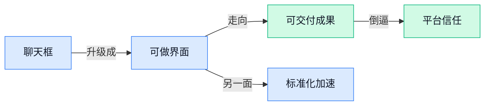

> AI 早报 · 每日早读 · 全网深度聚合

## **今日摘要**

```
Anthropic 推出 Claude Design，中文实测三轮对话做出可交互原型，AI 设计协作直冲生产级
Google 连发 AI Agent 三板斧，生成式界面标准落地、Chrome AI Mode 升级、Gemini 接入 Photos 造“像你”图片
成立仅 4 个月，Recursive Superintelligence 狂揽 5 亿美元，Cerebras 冲刺上市，资本重押 AI 底层基建
```

### 🔵 产品与功能更新

1. **Anthropic 推出 Claude Design，想把“做视觉稿”变成对话式协作。**
Anthropic 发布了 **Claude Design**，这是 Anthropic Labs（Anthropic 的实验产品部门）推出的新产品，主打和 Claude 一起完成**设计稿、原型、演示文稿、单页说明**等视觉内容 ✨。官方介绍强调，它不是单纯生成图片，而是让用户通过对话逐步协作，做出更完整、更像成品的视觉表达；TechCrunch 也提到，这个产品特别面向**没有设计背景**的创始人和产品经理，帮助他们更容易把想法讲清楚 💡。这意味着 AI 正从“帮你写字”进一步走向“帮你做成可展示的方案”，对需要频繁写方案、做汇报、提需求的同事会更有感。[Anthropic 官方发布页(briefing)](https://www.anthropic.com/news/claude-design-anthropic-labs) [TechCrunch 完整报道(briefing)](https://techcrunch.com/2026/04/17/anthropic-launches-claude-design-a-new-product-for-creating-quick-visuals/)


2. **Google 推出面向 AI Agent 的生成式界面标准。**
Google 发布了一个新的**生成式界面标准**，目标是让 **AI Agent**（能代替人执行多步任务的 AI 助手）不只是返回一段文字，还能直接生成可操作的界面组件 🧩。简单说，以后 Agent 在完成任务时，可能会像“边思考边搭界面”，把按钮、表单、结果卡片这类交互内容一起组织出来，而不是让用户自己再手动拼流程。对企业产品来说，这类标准一旦被采用，可能会让“聊天框 + 工具页面”逐渐融合，AI 产品的交互方式会更统一、更容易落地。[相关报道解读(briefing)](https://the-decoder.com/google-launches-generative-ui-standard-for-ai-agents/)

3. **Gemini app 开始用个人上下文和 Google Photos 生成更“像你”的图片。**
Google 宣布 Gemini app 新增更个性化的图片创建方式，**Nano Banana 2**（Google 的图像生成模型版本）现在会结合你的**个人上下文**和 **Google Photos**（Google 相册服务）来生成更贴近你真实生活的图片 🖼️。这类“个人上下文”可以理解为 AI 在得到授权后，参考你自己的内容与使用习惯，让结果不再千篇一律，而是更有“私人定制”味道。对普通用户来说，这代表 AI 生成图片正从“好看”走向“更懂你”；对做内容、活动和品牌物料的同事来说，也预示着个性化创意产出会越来越常见。[Google 官方说明(briefing)](https://blog.google/innovation-and-ai/products/gemini-app/personal-intelligence-nano-banana/)

4. **Chrome 里的 AI Mode 升级，Google 想把“逛网页”也变成 AI 协作。**
Google 介绍了 Chrome 中 **AI Mode**（AI 模式，用对话方式辅助搜索和浏览网页）的新能力，核心方向是重新定义用户和网页内容的互动方式 🌐。从官方表述看，这次升级不是单纯多加一个问答入口，而是要让浏览网页这件事本身更像和 AI 一起探索信息、理解页面、推进任务。对日常办公场景来说，这类能力如果成熟，可能会让查资料、比信息、做初步整理这些动作变得更顺手，浏览器也会更像一个随时待命的工作助手。[Google 官方发布页(briefing)](https://blog.google/products-and-platforms/products/search/ai-mode-chrome/)

5. **中文实测称 Claude Design 三轮对话就能做出可交互原型。**
一篇中文体验文章把 Claude Design 形容为设计圈的 **Claude Code** 时刻，意思是它可能像 Claude Code（Claude 的编程助手产品）影响写代码那样，开始改变设计工作的流程 🚀。作者实测称，只用三轮对话就产出了**可交互原型**，也就是能模拟点击、跳转和流程体验的设计样稿，比静态图片更接近真实产品。虽然这是一篇体验观察，不是官方功能清单，但它提供了一个很实际的信号：AI 设计工具正在从“给灵感”走向“直接交付可讨论的半成品”。[中文体验文章(briefing)](https://baoyu.io/blog/2026-04-17/claude-design)

### 🟢 前沿研究

1. **新基准发现：图表一复杂，顶尖 AI 模型性能会掉近一半。**
一项新评测显示，AI 把图表“看懂并转成代码”的能力，在简单场景还不错，但一旦遇到更复杂的**坐标轴、图例、颜色映射**和多层结构，表现就明显下滑 📉。这类基准测试关注的是 **Chart-to-Code（把图表自动转成可编辑代码，方便复刻和修改）** 能力，本质上是在考验模型是否真正理解图表，而不只是“看个大概”。对业务和设计同事来说，这意味着：别太早把复杂报表、信息图交给 AI 自动生成，尤其是需要高准确度的汇报材料，仍然要有人审校 💡。具体测试背景与结果可看 [图表基准完整报道(briefing)](https://the-decoder.com/even-the-best-ai-models-lose-about-half-their-performance-when-charts-get-complicated-new-benchmark-finds/)。


2. **成立仅 4 个月，Recursive Superintelligence 拿下 5 亿美元融资。**
这家主打 **self-improving AI（自我改进 AI，指模型能利用反馈持续优化自己表现）** 的创业公司，在成立极短时间内就获得大额融资，说明资本市场仍在押注更强的“会自己进化”的模型路线 🚀。从行业信号看，大家关注的不只是模型会不会回答问题，而是它能否在任务执行中形成持续改进能力，这背后也常与 **recursive（递归式，像不断复盘再升级的循环过程）** 训练思路有关。对普通公司来说，这类消息的意义不在“跟风投钱”，而在于未来 AI 产品可能不只是工具，而会更像能边做边学的长期助手。更多细节可见 [融资动态报道(briefing)](https://the-decoder.com/self-improving-ai-startup-recursive-superintelligence-pulls-in-500-million-just-four-months-after-founding/)。


3. **开发者把 Claude 的系统提示词整理成 Git 时间线，AI“幕后设定”更透明了。**
Simon Willison 把 Anthropic 发布过的 Claude **system prompts（系统提示词，模型在回答前必须遵守的隐藏规则）** 做成了 **git timeline（像版本管理记录一样的时间线，方便看每次改了什么）**，让外界能更直观看到模型行为规则是怎样一步步演变的 🧭。这类整理的价值在于，它不只是“围观提示词”，更能帮助大家理解模型为什么会突然更谨慎、更多话，或者在某些任务上风格变化明显。对企业用户来说，系统提示词其实就像 AI 产品的“隐形制度”，会直接影响输出边界、语气和可靠性。相关整理与方法可看 [提示词时间线整理(briefing)](https://simonwillison.net/2026/Apr/18/extract-system-prompts/#atom-everything) 和 [GitHub 研究页面(briefing)](https://github.com/simonw/research/tree/main/extract-system-prompts#readme)。

### 🟡 行业展望与社会影响

1. **Anthropic CEO 继续押注 AI 扩展：能力天花板远未到来。**
Anthropic CEO Dario Amodei 在公开表态中再次强调，**AI scaling（规模化扩展，指通过更多算力、数据和更大模型持续提升能力）** 还没有走到尽头，他用“**rainbow（彩虹，比喻能力提升空间还很长）**”来形容未来潜力 🌈。这类判断的行业意义很直接：头部公司会继续砸钱建设**算力**、训练更大的模型，也会进一步拉高竞争门槛。对普通企业来说，这意味着未来一两年 AI 能力大概率还会继续上台阶，今天觉得“不太行”的场景，可能很快就能被新模型补上 💡。[完整报道解读(briefing)](https://the-decoder.com/anthropic-ceo-amodei-declares-there-is-no-end-to-the-rainbow-for-ai-scaling/)


2. **小型开源模型也能抓安全漏洞，Anthropic 的“神话时刻”被迅速追平。**
一篇对比报道指出，Anthropic 之前展示的**cybersecurity（网络安全，主要指发现系统漏洞和潜在攻击风险）** 能力，并没有长期停留在“只有顶级闭源模型才能做到”的阶段。如今一些更小的**open models（开源模型，外部开发者可下载和修改的模型）**，也开始找到相似类型的安全问题，这说明模型能力扩散得比很多人想象更快 ⚠️。这对行业是个很现实的提醒：一方面，AI 安全工具会更便宜、更普及；另一方面，攻防两端都在升级，企业不能只盯着“谁家模型最强”，更要重视实际部署和风控。换句话说，AI 的竞争不只是在实验室里比参数，也在比谁能更快把能力落到真实场景里 🚀。[对比报道原文(briefing)](https://the-decoder.com/the-myth-of-claude-mythos-crumbles-as-small-open-models-hunt-the-same-cybersecurity-bugs-anthropic-showcased/)


3. **黄仁勋谈 TPU、华为与出口管制：英伟达真正的底气是 CUDA 生态。**
在一场长达两小时的访谈里，黄仁勋系统回应了外界最关心的几个问题：为什么英伟达不太怕 **TPU（Google 自研的 AI 专用芯片，主要用于训练和运行大模型）**、不太怕华为，也不把出口管制视为决定胜负的唯一变量。核心逻辑是 **CUDA（英伟达的软件生态，相当于让开发者“默认围着它写程序”的工具体系）** 已经形成很深的护城河，很多 AI 应用和研发流程都建立在这套生态之上。对非技术同事也很好理解：芯片竞争不只是“谁硬件更强”，更是“谁的软件、开发者和客户习惯更难替代” 🧠。这也解释了为什么 AI 产业的竞争，越来越像“平台战”而不只是单点产品战。[专访全文整理(briefing)](https://baoyu.io/blog/jensen-huang-dwarkesh-interview)


4. **AI 芯片公司 Cerebras 申请上市，资本继续押注大模型底层基础设施。**
AI 芯片创业公司 Cerebras 已提交 **IPO（首次公开募股，企业第一次向公众发行股票上市）** 申请，释放出一个明确信号：资本市场依然愿意为 AI 的底层硬件买单 📈。报道提到，这家公司近月先后宣布与 **Amazon Web Services（亚马逊云服务平台）** 合作，让自家芯片进入亚马逊数据中心，还拿下了与 OpenAI 的大额合作。对行业来说，这不只是“一家公司要上市”，更说明围绕大模型的竞争正在从模型层往下延伸到**数据中心**、芯片和云基础设施。谁能控制更便宜、更高效的算力，谁就更有机会在下一轮 AI 竞争里占据主动 🚀。[TechCrunch 报道(briefing)](https://techcrunch.com/2026/04/18/ai-chip-startup-cerebras-files-for-ipo/)

### 🟣 开源TOP项目

1. **claude-mem：给 Claude Code 装上“长期记忆”。**
这个项目是一个 Claude Code 插件，会自动记录 Claude 在编程会话里的操作，再用 AI 做压缩整理，并把后续任务真正需要的上下文重新喂回去 💡。通俗说，它像是帮 AI 建了一本“工作笔记”，避免每次新开会话都从零开始，大幅减少上下文断片。这里的 agent-sdk（Agent 开发工具包，用来让 AI 按规则调用能力、完成多步任务）也点明了它不是简单存日志，而是在做更实用的**记忆管理**与**上下文续接**。[GitHub 项目页(briefing)](https://github.com/thedotmack/claude-mem)


2. **superpowers：把 Agent 能力做成可复用的“技能框架”。**
obra/superpowers 主打的是一套 agentic skills framework（Agent 技能框架，把 AI 能做的事拆成可重复调用的技能模块）和软件开发方法论，不只是“让 AI 回答问题”，而是让它更像按流程协作的成员 🚀。对团队来说，这类项目的意义在于把零散 prompt 变成更稳定的**工作套路**，让 AI 在不同任务里复用同一种做事方式。methodology（方法论，指一套可执行的工作原则和步骤）这个词也说明，它想解决的是“AI 能不能持续稳定干活”，而不只是一次性演示效果。[GitHub 仓库(briefing)](https://github.com/obra/superpowers)


3. **gstack：把 CEO、设计、研发管理、测试等角色打包成一套 Claude Code 工作流。**
garrytan/gstack 提供的是 Garry Tan 本人使用的 Claude Code 配置，内含 23 个带明确分工的工具，覆盖 **CEO**、设计、工程经理、发布经理、文档工程师、QA 等角色分工 😮。QA（质量测试，负责提前发现产品问题）和 Release Manager（发布经理，负责把版本稳定上线的人）这类角色被做成工具后，意味着 AI 不再只是“写代码助手”，而是开始参与更完整的研发协作链条。对非技术同事也很好理解：这像是把一个产品团队的多个岗位流程，尽量标准化后交给 AI 辅助执行。[项目主页(briefing)](https://github.com/garrytan/gstack)


4. **Multica：把编程 Agent 变成会接活、会汇报、会卡点反馈的“数字同事”。**
Multica 的核心卖点很直白：你可以像给同事派工一样，把 issue（任务单，通常用来记录要修什么问题、做什么功能）分配给 Agent，它会自己接手、写代码、汇报 blocker（阻塞项，也就是“卡住了、需要人帮忙”的问题）并更新状态 📌。这让 AI 从“等你一句句指挥”变成更接近真实协作对象的存在，尤其适合任务较多、需要持续跟进的团队。它强调 autonomously（自主地完成，不是每一步都等人手动确认），说明重点是**流程协作**，而不是单次生成代码。[GitHub 项目页(briefing)](https://github.com/multica-ai/multica)

5. **andrej-karpathy-skills：把 Andrej Karpathy 风格的 AI 技能集开源出来。**
虽然候选摘要里没有更多介绍，但从项目名称可以明确看出，它主打的是一套可直接复用的 skills（技能包，把常见任务整理成一组标准动作）🧩。这类项目通常对想快速搭建 Agent 工作流的人很有吸引力，因为比起自己从头写 prompt，直接套一组成熟技能更省时间。对普通团队来说，它的价值在于把“高手经验”沉淀成可复制模板，让 AI 使用方式更统一。[GitHub 仓库页(briefing)](https://github.com/forrestchang/andrej-karpathy-skills)

6. **OpenAI 开源 Agents Python：轻量但完整的多 Agent 工作流框架。**
这个项目是 OpenAI 推出的 Python（常用于 AI 开发的主流编程语言）框架，定位是轻量但功能强，专门用于搭建 multi-agent workflows（多 Agent 工作流，让多个 AI 分工协作完成任务）⚙️。它的价值不只是“又一个开发库”，而是给开发者一个更标准的方式去组织多个 AI 角色如何协作、交接和完成复杂任务。framework（框架，像搭积木时先给你准备好的骨架）这一点很关键：它降低了团队从单个聊天机器人，走向**多角色 AI 系统**的门槛。[OpenAI 官方仓库(briefing)](https://github.com/openai/openai-agents-python)

### 🔴 社媒分享

1. **美国教师用打字机“反 AI 作业”，顺手把课堂拉回慢思考。**
一位大学老师为了减少学生直接交 **AI 代写** 内容，干脆把写作工具换成了打字机，这个做法一下子在社媒上引发很多讨论 📝。这件事有意思的地方不只是“防作弊”，更是在提醒大家：当 **生成式 AI** 越来越会写，学校到底还要教什么、怎么判断学生真的理解了内容。对职场人来说，这也像个缩影——以后真正值钱的，可能不只是“写得出来”，而是能不能展示自己的思考过程与判断。可看这篇[完整报道(briefing)](https://sentinelcolorado.com/uncategorized/a-college-instructor-turns-to-typewriters-to-curb-ai-written-work-and-teach-life-lessons/)了解讨论背景 💡


2. **设计师视角复盘 Claude Design：AI 设计协作正在变得更像“搭档”而不是“工具”。**
这篇文章分享了作者对 **Claude Design（Claude 的设计协作使用体验，指用 AI 参与界面与产品设计思考）** 的真实感受，重点不在炫技，而在 AI 怎么融入日常设计流程 🎨。它反映出一个越来越明显的趋势：大家讨论的已经不只是模型“会不会做图”，而是它能不能参与结构梳理、方案比较和表达优化。对运营、产品、设计同事也很有参考价值，因为这类 AI 协作更像是在帮人补“思路”和“反馈回路”，而不是一键替代工作。[作者体验原文(briefing)](https://samhenri.gold/blog/20260418-claude-design/)里能看到更完整的使用感受与判断 🚀


3. **《Servers, Satellites, and Stars》把 AI、基础设施与太空放进同一张产业地图。**
Stratechery 这篇文章从 **servers（服务器，承载 AI 和互联网服务的核心计算设备）**、卫星到太空产业切入，讨论这些看似分散的领域如何在今天的科技竞争中彼此牵动 🌌。它值得转发的原因在于，AI 热潮背后不只是聊天机器人，更是 **基础设施**、能源、网络覆盖和资本布局的连锁反应。对非技术同事来说，这能帮助理解为什么大公司一边做模型，一边又在拼数据中心、卫星网络和长期资源配置——因为这些已经不是孤立业务，而是一整套未来能力版图。[原文分析(briefing)](https://stratechery.com/2026/servers-satellites-and-stars/)提供了更完整的产业视角 📡

4. **为什么“对聊天机器人友善一点”可能不是玄学，而是有研究依据。**
这篇报道讨论了一个很多人都有体感的话题：和聊天机器人说话更礼貌，结果是不是会更好一点 🤖。文章把讨论拉回到 **alignment（对齐，让模型行为尽量符合人类意图的训练过程）** 和 **interpretability（可解释性，研究人员用来理解模型“脑子里”怎么做判断的方向）** 上，尝试解释人类表达方式为什么会影响模型输出。对普通用户来说，这不意味着“AI 有情绪”，而是提醒我们：提问方式、上下文和语气，本来就会改变模型如何理解任务。[完整报道(briefing)](https://www.platformer.news/chatbot-emotion-research-anthropic-alignment-interpretability/)把这种“礼貌是否有用”的争议讲得比较清楚 💬

5. **Claude Opus 4.6 到 4.7 的系统提示词变化，被网友当成“AI 性格更新日志”来研究。**
Simon Willison 对比了 Claude Opus 4.6 和 4.7 的 **system prompt（系统提示词，模型上线前写给它的“总规则”和行为说明）** 差异，展现出模型行为如何通过看不见的底层规则被调整 🔍。这类内容在社媒上很容易引发关注，因为很多人第一次直观看到：AI 的回答风格、边界感和“个性”，并不只是模型自己长出来的，也和官方写下的规则强相关。对企业用户尤其重要——你看到的模型表现，往往不只取决于能力，还取决于产品团队怎么设定它该怎么说、能说什么。[系统提示词对比解读(briefing)](https://simonwillison.net/2026/Apr/18/opus-system-prompt/#atom-everything)值得一看 🧩

6. **一位 AI 作者公开自己的“大模型读图笔记法”，教你怎么真正看懂模型结构。**
Sebastian Raschka 分享了自己理解 **LLM（大语言模型）** 架构的工作流，重点是如何把复杂论文和模型结构整理成更容易看懂的图示 ✍️。这里提到的 **architecture（模型架构，指模型内部是怎么分层、怎么传递信息的“设计图”）**，其实就像看一家公司组织结构图：不必会写代码，也能先搞清谁负责什么、信息怎么流动。对想补 AI 基础但又怕论文太硬的人，这类内容很适合入门，因为它教的不是单个知识点，而是一套“怎么学”的方法。[作者工作流分享(briefing)](https://magazine.sebastianraschka.com/p/workflow-for-understanding-llms)能帮助你更系统地理解大模型世界 💡

---



### 📊 行业洞察（今日 4 条）

1. Anthropic发布 Claude Design，Google 推生成式界面标准，Chrome 里的 AI Mode 也在把逛网页变成 AI 协作
  【洞察】AI 正从“回答你”变成“直接帮你搭界面、做方案、推进任务”，产品竞争点开始从模型能力转向交付完成度

2. 中文实测称 Claude Design 三轮就能做出可交互原型，目标用户还是不会设计的创始人和产品经理
  【洞察】AI 正在吃掉“把想法先做成能讨论样子”这一步，中间型设计劳动会先被压缩，但最终拍板和审美责任还在人

3. OpenAI 开源 Agents Python（多 Agent 工作流框架），同时出现 gstack、Multica、superpowers 等一批“数字同事”项目
  【洞察】多 Agent 已从概念演示进入模板化复制阶段，门槛在快速下降；真正稀缺的不会是框架，而是稳定协作和结果可信

4. 一边是 Anthropic CEO 说能力天花板远没到，另一边小型开源模型已追平部分 Anthropic 展示过的安全找漏洞能力
  【洞察】头部模型还会继续变强，但领先优势会更快扩散；只靠“我们接了最强模型”做卖点，护城河会比想象中更薄

### 💭 对我们的启发（今日 3 条）

1. Google 推生成式界面标准、Anthropic 做 Claude Design，说明用户想要的不是一个聊天框，而是“任务过程中自动出现合适界面”，这更验证我们做 Agent 调度平台时要把结果展示层一起设计。

2. OpenAI 开源 Agents Python，加上一堆开源“数字同事”项目，说明底层编排会越来越便宜。对我们是提醒：平台价值不能停在“能接很多 Agent”，而要放在“怎么选、怎么评、怎么让人信”。

3. 小型开源模型追平部分高端能力，是机会也是冷水。机会是我们能更低成本接入更多方案；风险是如果平台没有明确评测和淘汰机制，用户会很快觉得“你这里的 Agent 都差不多”。


---

> 本周周报：[第16周综合分析](/blog/weekly/2026-w16/)
