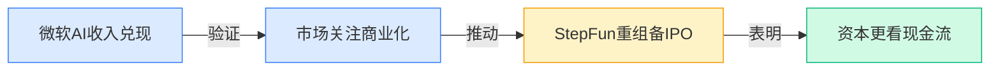
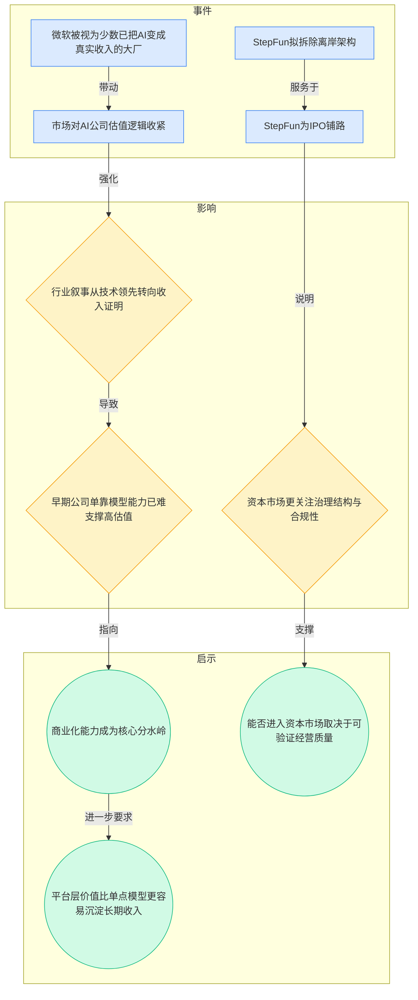
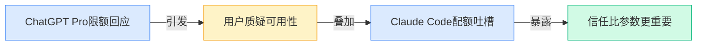
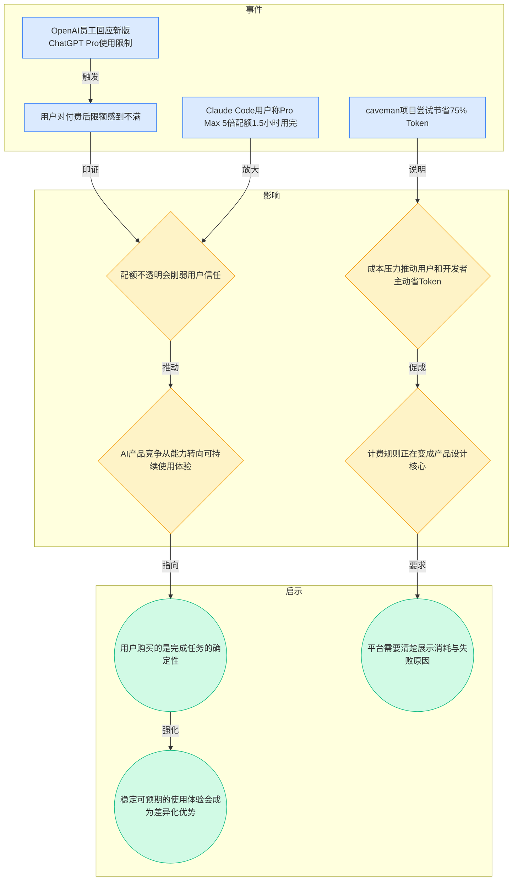
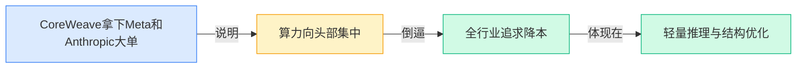
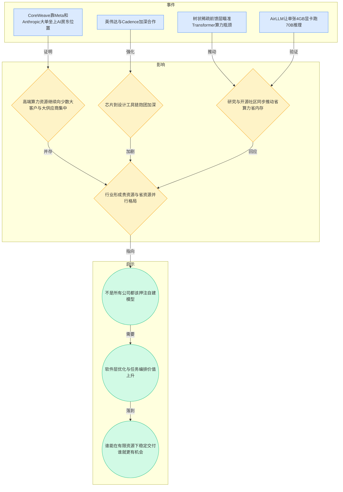
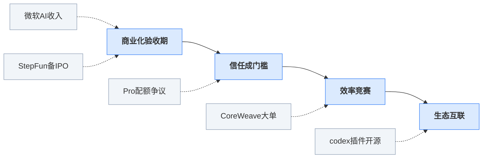

> 2026-04-13 ~ 2026-04-19 | 本周共 1 期日报

**本周日报**: [04-13](/ai-daily-site/2026/2026-04/2026-04-13/)

---

## 本周聚焦

### 从“会讲故事”到“拿出收入”：AI 行业进入商业化验收期

展开详细图谱

本周最值得重视的变化，不是又出了哪个更强模型，而是市场对 AI 公司的评判标准正在迅速切换。日报里最关键的两条，一条是“微软已经在把 AI 变成真金白银的收入”，另一条是“StepFun 拟拆除离岸架构，为 IPO 铺路”。这两件事表面上分属大厂与创业公司，实则共同指向一件事：AI 行业开始从“相信未来”进入“核验现实”。

过去一段时间，行业愿意为“技术潜力”付高溢价，哪怕产品模式、收费能力、持续交付能力都还不清晰，也能获得关注。但微软的案例说明，真正被市场高看一眼的，不再只是会发布能力升级，而是能把 AI 使用量、企业采购、订阅收入转成财务结果。StepFun 的动作则说明，连创业公司也开始为更严格的资本市场要求做准备，组织结构、合规路径、持续经营能力都变得重要。

为什么这件事重要？因为它意味着 AI 公司的竞争门槛在抬高。以前你只要证明“模型很强、增长很快”，现在还要证明“这份增长可持续、收入可解释、治理可审视”。这对行业是一次筛选：靠融资输血维持声量的公司会更难讲故事，而有真实客户价值、能形成复购与支付闭环的公司，会更容易获得资源。

对行业意味着什么？第一，资本会更偏向“卖结果”而不是“卖能力”的公司。单纯调用底层模型，越来越像薄层包装，难以建立护城河（不容易被替代的长期优势）。第二，平台型公司价值抬升。因为企业和用户最终买的不是某个参数规模，而是稳定交付、可解释成本、可追踪效果。第三，IPO 逻辑提前影响早期创业：哪怕离上市还远，团队现在也得更早思考收入结构、治理结构和合规路径。换句话说，行业正在从技术竞赛进入经营竞赛。

### 付费不等于可用：配额争议把“信任”推到台前

展开详细图谱

本周另一个非常扎眼的线索，是 OpenAI 对 ChatGPT Pro 套餐限额的回应，以及 Claude Code 用户对配额消耗过快的抱怨。再加上开源项目 caveman 通过压缩表达方式帮 Claude Code 节省大量 Token（模型处理文本时的计量单位），这些碎片其实拼成了一张很完整的图：AI 产品正在进入“算账时代”。

发生了什么并不复杂：用户付了钱，却发现“能不能顺利用完一个任务”并不确定。表面上争议的是限额设置，实质上争议的是承诺边界。用户买了 Pro、Max 之类的高阶套餐，本能预期是“我可以放心重度使用”，但如果配额规则复杂、消耗速度超预期、不同任务成本波动大，用户就会迅速从“愿意尝试”转向“怀疑被坑”。

为什么这件事重要？因为 AI 产品已经从尝鲜型工具，逐步变成工作流的一部分。一旦用户把它接入日常工作，就不再接受“偶尔不稳也没关系”。在这个阶段，模型能力提升固然重要，但“稳定完成任务的确定性”更重要。也就是说，用户感受到的价值，不只来自回答质量，还来自过程是否透明：什么时候会耗尽、为什么耗尽、失败是模型问题还是额度问题、升级后到底多了什么。这些过去像运营细节，现在正在变成核心产品能力。

对行业意味着什么？第一，配额、计费、上下文（模型一次能处理的信息范围）长度、失败提示，将从后台规则变成前台竞争。第二，越来越多工具会围绕“省 Token、降成本、提完成率”做创新，因为用户真正痛的是总任务成本，而不是单次调用价格。第三，品牌信任会受到更直接考验。以前模型厂商可以靠能力发布掩盖体验瑕疵，但当价格上去后，用户会拿 SaaS（按订阅收费的软件服务）的标准来要求 AI：说清楚、用得稳、预期一致。谁做不到，口碑就会很快反噬增长。

### 算力越来越贵，也越来越省：资源集中与降本创新同时加速

展开详细图谱

本周关于基础设施的几条新闻也很能说明行业真实处境：CoreWeave 靠 Meta 和 Anthropic 大单坐上 AI“房东”位置，英伟达与 Cadence 加深合作，说明从芯片到设计工具的上游链条正在进一步抱团；与此同时，研究侧有树状稀疏前馈层（通过减少不必要计算来降低模型耗费的结构优化方法），开源侧有 AirLLM 让低显存显卡也能跑超大模型推理。表面看似方向相反，实则是一体两面。

发生了什么？一边是高端资源继续被头部玩家锁定，能拿到大规模 GPU（图形处理器，当前 AI 训练和推理的核心算力）的人拥有更强的训练、部署和服务能力；另一边是拿不到同等资源的人，不得不从算法结构、推理框架、内存优化上寻找生路。于是行业同时出现两种趋势：最贵的资源越来越贵、最省的方案越来越多。

为什么这件事重要？因为这决定了未来竞争并不只是“有没有最强模型”，而是“你在资源约束下还能不能把任务完成”。对于大量创业公司来说，头部算力的获取难度不会快速下降，因此单纯跟着大厂拼底模（基础大模型）并不现实。真正可行的路径，是在有限资源上做更聪明的任务拆分、模型选择、上下文控制和结果评估。

对行业意味着什么？第一，基础设施层会进一步集中，类似 CoreWeave 这样的 AI“房东”价值继续上升。第二，应用层会更重视效率工程，谁能省算力、降等待、提成功率，谁就更接近真实商业化。第三，生态合作会加深，英伟达与 Cadence 的联动说明，未来硬件优势不是单点芯片，而是整条工具链协同。对于多数公司来说，机会不在最上游，而在把分散能力拼成用户可感知结果的中间层。

---

## 信号与噪音

1. Palantir CEO 直言 AI“将摧毁”文科类岗位。点评：这类表态有明显传播效应，但也提醒我们，AI 影响劳动力结构的讨论正在从抽象担忧变成管理层公开判断，未来产品叙事不能只讲提效，也要考虑“人机分工”带来的心理和组织摩擦。

2. 研究者给“世界模型”下定义，明确文生视频并不算。点评：这说明行业开始纠正概念滥用，热门词不会一直能随便借，真正有长期价值的方向会越来越强调定义边界与能力验证，对创业公司来说，命名包装的红利在下降。

3. Sam Altman 回应《纽约客》争议报道，并提到住所遭袭事件。点评：头部人物的个人舆论风险已开始反过来影响公司品牌与行业情绪，AI 公司越来越像高关注度公众机构，创始人治理、对外表达和危机承受力都在变成经营变量。

4. OpenAI 开源 codex-plugin-cc，让 Claude Code 也能调用 Codex。点评：这是一条很值得留意的互操作（不同系统可配合使用）信号，说明即便头部玩家彼此竞争，也不得不面对用户“混搭使用”的现实；未来真正强势的，不一定是封闭单体，而是能嵌进更多工作流的一方。

5. OmniVoice 开源，支持 600 多种语言的高质量语音克隆 TTS（文本转语音）。点评：多语言语音能力继续下沉到开源社区，意味着过去较稀缺的语音表现力会更快商品化；对 to C 产品来说，差异化重点将从“能不能说”转向“能否被信任、是否合规、适不适合具体场景”。

6. JoyAI-Image 作为统一多模态图像基础模型被京东开源。点评：大公司继续通过开源释放基础能力，既能扩大生态影响，也会压缩中间层纯模型公司的空间；以后只靠“我也有个图像模型”会越来越难讲出新故事，应用整合能力更重要。

7. AirLLM 让单张 4GB 显卡也能跑 70B 大模型推理。点评：虽然这不意味着低成本设备就能全面替代云端高性能部署，但它再次证明“可用性门槛”正在被工程优化持续拉低；行业并不会只朝头部集中发展，边缘侧（更轻量、本地化的运行方式）机会仍在被打开。

---

## 宏观趋势

1. 商业化验证取代技术想象。微软被认为已把 AI 变成真实收入，StepFun 也开始为 IPO 调整结构，这共同验证了资本市场正在从“看能力”转向“看经营”。未来，收入质量、复购、合规和治理会比单次技术发布更影响公司估值。

2. 用户信任正在从模型能力转向使用确定性。ChatGPT Pro 限额回应、Claude Code 配额吐槽、caveman 节省 Token 都说明，用户越来越在意“买了之后到底能不能稳定完成任务”。未来，透明计费、可解释消耗、稳定完成率会成为 AI 产品的基础门槛。

3. 算力集中与降本创新并行加速。CoreWeave、英伟达与 Cadence 说明高端资源持续向头部集中；树状稀疏前馈层、AirLLM 则说明全行业都在用技术和工程手段抵抗资源不均。未来，最有竞争力的公司不一定拥有最多算力，而是最会把算力用在刀刃上的公司。

4. 开放协作比封闭独占更贴近用户现实。OpenAI 开源 codex-plugin-cc、多个开源模型和工具同步涌现，说明用户天然会跨工具、跨模型组合使用。未来，生态连接能力、工作流兼容性和结果评估能力，可能比“单模型全包”更符合市场演进方向。

---

## 对我们的启发

产品方向上，第一，我们要把“稳定完成任务的确定性”做成核心体验，而不是默认用户理解模型限制。任务消耗、失败原因、替代方案、不同模型的成本差异，都应尽量前置说明。第二，平台评估不应只看一次输出是否惊艳，更要测试在不同措辞、不同任务复杂度下的稳定性，这会更接近真实用户价值。

竞争策略上，第一，不要把价值建立在“我们也能接某个模型”上，底层能力会持续同质化；更值得构建的是选择、编排、评估、信任这一层。第二，顺应多模型混用趋势，优先做兼容和可替换，而不是假设用户会长期绑定单一模型供应商。

时机判断上，AI 行业正在从讲故事进入交作业阶段，这对早期团队不是坏消息。只要我们能更早证明真实完成率、用户信任和成本效率，就有机会在商业化筛选阶段占到位置。

---

## 本周思考

当底层模型能力越来越接近时，用户最终会把信任交给“最强模型”，还是交给“最能稳定把事做成的平台”？
