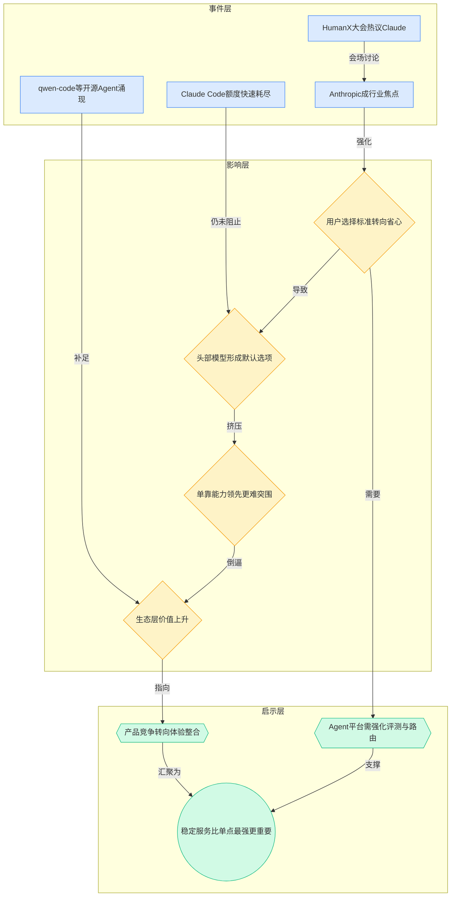
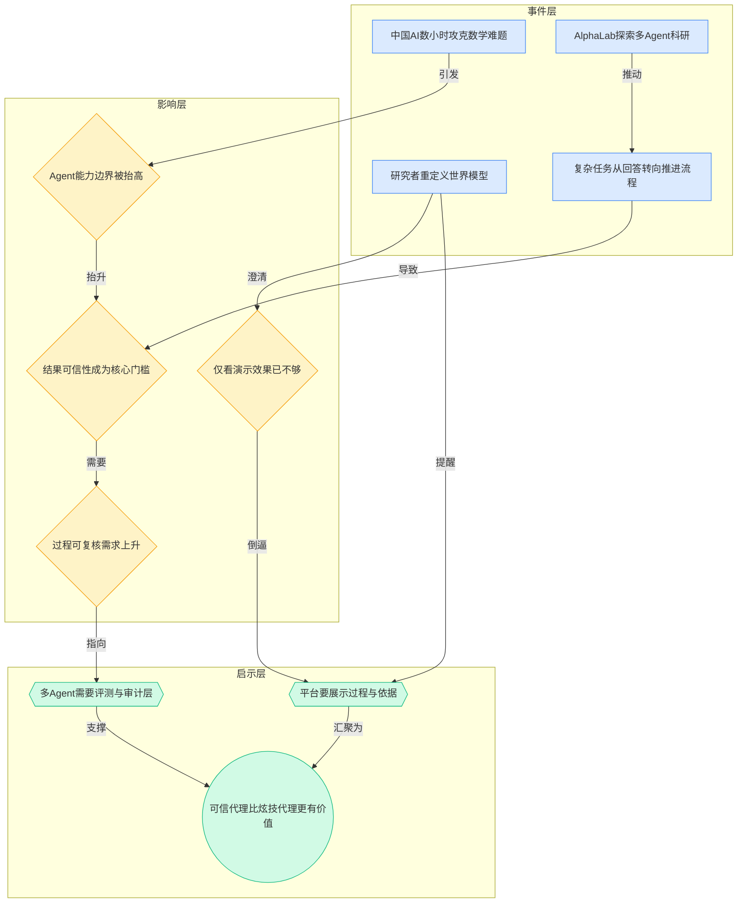
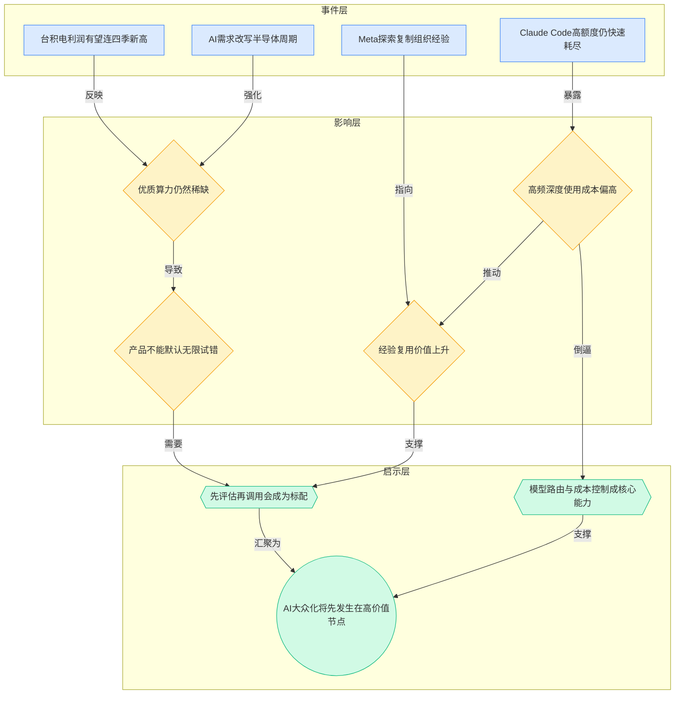
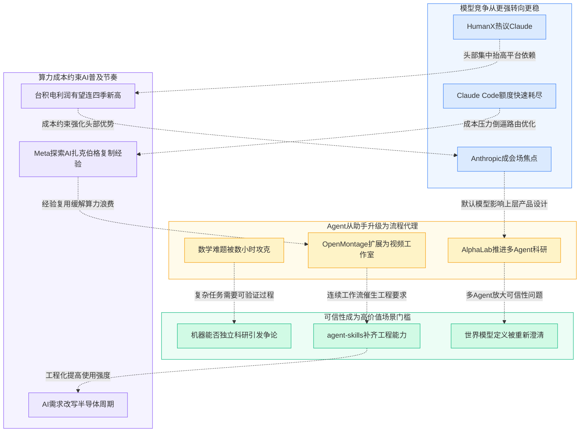

> 2026-04-13 ~ 2026-04-19 | 本周共 1 期日报

**本周日报**: [04-13](/ai-daily-site/2026/2026-04/2026-04-13/)

---

## 本周聚焦

### 1. “更强模型”之外，市场开始追逐“更省心的默认选择”
本周一个很强的会场信号来自 HumanX：大会几乎都在聊 Claude，Anthropic 成为焦点。这不是单一品牌热度的问题，而是在说明模型市场的竞争标准正在发生变化。过去大家更关注“谁在榜单上更强”，现在越来越多真实使用者开始偏向“谁更稳定、谁更少出错、谁更容易接入团队工作流（把工具真正嵌进日常工作流程）”。同一天出现的另一条信息也能互相印证：Claude Code 用户反馈，Pro Max 5 倍额度 1.5 小时就耗尽。也就是说，头部产品即便仍有成本和额度摩擦，用户依然在涌向它，说明市场对“可靠默认值”的需求，正在压过对“单次极限性能”的追逐。

这为什么重要？因为这意味着行业已经从“技术展示期”进入“选择收敛期”。在展示期，新模型只要在某个 benchmark（基准测试）上赢一点，就有传播空间；但在选择收敛期，用户真正关心的是：能不能持续用、团队里大多数人会不会用、出问题时能不能解释、采购和上线风险大不大。Anthropic 被热议，本质上反映的不是大家突然不在乎性能，而是企业和开发者开始用“总体使用体验”来投票。

对行业意味着什么？第一，后来者只靠再做一个“平均能力更强一点”的模型，会越来越难突围。第二，围绕头部模型形成的生态位会更值钱，比如代码 Agent、工作流封装、组织知识复用、结果审查与评测层。第三，用户会越来越接受“模型不是主角，能把模型变成稳定服务的平台才是主角”。这对创业公司尤其关键：如果底层模型头部集中加快，那么上层产品的护城河就不能建立在“我们也能接一个最强模型”，而要建立在“我们能把复杂选择变成可信结果”。

从本周素材看，开源项目如 qwen-code、agent-skills、claude-code-local 也在侧面证明这一点：大家不是在单纯追求一个聊天机器人，而是在补齐终端执行、工程技能、本地替代这些“可用性缺口”。模型战争表面上仍在卷参数和能力，实际上市场更在乎的是谁能成为默认工作界面。

### 2. Agent 正从“执行助手”走向“复杂流程代理”，但可信性成为门槛
本周最值得重视的另一条主线，是“中国 AI 数小时攻克十年数学难题”引发“机器能否独立科研”讨论，以及 AlphaLab 这类多智能体自动跑完整科研实验的方向被提及。与此同时，还有研究者专门给“世界模型”下定义，并指出文生视频还不算。这几条信息放在一起看，代表行业正在尝试把 Agent 从“回答问题、生成内容”推进到“理解任务、规划步骤、调用工具、迭代验证、产出结论”的更高层级。

这为什么重要？因为一旦 Agent 的目标从“输出一个像样答案”变成“推进一条复杂任务链”，评价标准就变了。过去用户可能只需要一句看起来合理的话，现在必须追问：这个结果是怎么得到的？中间调用了哪些工具？哪些环节是模型猜的，哪些环节有外部依据？别人能否复现？特别是科研、代码、数据分析、商业决策这些高价值任务，真正的瓶颈不再只是能力，而是可信度和可复核性（别人能沿着同样过程重新检查）。

“世界模型”定义之争也很关键。它提醒行业：不要把任何看起来复杂、能生成多模态内容的系统都称为“理解世界”。如果一个系统只是在统计上生成逼真视频，它不一定具备可用于推理、规划和长期任务执行的内部表征（对环境状态的稳定理解）。这类概念澄清看似学术，实际上会直接影响产品判断。很多团队容易被“能演示”误导，以为离“能完成复杂任务”只差一点工程封装；但本周的讨论说明，这两者中间还隔着验证、记忆、反馈、环境建模等一整套能力栈。

对行业意味着什么？第一，多 Agent 会继续升温，因为复杂任务天然适合拆分角色与流程。第二，展示结果会越来越不够，平台需要展示依据、轨迹、评价和回放。第三，真正有价值的不是“某个 Agent 会不会自动做科研”，而是“它产出的过程能不能被人和系统共同审计（系统化检查）”。这将决定 Agent 是停留在演示玩具，还是进入真实生产环境。

对于面向普通用户的产品，这一点反而更关键。普通人不是不愿意用 AI 替他做事，而是不敢在高价值任务上把决定权交出去。谁能把“黑箱代理”变成“可追溯代理”，谁就更接近建立长期信任。

### 3. AI 很热，但“人人随便用”的经济条件仍未成立
本周还有一条很现实的主线：台积电有望连四季创利润新高，AI 需求正在改写半导体景气周期；另一边，Claude Code 用户对额度消耗过快的抱怨，直接把“高阶 AI 很贵”这件事暴露出来。行业表面看起来已经进入繁荣期，但底层事实是，算力供给仍然紧、成本仍然高、用户在高频深度使用时依旧会碰到明显摩擦。

这为什么重要？因为它打破了一个常见误判：很多人会默认模型会像互联网流量一样快速便宜化，然后产品只要先把功能做全、把试错门槛拉低就行。但本周信号表明，至少在中短期内，优质模型和高强度推理（需要更长上下文、更复杂步骤的模型计算）依然是稀缺资源。台积电利润持续创新高，说明不是某一家模型公司在赚钱，而是整条基础设施链条都仍处于供不应求的阶段。

对行业意味着什么？第一，成本控制会继续决定产品形态。不是所有功能都值得默认开启，也不是所有用户都能承受“无限调用、无限试错”的交互方式。第二，路由能力（先判断任务该交给哪类模型）会比“单模型全包”更重要。第三，缓存、复用、经验沉淀和结果评估的价值会上升，因为每一次不必要的调用都是真金白银。第四，所谓 AI 普及，不会先表现为“人人无限使用最强模型”，而更可能表现为“在关键节点上调用足够好的模型，其余环节尽量工程化节省成本”。

这一点也和 Meta 做“AI 扎克伯格”形成呼应。企业下一波买单，不一定是更强的通用模型，而可能是把组织内最佳经验打包成可复用资产。原因很现实：复制经验通常比重新从零推理便宜，也更稳定。换句话说，成本压力会逼着行业从“每次都重新思考”转向“优先复用验证过的做法”。

---

## 信号与噪音

1. 谷歌的 AI 广告机器正在改写搜索规则，品牌方称营收最高可增 80%。点评：这说明 AI 对商业化的影响已不止是“提升内容生产效率”，而是开始改写流量分配与投放回报逻辑；但这类收益往往建立在平台黑箱增强之上，品牌对平台依赖也会同步上升。

2. Meta 被曝打造“AI 扎克伯格”，让员工与创始人的数字分身互动。点评：企业场景的真实需求可能不是一个万能助手，而是把高价值人物的表达风格、判断框架和经验沉淀成可反复调用的资产，这对知识管理和组织复制是个重要信号。

3. 苹果 AI 眼镜曝光，或将以多种风格对标 Meta。点评：硬件入口竞争仍在继续，但从本周信息看，真正的胜负还不在“有没有 AI 眼镜”，而在“眼镜承载的 AI 是否足够日常、足够自然、足够有持续价值”。

4. OpenMontage 把 AI 编码助手扩展成视频制作工作室。点评：这代表“代码 Agent”正在外溢到更广义的生产工具形态，用户并不在意底层是不是代码模型，他们在意的是一个 Agent 能不能连续完成多步创作任务。

5. JoyAI-Image 作为统一多模态图像基础模型被京东开源。点评：多模态基础模型仍在持续下沉到开源生态，这会加速图像相关能力的商品化；但对创业公司来说，单一生成能力更难形成壁垒，关键仍是流程和场景整合。

6. agent-skills 这类项目试图给 AI 编码助手补上工程化真本事。点评：这说明市场对“会说”已经不满足，开始要求 Agent 具备真实工程能力，例如理解项目结构、处理依赖关系、执行更完整任务链；真正的价值在于可交付，而不是会聊天。

7. 《AI 裁员陷阱》讨论企业用 AI 替代人力的潜在反噬。点评：这提醒行业，AI 的短期 ROI（投入产出比）叙事可能掩盖了组织学习能力下降、责任边界模糊和服务质量波动等长期风险，企业采纳 AI 不能只看人力替代数字。

---

## 宏观趋势

1. 趋势名称：模型竞争从“谁更强”转向“谁更稳”。本周验证事件包括 HumanX 大会热议 Claude、Anthropic 成焦点，以及 Claude Code 即便存在额度压力仍被高频使用。未来可能走向是：头部模型继续集中，真正的竞争重心转向稳定性、默认集成度和生态完整度。

2. 趋势名称：Agent 从工具助手升级为流程代理。本周验证事件包括中国 AI 数小时攻克数学难题、AlphaLab 多 Agent 科研方向，以及 OpenMontage、agent-skills 这类把单点能力扩展成连续工作流的项目。未来可能走向是：多 Agent 编排、任务拆解、结果回放与审计会成为平台级能力。

3. 趋势名称：可信性正在取代炫技，成为高价值场景门槛。本周验证事件包括“机器能否独立科研”的讨论，以及研究者对“世界模型”概念的澄清。未来可能走向是：谁能提供依据展示、过程可复核、结果可比较，谁才更有机会进入科研、企业决策和复杂生产场景。

4. 趋势名称：AI 普及节奏仍受算力成本约束。本周验证事件包括台积电利润持续创新高和 Claude Code 配额消耗过快。未来可能走向是：产品形态会更强调模型路由、成本分层、经验复用，而不是假设用户可以无限调用最强模型。

### 趋势全景图

---

## 对我们的启发

产品方向上，最直接的启发是：不要把平台理解成“接更多模型”，而要理解成“帮用户减少选择成本并提高结果可信度”。本周多条事件都在说明，用户不缺能聊天的模型，缺的是能解释为什么这样做、能展示过程、能比较不同方案的产品层。我们应优先强化任务评估、Agent 过程展示、结果复核，而不是一味堆能力入口。

竞争策略上，Anthropic 成为焦点说明头部模型会越来越像基础设施。对我们来说，与其幻想自建底模差异，不如把护城河放在上层：对不同 Agent 的评价体系、经验沉淀、人格与风格标签、可信来源标注，以及在不同任务中做模型与方案路由。谁能让普通用户知道“该选谁、为什么选、出了问题怎么追”，谁更有机会赢。

时机判断上，本周也提醒我们不能假设 AI 已进入“无限低成本普及”阶段。算力仍贵、深度使用仍有额度摩擦，所以产品设计必须珍惜每一次调用。先评估再调用、优先复用已有经验、把高成本能力放到关键节点，会比默认让用户无脑试错更现实。这也是早期团队建立效率优势的机会。

---

## 本周思考

如果未来真正稀缺的不是模型能力，而是“被验证过、能复用、可追责的 Agent 做事方式”，那么我们在构建的是一个工具平台，还是一个新的“AI 信誉体系”入口？
