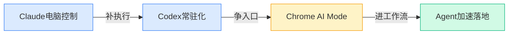
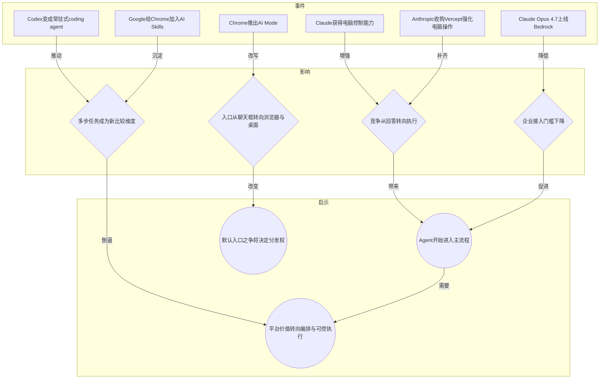
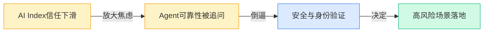
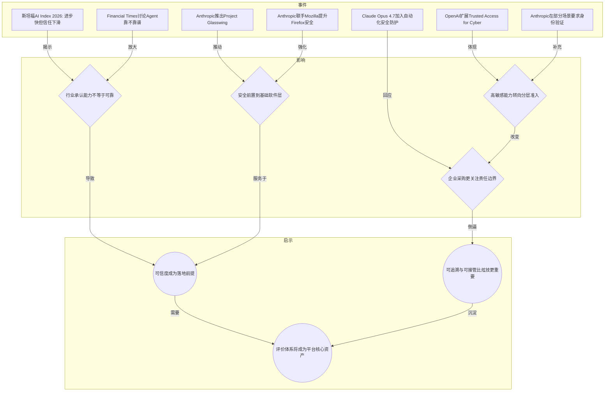
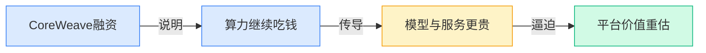
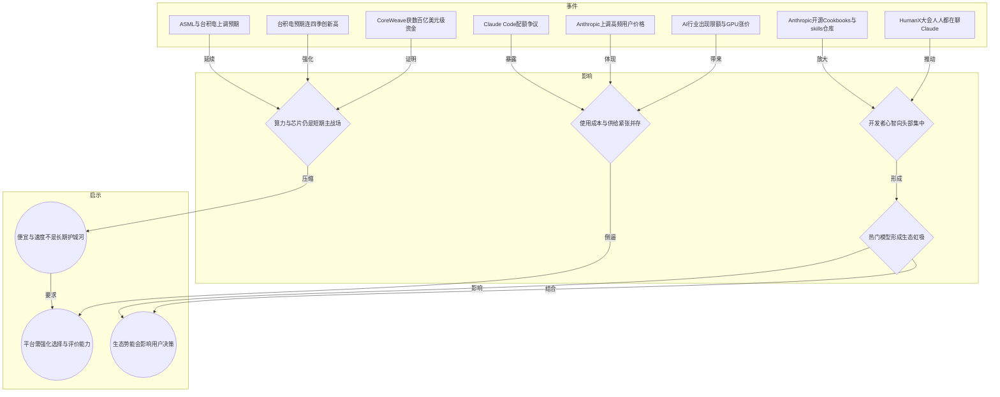
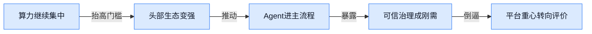
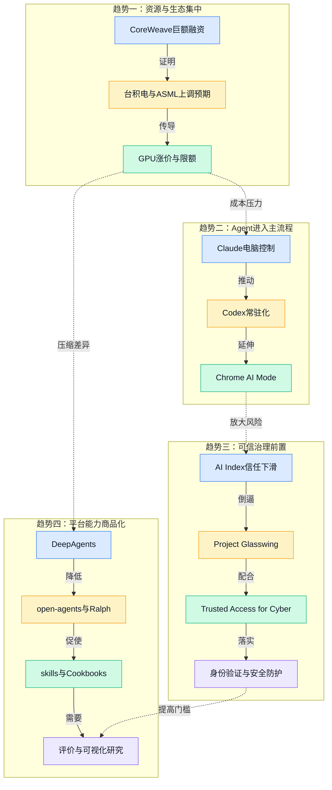

> 2026-04-13 ~ 2026-04-19 | 本周共 5 期日报

**本周日报**: [04-13](/ai-daily-site/2026/2026-04/2026-04-13/) | [04-14](/ai-daily-site/2026/2026-04/2026-04-14/) | [04-15](/ai-daily-site/2026/2026-04/2026-04-15/) | [04-16](/ai-daily-site/2026/2026-04/2026-04-16/) | [04-17](/ai-daily-site/2026/2026-04/2026-04-17/)

---

## 本周聚焦

### Agent 从“会回答”走向“直接做事”，入口与执行力成为新主战场

展开详细图谱

本周最值得连起来看的一条线索，是 Agent 正快速从“你问一句、它答一句”的助手，变成“能持续盯着任务往前推”的执行系统。4 月 14 日，Anthropic 收购 Vercept，继续补强 Claude 的电脑操作能力；4 月 15 日，Claude 获得“电脑控制”能力，Claude Code routines 还能自动修 bug、做代码审查；4 月 17 日，OpenAI 又把 Codex 做成常驻式 coding agent（编程代理，能持续协助写代码和执行任务的 AI 助手），Google 则让 Chrome 的 AI Mode 把“浏览网页”变成“和网页对话”。这些消息放在一起，不是零散功能更新，而是同一场竞争的不同侧面：谁能最先占住用户真实工作流，谁就更接近下一代默认入口。

为什么这件事重要？因为 AI 的价值衡量标准正在变化。过去，模型竞争主要看答题、写作、编程分数；现在，厂商更在意的是 AI 能不能跨软件、跨网页、跨步骤，把完整事情做完。Claude 打通电脑操作，Codex 改成持续在线，Chrome 直接把浏览器入口改造掉，本质上都在争“最后一公里执行权”。这也解释了为什么 Claude Opus 4.7 上线 Amazon Bedrock（亚马逊提供企业调用多家 AI 模型的云平台）同样值得重视：模型一旦进入企业现成采购与部署体系，落地速度往往比单点性能更关键。

对行业意味着什么？第一，独立聊天框不再是唯一入口，浏览器、桌面应用、企业云平台都在变成 Agent 的分发渠道。第二，真正的竞争门槛正从“模型更强”转向“谁能把模型放进高频场景并稳定执行”。第三，平台层机会和压力同时上升：机会在于用户越来越需要跨工具编排、状态可视化、任务持续推进；压力在于一旦大厂把浏览器、办公软件、云平台都打通，单纯“套一个模型壳子”的产品空间会被压缩。对做 Agent 调度与进化平台的人来说，这周信息非常明确：未来不会是用户手动挑模型，而是平台替用户消化复杂性，直接交付一个能把事办完、还能随时接管的系统。

### 可信与治理从附加项变成必答题，Agent 落地的真正瓶颈开始显形

展开详细图谱

如果说上一条线索讲的是“Agent 变得更能干”，那本周另一条 equally important（同样重要）的线索，就是行业开始更严肃地面对“Agent 变能干之后会不会更会闯祸”。4 月 14 日，斯坦福 AI Index 2026 再次强调：AI 进步很快，但安全担忧上升、公众信任下滑；同一天，Anthropic 推出 Project Glasswing，联手 Mozilla 提升 Firefox 安全。4 月 15 日，OpenAI 扩展 Trusted Access for Cyber（面向网络安全场景的受控开放计划），并推出 GPT-5.4-Cyber；4 月 16 日，《金融时报》直接讨论 Agent 到底靠不靠谱，Anthropic 还在部分 Claude 场景要求身份验证；4 月 17 日，Claude Opus 4.7 一边强调多步执行，一边加入自动化安全防护。信号已经很集中：大厂不再把安全当作发布会角落里的补充说明，而是开始把它与能力打包出售。

为什么这件事重要？因为 Agent 的核心风险，和普通聊天机器人不是一个量级。聊天机器人答错，很多时候只是信息偏差；Agent 如果能控制电脑、访问软件、持续执行多步任务，错误就可能变成误删文件、错误转账、越权操作，甚至在高敏感场景引发实际损失。也因此，本周出现的身份验证、分层准入、基础软件安全、自动化防护，并不是保守，而是在为“更强执行力”补上责任机制。行业已经开始接受一个现实：Agent 不只是“能不能做”，还要回答“出了问题怎么发现、怎么停下、谁来负责”。

对行业意味着什么？第一，可信度将成为企业采购和用户采纳的前提条件，而不是锦上添花。第二，高风险能力很可能都会走向分级开放，不同用户看到的能力边界会不同。第三，评价体系会从“成功率”扩展到“失败方式是否可接受”。这点尤其关键：未来一个好 Agent，不一定是从不犯错，而是犯错时不失控、能解释、可回退、可人工接管。对平台公司来说，这几乎是在点名一个方向：单做调用和分发不够，必须把任务过程记录、失败归因、权限边界、人工接管点做成基础设施。因为真正稀缺的，不再是“接上多少模型”，而是“谁能让用户放心把真实任务交出去”。

### 上游算力与生态势能继续集中，平台层必须避免被资源战拖走

展开详细图谱

本周还有一条更“底层”的线索，决定了很多上层产品会怎么长：钱和资源仍在快速向算力、芯片与头部生态集中。4 月 13 日，CoreWeave 几天内拿到数百亿美元级资金，台积电被预期连四季创新高；4 月 14 日，行业又出现算力紧张、限额和 GPU 涨价同时发生；4 月 16 日，ASML（全球最重要的光刻机制造商）和台积电上调预期，台积电利润大增 58%，Anthropic 还上调高频用户价格；同一周里，Claude 在 HumanX 大会成为会场焦点，Anthropic 持续开源 Claude Cookbooks、实战手册和 skills 仓库，但另一面也出现 Claude Code 配额争议。把这些拼起来看，能得出一个不算新、但越来越残酷的事实：上游资源并没有变便宜，头部生态的吸引力反而更强了。

为什么这件事重要？因为它改变了平台公司的竞争方式。很多创业团队天然会设想，随着模型普及，调用成本会不断下降，未来可以靠“更便宜、更快”拿下用户。但本周信号说明，至少在可见阶段，情况并不乐观：算力紧张、服务提价、配额限制，意味着成本和供给波动会长期存在；而像 Claude 这样同时拥有模型热度、开发者文档、技能仓库和会场心智的生态，又会不断吸走新用户和开发者。这种环境下，单靠接更多模型或压一点价格，很难构成稳定优势。

对行业意味着什么？第一，头部模型厂商会越来越像“基础设施+生态平台”的结合体，而不只是 API 供应商。第二，平台层会被迫证明自己的独立价值：不是替换模型，而是帮助用户在成本、效果、可靠性之间做选择。第三，生态势能本身会成为产品体验的一部分。用户并不会只看结果，还会看社区资料多不多、复用模板是否成熟、遇到问题是否有人总结经验。也就是说，平台如果想在资源战之外活下来，就必须把重心放在“可信选择、效果对比、技能复用、过程透明”上，而不是幻想自己能在算力或通用模型层面和上游正面竞争。

---

## 信号与噪音

1. OpenAI 收购 Hiro，连续两天都被提及，目标指向“个人 AI CFO”（个人财务顾问式 AI 助手）。点评：这说明大厂开始把通用模型能力往高价值、强信任的垂直决策场景压缩，金融类助手会更早检验“有用”和“敢用”之间的差距。

2. LangChain 推出 DeepAgents，open-agents、Ralph、oh-my-claudecode、Claude-Code-Game-Studios 等一批开源项目集中出现。点评：Agent 编排正在快速模板化、开源化，基础搭建门槛持续下滑，但也意味着“能搭出来”很快不再值钱，真正稀缺的是评估与治理能力。

3. Anthropic 持续开源 Claude Cookbooks、实战手册和 skills 仓库，OpenAI 也放出 codex-plugin-cc，让 Claude Code 调用 Codex。点评：头部公司一边竞争，一边又在工具层互相渗透，行业正在从封闭对抗转向“模型竞争 + 工具互联”并存，开发者会越来越希望混搭最优能力。

4. Cloudflare Agent Cloud 接入 OpenAI，Claude Opus 4.7 又上线 Amazon Bedrock。点评：企业市场正在把 Agent 能力吸收到现有云采购体系里，谁能进标准化企业入口，谁就更容易被默认采用；独立新平台若缺少集成位，获客会更难。

5. Google 为 Gemini 推出 Mac 应用，同时在 Chrome 中加入 AI Skills 和 AI Mode。点评：Google 的策略很清楚，不一定先卷最炫的 Agent 演示，而是先把 AI 塞进浏览器和桌面这类高频入口；这比单次模型升级更像长期分发战。

6. OpenAI 称 ChatGPT 女性用户已超过男性，同时又想在 ChatGPT 里卖更多广告，但广告主嫌投放工具还不够用。点评：AI 产品正在真正走向大众化，但商业化基础设施尚未成熟；用户规模扩张不自动等于商业模式跑通，尤其当入口从工具转向媒体时，产品形态会变复杂。

7. C2 这类“用二选一偏好训练奖励模型”的研究，以及 claude-hud、GitNexus 等可视化工具本周同时出现。点评：行业不只在追求更强结果，也在补“怎么看懂 AI 为什么这么做”这一层；评价和可视化很可能成为下一阶段的重要差异点，而不是边缘功能。

---

## 宏观趋势

展开详细图谱

1. 趋势名称：Agent 进入真实工作流。验证事件包括 Claude 的电脑控制、Codex 常驻化、Chrome AI Mode、Google 的 AI Skills、Claude Opus 4.7 上云。未来走向是，AI 会从聊天框继续迁移到浏览器、桌面、办公软件和企业云里，用户未必显式“打开 Agent”，而是在原流程里直接调用它。

2. 趋势名称：安全治理前置化。验证事件包括斯坦福 AI Index 的信任下滑、Project Glasswing、Mozilla 合作、Trusted Access for Cyber、身份验证、自动化安全防护。未来走向是，高风险能力将越来越多采用分级开放、审计留痕和权限控制，安全不再是法务补丁，而是产品设计的一部分。

3. 趋势名称：平台能力商品化，评价能力稀缺化。验证事件包括 DeepAgents、open-agents、Ralph、oh-my-claudecode 等开源项目集中涌现。未来走向是，搭建 Agent 系统会越来越便宜，真正形成护城河的，将是任务拆解质量、效果评估、失败归因、技能复用和跨模型选择机制。

4. 趋势名称：上游资源与头部生态继续集中。验证事件包括 CoreWeave 巨额融资、台积电与 ASML 上调预期、GPU 涨价与限额、Anthropic 涨价、Claude 生态热度升高。未来走向是，模型与算力不会在短期内快速平权，平台层若没有明确独立价值，很容易被头部生态虹吸或被成本波动挤压。

---

## 对我们的启发

1. 产品方向：本周最强信号不是“哪个模型又更强了”，而是 Agent 正进入浏览器、桌面、办公与企业云。我们的平台应优先支持跨工具任务编排、持续任务状态展示、人工接管点，而不是只做聊天式分发。

2. 产品方向：可信治理必须前置。可追溯过程、失败原因、权限边界、身份与分级能力管理，应该被当作核心能力建设，而不是后续补充，否则越接近真实任务，用户越不敢交付。

3. 竞争策略：开源编排框架正在快速普及，意味着“能接模型、能跑 Agent”会越来越同质化。我们的差异化应放在评价体系、效果对比、技能复用、历史表现与用户信任机制上，避免沦为又一个薄平台。

4. 时机判断：现在是切入“可信选择层”的窗口期。上游资源仍紧、头部生态虹吸明显，大厂更偏向占入口和云集成，尚未彻底解决多 Agent 之间如何比较、何时接管、怎样建立用户信任的问题，这正是我们可以抢位的时间差。

---

## 本周思考

当 Agent 真正开始替用户完成跨软件、多步骤、带权限的任务时，用户最终会信任“最强的那个”，还是“最可控、最可解释的那个”？如果两者不能兼得，平台应该替用户优先选择什么？
