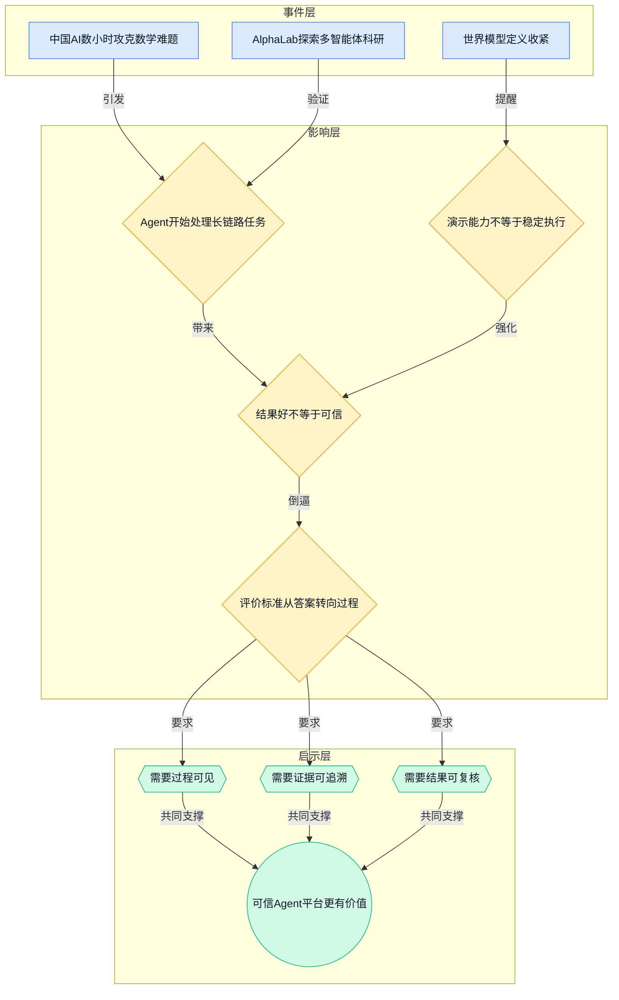
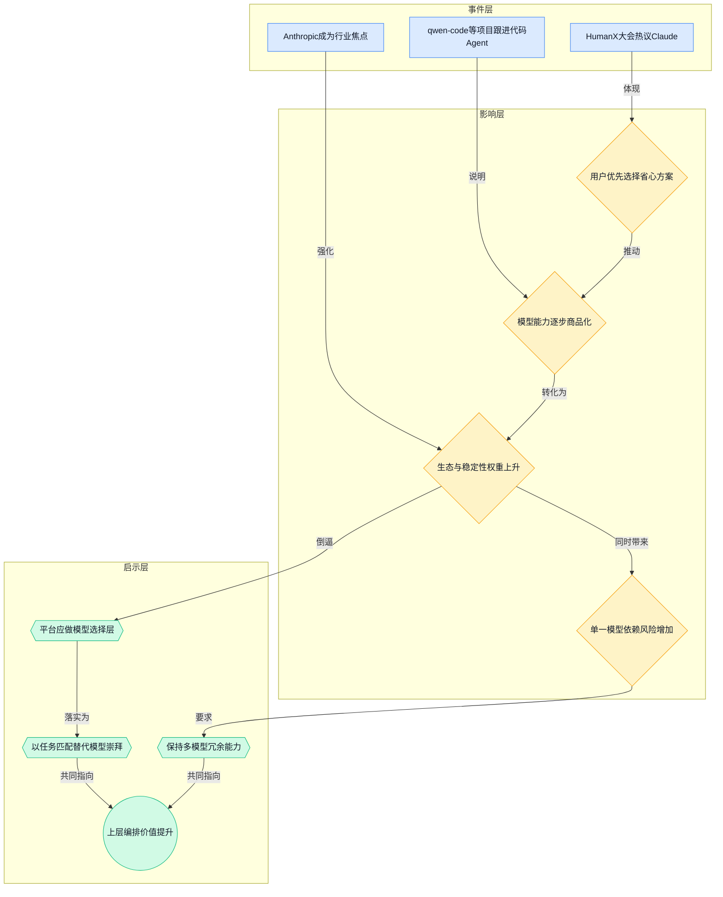
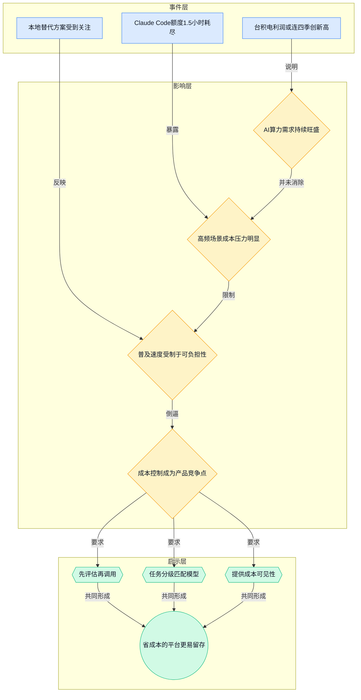
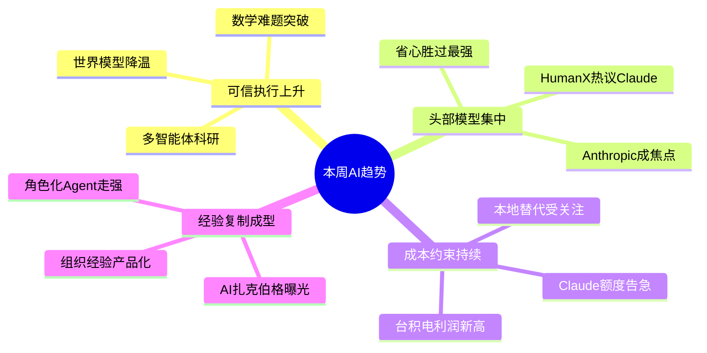

> 2026-04-13 ~ 2026-04-19 | 本周共 1 期日报

**本周日报**: [04-13](/ai-daily-site/2026/2026-04/2026-04-13/)

---

## 本周聚焦

### 1. Agent 正在从“工具调用”走向“复杂流程代理”，但可信度成为真正门槛
本周最值得重视的一条线索，来自两类看似不同、实则指向同一趋势的事件：一是“中国 AI 数小时攻克十年数学难题”，引发“机器能否独立科研”的讨论；二是行业洞察提到 AlphaLab 试图让多智能体自动跑完整科研实验。这两件事共同说明，Agent（可自主分解任务并调用工具的智能体）正在从“回答问题、写点代码、做个摘要”，升级为“推进长链路复杂任务”。

为什么这很重要？因为一旦 AI 的工作对象从单步任务变成多步骤流程，行业竞争焦点就会发生变化。过去，大家主要比较模型会不会答、答得像不像；现在，用户更在意的是：它能不能持续推进、能不能在中间遇到问题时调整方案、最终结果能不能被验证。数学解题和科研实验之所以有象征意义，不是因为它们离大众最近，而是因为它们天然要求严谨、链路长、容错低，正好暴露出 Agent 的核心短板：结果未必等于可信结果。

对行业意味着什么？意味着 Agent 平台的价值评估标准要升级。未来真正有竞争力的平台，不只是把多个模型或工具接起来，而是能回答三个问题：第一，过程是否可见；第二，依据是否可追溯；第三，结果是否可复核。尤其对我们这类面向普通用户的 Agent 调度与进化平台来说，用户未必能判断一个方案“技术上多先进”，但一定会在意“这东西我敢不敢信、出了错能不能看明白”。

这也解释了为什么“研究者给世界模型下定义：文生视频还不算”值得放在同一语境里看。它提醒行业，不要把看起来很像“理解世界”的表现，误当成真正可稳定推理、可持续行动的能力。很多 Agent 演示很惊艳，但如果底层只是模式拟合（根据训练数据做高概率预测），而不具备稳定的环境建模和纠错机制，那么一旦进入真实业务流程，失败率会迅速上升。换句话说，本周不是在证明“AI 已经能独立科研”，而是在提醒大家：复杂任务自动化已经开始试探边界，但可信执行才是下一阶段的主战场。

对我们的启发非常直接：平台不能只展示“成功案例”或“最终答案”，还要把中间路径结构化呈现，例如任务拆解、工具调用记录、关键判断节点、证据来源、人工介入点。用户信任不来自一句“交给 AI 就行”，而来自“我知道它怎么做出来的，而且必要时我能接管”。这不是附加功能，而会逐步变成 Agent 平台的基础设施。

### 2. 模型市场加速头部集中，“省心”正在压过“最强”
本周另一个非常关键的变化，来自 HumanX 大会对 Claude 的集中讨论。日报提到，Anthropic 正在成为行业焦点；行业洞察进一步指出，模型市场正在加速头部集中，大家选的不是“最先进”，而是“最省心”。这句话非常值得反复看，因为它揭示了当前 AI 市场最现实的购买逻辑。

发生了什么？从会场热度看，Claude 已经不只是一个模型名，而是在开发者和企业用户心中逐渐对应一整套预期：稳定、少出错、易接入、适合生产环境。与此同时，开源侧也出现了多条与 Claude Code 周边相关的项目，如 qwen-code、agent-skills、claude-code-local，说明开发者一边追随头部体验，一边试图补齐工程化能力或降低依赖成本。

为什么重要？因为这意味着模型竞争已经进入“能力商品化”阶段。也就是说，单纯强调跑分、参数量、某一项 benchmark（基准测试）领先，已经不足以形成稳固优势。真正决定采用率的，是一整套使用体验：是否稳定、文档是否清晰、失败是否可预测、生态是否兼容、计费是否可控。Anthropic 的上升，本质上是“产品化模型”在赢，而不只是“更强模型”在赢。

对行业意味着什么？首先，后来者只靠模型能力突围会越来越难。因为用户并不是每周都重新评估所有模型，而是一旦选定一个足够省心的方案，就会围绕它建立流程、提示词、接口和团队习惯，迁移成本会越来越高。其次，模型层的头部集中，反而会给上层平台带来机会。因为当底层模型趋于集中后，用户开始需要的是：如何在不同模型、不同任务、不同成本约束之间做最优选择，而不是永远追最新模型。

这也是我们尤其需要看清的一点：如果底层大模型逐渐形成寡头格局（少数头部厂商主导），那么中间层的平台价值，不在于“自研一个更大的模型”，而在于“帮用户把复杂选择变简单”。例如，什么任务适合用高质量模型，什么任务可以交给便宜模型，什么情况下需要双重校验，什么场景必须保留人工确认。用户不需要更多模型名词，他们需要的是一套可放心使用的决策系统。

本周的信号也提示风险：一旦头部效应强化，平台若过度依赖单一模型供应商，未来无论是价格、配额、策略变化，还是产品路线调整，都会被动。因此，“借势头部”是现实选择，但“避免单点依赖”也必须同步设计。

### 3. AI 需求很热，但成本约束远没有消失，普及战还在早期
第三条主线来自两个一冷一热的信号：一方面，台积电有望连四季创利润新高，说明 AI 需求正在改写半导体景气周期；另一方面，Claude Code 用户反馈 Pro Max 5 倍额度 1.5 小时就耗尽，直接暴露出高频使用场景下的成本与配额压力。二者放在一起看，比单独看任何一条都更有解释力。

发生了什么？上游芯片需求强劲，证明市场对 AI 算力（支撑模型训练和推理的计算资源）仍在持续加码；但下游用户却已经开始明显感受到“好用归好用，真用起来很贵”。这说明行业现在并不是需求不足，而是供给仍稀缺、成本仍高、资源分配仍不均衡。

为什么重要？因为很多团队容易被“AI 到处都在爆发”这类叙事带偏，以为大众化已经近在眼前。但本周的信息刚好提醒我们：热度并不等于可负担。尤其对于代码 Agent、视频生成、多模态图像等高调用量场景，用户实际付出的不是一次订阅费，而是持续的计算消耗。只要算力价格和模型推理成本没有明显下台阶，用户就不会无限试错，平台也不能按“资源无限”来设计交互流程。

对行业意味着什么？第一，AI 产品会越来越分层：高价值、高复杂度任务可以承受高成本；低价值、日常化场景则必须靠更便宜的模型、更短链路、更少调用来跑通。第二，成本控制本身会成为产品能力，而不只是财务问题。谁能让用户在达到同等结果时少花调用次数、少走冤枉路，谁就更容易形成留存。第三，开源和本地化方案会继续得到关注，比如 claude-code-local 这类项目，本质上就是在寻找“可接受体验”和“可控制成本”的平衡点。

对我们而言，这意味着产品设计必须天然具备“先评估、再调用”的机制。不是所有请求都直接交给最贵、最强的模型；更合理的方式是先做任务分级、风险判断、候选方案筛选，再决定是否进入高成本执行。对普通用户来说，真正好的体验未必是“无脑最强”，而是“在我愿意支付的时间和成本内，给我最稳妥的结果”。

---

## 信号与噪音

1. 谷歌 AI 广告机器改写搜索规则，品牌称营收最高可增 80%。点评：这说明 AI 不只在替代内容生产，还在重写流量分发逻辑；对消费级产品来说，未来“被用户找到”的方式可能越来越依赖平台内的 AI 推荐与自动投放，而不是传统搜索排名。

2. Meta 被曝打造“AI 扎克伯格”与员工互动。点评：这不是单纯的数字人噱头，更像是在测试“把组织中最强个人的决策风格产品化”；企业未来采购的也许不是通用模型，而是某种可反复调用的“经验人格”。

3. 研究者给“世界模型”下定义，明确文生视频还不算。点评：这给当前大量夸大叙事踩了一脚刹车，提醒行业区分“生成得像”与“真正理解环境并可持续行动”是两回事，尤其适合给 Agent 产品降温、避免误判能力边界。

4. QwenLM 开源 qwen-code，被描述为“住在终端里的开源 AI Agent”。点评：代码 Agent 正从聊天界面走向更贴近真实工作流的环境，说明用户需要的不是会说话的助手，而是能嵌入现有工具链、直接产生结果的执行体。

5. agent-skills 试图给 AI 编码助手补上工程化真本事。点评：这类项目虽不一定成为大众级产品，但它们反映出一个明确信号：模型已经够会写，真正缺的是在真实项目中遵守规范、理解结构、持续协作的能力。

6. OpenMontage 把 AI 编码助手扩展成视频制作工作室，JoyAI-Image 开源统一多模态图像基础模型。点评：多模态（同时处理文本、图像、视频等多种输入输出）能力继续往工作流层渗透，意味着未来 Agent 平台不能只围绕文本任务设计，图像和视频正在成为重要的任务类型而不是附属功能。

7. 《AI 裁员陷阱》关注企业用 AI 替代人力的潜在反噬，经验回放有望让大模型强化学习训练更省成本。点评：前者提醒管理层，AI 提效不等于简单减人，组织可能因知识流失与流程脆弱付出更大代价；后者则说明底层训练仍在拼效率，行业一边追求自动化，一边也在为成本瓶颈寻找技术解法。

---

## 宏观趋势

1. 可信执行成为 Agent 的核心竞争点。本周由“AI 攻克数学难题”、AlphaLab 多智能体科研探索，以及“世界模型”定义收紧共同验证：行业开始从惊艳演示转向严肃任务。未来走向不是谁更会表演，而是谁能把过程、证据和复核机制做成标准能力。

2. 模型市场继续向头部集中。HumanX 大会热议 Claude、Anthropic 成为焦点，是本周最直接的验证。未来可能出现的局面是：底层模型寡头化，上层产品层和编排层分化加速，用户更依赖“默认安全选项”而不是反复比较参数。

3. 成本约束将长期影响 AI 产品设计。台积电利润走高与 Claude Code 配额快速耗尽一起说明，需求旺盛不代表使用无门槛。未来产品会更强调成本感知、任务分级、轻重模型混用，以及本地化或开源替代方案的组合。

4. “经验复制”正在成为企业级 AI 的重要方向。Meta 的“AI 扎克伯格”说明，组织真正愿意付费的可能不是一个全能 Agent，而是把优秀员工或领导者的方法、风格和判断固化下来。未来企业 AI 可能越来越像“角色化能力资产库”，而不只是统一聊天入口。

### 趋势全景图

---

## 对我们的启发

产品方向上，第一，要把“过程可见、依据可追溯、结果可复核”做成平台默认能力，而不是给高级用户的附加选项；这会直接决定普通用户是否敢把更复杂的任务交给 Agent。第二，要强化“先评估再调用”的任务入口，先判断任务复杂度、风险和预算，再决定调用哪类模型与方案，避免用户在高成本模型上盲目试错。

竞争策略上，不宜把自己定义成某个单一模型的外壳。更可行的是成为“多模型选择与多方案比较层”，帮用户在质量、价格、速度和可信度之间做权衡。同时要重视“风格化 Agent”与“可信来源”标签，未来用户可能更愿意选择“像谁、按谁的方法做”，而不只是“用哪个模型”。

时机判断上，行业热度很高，但普及条件并未成熟，尤其成本和信任问题都还没解决。这对早期团队不一定是坏事：窗口期并未关闭，真正的机会不在再造一个聊天框，而在补上“选择、验证、信任”这层尚未被充分产品化的能力。

---

## 本周思考

如果未来用户真正愿意长期使用的，不是“最强 AI”，而是“最值得托付的 AI”，那么我们的平台首先应该优化的是模型能力，还是信任结构？
