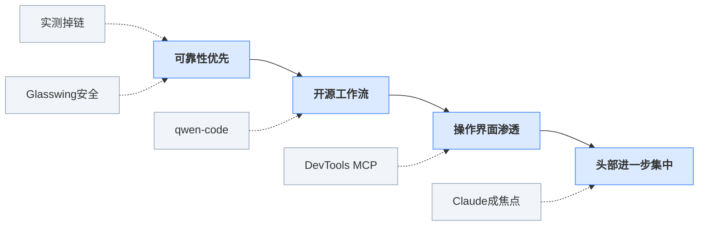

> 2026-04-13 ~ 2026-04-19 | 本周共 1 期日报

**本周日报**: [04-13](/ai-daily-site/2026/2026-04/2026-04-13/)

---

## 本周聚焦

### 1. Agent 从“会做题”转向“能落地”：真实环境可靠性成为分水岭
本周最值得重视的信号，不是某个模型又刷了新分数，而是研究直接指出：**Agent 在基准测试里很强，到了真实环境却容易掉链子**。同一天，Anthropic 推出 Project Glasswing，瞄准 AI 时代的软件安全。这两件事连起来看，说明行业讨论的重点正在发生明确迁移：从“模型能不能做复杂任务”，转向“它在真实业务里稳不稳、错了怎么办、谁来兜底”。

为什么这件事重要？因为基准测试本质上是标准化考场，任务边界清晰、输入相对干净、评价规则固定；而真实环境恰恰相反，充满脏数据、上下文缺失、权限限制、工具调用失败和人类临时改需求。一个 Agent 在 demo 里表现像“全能助手”，并不代表它在开放环境里能持续产出可交付结果。对于行业来说，这意味着过去那套“谁分数高谁更强”的叙事，正在失去解释力。

Anthropic 做安全项目，也不是孤立动作。它实际上是在承认：当 Agent 开始接触代码、浏览器、终端、企业知识库等高权限环境时，风险已经不只是“答错一道题”，而是可能造成数据泄露、错误执行、流程中断甚至合规问题。安全能力在这里不只是防黑客，而是让系统具备边界感、可审计性（能回看过程）、可回滚性（出错能撤回）和人工接管点。

对行业意味着什么？第一，下一阶段的竞争单位不再只是模型，而是“模型+工具+权限+安全+评估”的完整系统。第二，真正能拿到长期预算的，不会是最会演示的 Agent，而是最能稳定完成任务、最容易被追责和复盘的 Agent。第三，平台型机会开始变大：当单个模型都可能在不同场景失手，用户就需要一个中立层来做选择、路由（把任务分配给更合适模型）、记录和解释。

这对很多创业公司也是坏消息：如果只靠一个“万能 Agent”叙事，很容易被现实打脸；但也是好消息，因为这给了非底座公司一个清晰入口——不一定要做最强模型，但可以做最可信的使用层。

```mermaid
graph LR
A[基准很强] -->|落地后| B[真实掉链]
B -->|倒逼| C[安全加码]
C -->|进一步| D[系统评估]
D -->|最终| E[可信交付]
classDef start fill:#dbeafe,stroke:#3b82f6;
classDef mid fill:#fef3c7,stroke:#f59e0b;
classDef end fill:#d1fae5,stroke:#10b981;
class A start;
class B,C,D mid;
class E end;
```

### 2. 开源能力继续上探，但“强模型平权”并不等于竞争变容易
本周第二条主线，是开源生态明显在往更高难度任务推进。Arcee AI 花掉近半融资，推出对标 Claude Opus 的开源推理模型；QwenLM 开源 qwen-code，把 AI Agent 直接塞进终端；Chrome DevTools MCP（让 Agent 能接浏览器调试环境）、agent-skills（给编码 Agent 增加工程技能）、微软开源 Playwright CLI（浏览器自动化测试工具的命令行版）等工具也集中出现。它们共同说明：开源不再满足于“便宜替代聊天机器人”，而是在补全 Agent 真正工作的执行链路。

为什么重要？因为过去开源模型常被视为成本选项，适合轻量问答、私有化部署（放在企业或本地环境运行）或做二次开发；但本周这些动作显示，开源阵营正在试图覆盖更高价值场景，尤其是代码、浏览器、视频制作、语音等“能直接产生产出物”的任务。也就是说，开源正在从“模型可得”走向“工作流可用”。

但这不意味着竞争会变轻松，恰恰相反。Arcee AI 的案例已经说明，想把开源推到高阶任务可用，代价依然很高。强模型依旧是重资本游戏，训练、评估、数据、人才都要钱。与此同时，工具链开源会带来另一种加速：底层能力更快同质化。终端可用、浏览器可用、语音可用、本地可用，这些能力一旦成为公共基础设施，单纯“我也有 Agent”会迅速失去差异化。

对行业意味着什么？第一，模型层的护城河会部分转移到整合层和产品层。第二，未来竞争重点不是“有没有能力”，而是“怎样把能力组合成用户真正信任并愿意持续使用的方案”。第三，开源的繁荣会让模型供给更加丰富，也会让用户更需要比较、筛选和评价机制。选择成本上升，本身就是平台机会。

对创业团队尤其需要警惕的一点是：不要把开源进展误读成“模型不重要了”。事实更接近于：模型越来越多，但真正把它们组织起来、在具体场景下稳定交付的能力，变得更重要了。

```mermaid
graph LR
A[开源追赶] -->|延伸到| B[工具补全]
B -->|带来| C[能力同质]
C -->|倒逼| D[选择评估]
D -->|沉淀为| E[平台价值]
classDef start fill:#dbeafe,stroke:#3b82f6;
classDef mid fill:#fef3c7,stroke:#f59e0b;
classDef end fill:#d1fae5,stroke:#10b981;
class A start;
class B,C,D mid;
class E end;
```

### 3. 上游更贵、下游更集中：AI 产业进入“双重挤压”阶段
本周还有一条不能忽视的线索：台积电或将连续第四季创下利润新高，AI 需求成最大推手；与此同时，HumanX 大会现场大家讨论最多的是 Claude。前者说明上游算力仍在持续吸走利润，后者说明下游用户心智正在向少数头部品牌集中。把这两件事放在一起看，行业并不是在平均繁荣，而是在形成一种“双重挤压”结构：基础设施越来越贵，流量与信任却越来越向头部聚集。

为什么这件事重要？因为它直接影响创业公司的生存空间。算力贵，意味着做底座模型和大规模训练的门槛继续提高；品牌集中，意味着用户在不确定时更倾向于选择最熟悉、最被讨论的名字，而不是尝试新的通用助手。这会导致一个现实：中间层玩家如果没有明确定位，很容易既打不过大厂模型，又拿不到用户心智。

这也是为什么本周 Meta 做“扎克伯格 AI 分身”这类内部工具值得关注。头部公司已经不只在做通用模型，而是在把品牌、组织权威和内部知识结合起来，形成更强的分发能力。换句话说，未来的竞争不只是技术竞争，也包括谁能更有效占据用户入口、谁能把信任迁移到自己的 AI 形态上。

对行业意味着什么？第一，通用 AI 市场会越来越像“少数品牌吃掉大部分认知”。第二，创业公司若继续做泛化助手，获客成本和说服成本都会变高。第三，真正有机会的方向，是避开与头部正面争夺“最强模型”标签，转而在场景化选择、可信评价、任务编排（把任务拆分并分配给不同 Agent）和结果保障上建立独特价值。

简单说，行业不是在变得更平均，而是在变得更分层：上游吃资本，下游吃品牌，中间层只有在“帮用户降低选择成本和失败成本”时才有立足点。

```mermaid
graph LR
A[算力更贵] -->|同时| B[头部更热]
B -->|导致| C[心智集中]
C -->|挤压出| D[中层困境]
D -->|倒逼向| E[平台分工]
classDef start fill:#dbeafe,stroke:#3b82f6;
classDef mid fill:#fef3c7,stroke:#f59e0b;
classDef end fill:#d1fae5,stroke:#10b981;
class A start;
class B,C,D mid;
class E end;
```

---

## 信号与噪音

1. 中国 AI 在无人干预下数小时解出十年数学难题。点评：这说明模型在高复杂度推理任务上的上限还在抬升，但这类突破离真实业务价值仍有距离，不能直接等同于通用 Agent 已经成熟。

2. QwenLM 开源 qwen-code，把 AI Agent 直接塞进终端。点评：终端（命令行工作环境）是高价值高风险入口，开源阵营正在主动抢占专业用户工作台，也意味着 Agent 将更快进入“可执行”而非“只会建议”的阶段。

3. Chrome DevTools MCP 为编码 Agent 提供浏览器调试能力。点评：这类工具的意义不在于多一个插件，而在于让 Agent 开始真正理解网页运行状态，离“自己发现问题、自己验证修复”又近了一步。

4. 微软开源 Playwright CLI，把录制、生成代码和截图流程做成命令行。点评：浏览器自动化能力正在被重新包装成 Agent 可直接调用的标准积木，这会降低很多产品团队做测试、爬取、验证型 Agent 的门槛。

5. claude-code-local 让 Claude Code 在苹果芯片上跑本地 AI。点评：本地化不是主流替代云端，而是隐私敏感、网络受限和低延迟场景的重要补充；对企业和重度用户来说，本地部署（在个人设备运行）会持续增加吸引力。

6. MOSS-TTS-Nano 发布 0.1B 多语种开源语音模型，可在 4 核 CPU 实时生成语音。点评：这类轻量模型不是“最强”，但非常贴近实际落地，因为它让语音能力能进入低成本设备和边缘场景（不依赖高端服务器的环境）。

7. OpenMontage 想把 AI 编程助手升级成视频制作工作室，mtmd 已支持 Qwen3 音频能力。点评：多模态（文本、音频、视频等多种输入输出）能力正从实验展示进入工作流整合阶段，未来用户期待的不会是单一聊天框，而是一整套可生产内容的协作环境。

---

## 宏观趋势

1. 可靠性取代跑分，成为 Agent 下一阶段核心指标。本周“Agent 真实环境掉链子”的研究与 Anthropic 的安全项目共同验证了这一点。未来行业会更重视过程可见、失败可解释、结果可追责，而不只是单次演示效果。

2. 开源正在从模型开放走向工作流开放。Arcee AI 的高阶开源推理模型、qwen-code、DevTools MCP、Playwright CLI 都在证明，开源竞争点已从“有没有模型”扩展到“有没有完整执行链路”。未来会出现更多可拼装的 Agent 基础设施。

3. AI 能力继续向真实操作界面渗透。终端、浏览器、视频制作、语音生成都在本周出现新进展，说明 Agent 正在从聊天入口走向生产工具入口。未来用户对 AI 的要求会从“会说”转向“会做并能交付”。

4. 产业结构进一步分层：上游利润增强，下游品牌集中。台积电利润预期与 Claude 在大会上的高热度共同说明，行业正在同时强化资本密集和头部集中。未来中间层公司若没有明确差异化，将更难生存。

### 趋势全景图



---

## 对我们的启发

产品方向上，最该坚持的是“调度与可信层”而不是押注单一最强 Agent。本周研究已经验证，真实环境中的稳定性差异远比基准分数更关键；我们应优先构建场景化评测、过程展示、失败原因标注和人工接管设计。

竞争策略上，不要与头部模型正面争“最聪明”，而要争“最会选、最会组合、最值得信任”。开源能力持续丰富，意味着我们未来可接入的 Agent 供给会更多；真正的壁垒应放在评价体系、任务分配逻辑和用户信任机制，而不是某一个模型接口。

时机判断上，现在仍是值得进入的窗口，但窗口正在收窄。好处是行业还没有把“可信选择层”做成共识产品；风险是头部品牌集中越来越快，一旦用户默认只信少数助手，中立平台的教育成本会更高。因此应尽快把“为什么要通过平台选 Agent”讲清楚，并用可见证据而非口号建立信任。

---

## 本周思考

如果未来用户默认只信任少数几个头部 AI 品牌，那么一个中立的 Agent 平台要靠什么赢得存在价值：更低成本，还是更高可信度？
