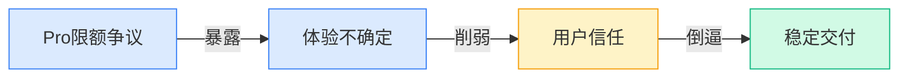
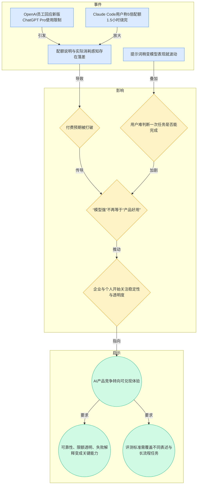
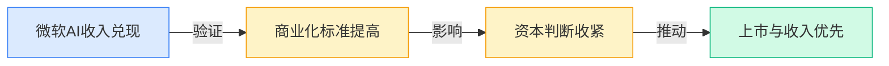
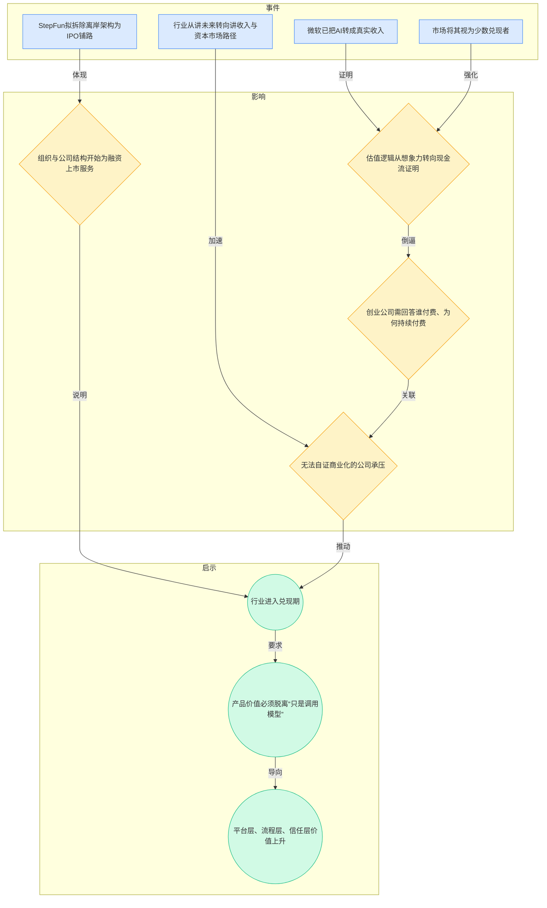
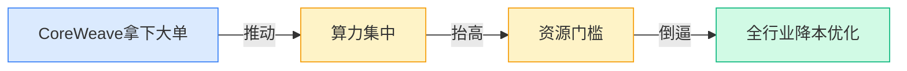
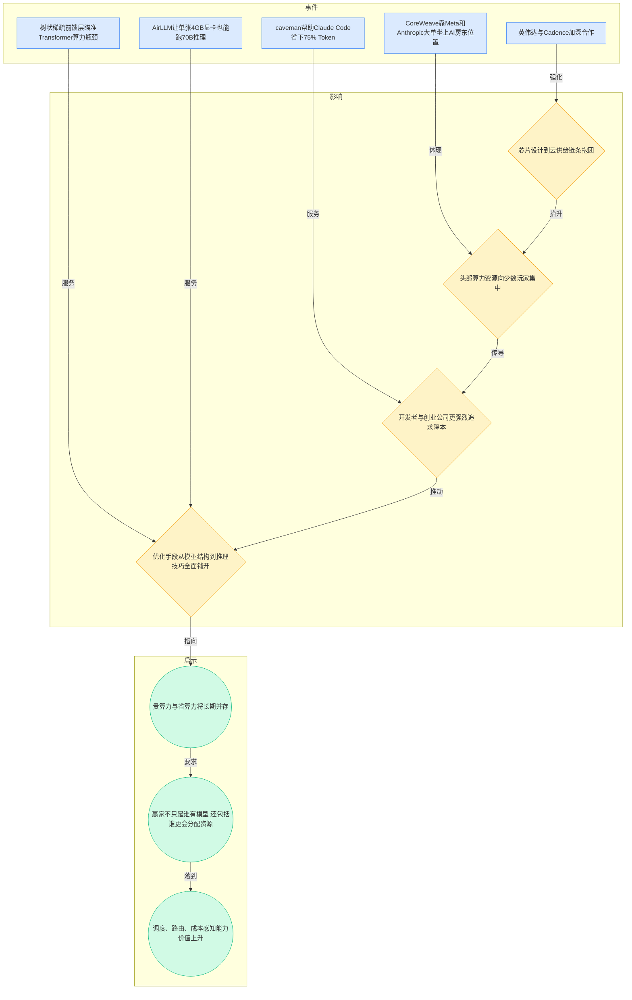
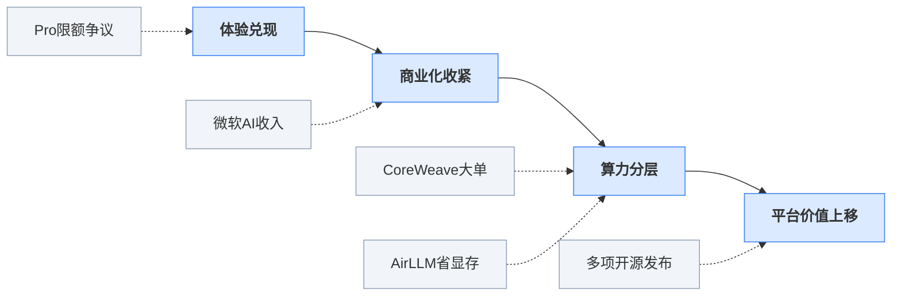

> 2026-04-13 ~ 2026-04-19 | 本周共 1 期日报

**本周日报**: [04-13](/ai-daily-site/2026/2026-04/2026-04-13/)

---

## 本周聚焦

### 从“能用”转向“能稳定用”：配额争议把 AI 产品带入体验兑现阶段

展开详细图谱

本周最值得重视的，不是又一个模型参数刷新，而是 OpenAI 员工回应新版 ChatGPT Pro 套餐限制、以及 Claude Code 用户抱怨“5 倍配额 1.5 小时就用完”这两件事，把行业一个更现实的问题彻底暴露出来：用户付费后买到的到底是什么。过去大家默认买的是“更强模型的使用资格”，现在越来越多人发现，真正想买的是“我这件事今天到底能不能顺利做完”的确定性。

这件事为什么重要？因为 AI 产品正在从尝鲜工具，进入生产力消费品阶段。只要进入这个阶段，评价标准就会变化。用户不再只看一次回答惊不惊艳，而会关心配额怎么扣、长任务会不会中途断、同样意思换个说法为什么结果差很多、付费之后能否稳定复现上次效果。日报里的行业洞察已经点出这一点：竞争不只是“强不强”，而是“付费后到底能稳定用多久”。这其实意味着行业的比拼重心，从模型能力展示，开始转向产品承诺兑现。

对行业意味着什么？第一，可靠性会成为新的产品护城河。这里的可靠性，不只是模型答对率，而是包括限额透明、消耗可预期、失败原因可解释、不同表述下表现稳定。第二，评测体系会升级。过去的榜单大多像考试分数，但本周提到“换个措辞和格式就明显掉分”，说明高分不等于真实可交付。未来谁能建立更贴近真实任务流的评测，谁就更接近商业价值。第三，用户信任会进一步分层。头部模型仍强，但如果体验规则复杂、边界模糊，平台型机会反而更大，因为用户会需要一个能帮自己选择、比较、兜底的中间层。

### 商业化叙事切换：资本开始奖励“真钱”而不是“远景”

展开详细图谱

第二条主线，是商业化标准明显变严。日报中两件事形成了很强的对照：一边是微软已经被市场视为少数把 AI 变成真金白银收入的大厂；另一边是中国 AI 创企 StepFun 拟拆除离岸架构，为 IPO 铺路。这说明行业叙事正在变化：以前资本主要押注“谁最可能成为未来平台”，现在更看重“谁已经证明自己能赚钱，谁具备进入资本市场的组织准备”。

为什么这件事重要？因为它直接改变了创业公司的生存环境。过去只要增长快、模型故事大、团队明星化，就容易拿到高估值；现在如果收入路径不清晰，或者产品价值无法被客户持续购买，融资与市场信心都会变弱。微软的案例给出的不是简单的利好，而是一个新的行业标尺：AI 不再被单独看成前沿技术，而被看成必须进入财务报表的业务。StepFun 的动作也说明，连仍处发展中的公司，都开始按照资本市场的要求整理公司结构，这背后是“商业兑现时间窗正在缩短”。

对行业意味着什么？第一，纯模型叙事进一步贬值。没有商业闭环的能力领先，可能无法长期转化成公司价值。第二，中间层价值会被重新定价。因为最终赚钱的往往不是“会调用模型”本身，而是能把模型变成稳定结果、可管理流程、可计费服务的那一层。第三，市场会更重视可验证的单位经济模型（每服务一个用户是否划算）。这对平台型创业公司是警示，也是机会：如果只能证明“模型可用”，不够；如果能证明“帮用户更低风险地完成任务，并愿意为此持续付费”，价值就更扎实。

### 算力继续集中，但全行业同时在拼命省：贵与省并行成为新常态

展开详细图谱

第三条主线，是资源结构的两极化。本周 CoreWeave 靠 Meta 和 Anthropic 大单巩固“AI 房东”位置，英伟达与 Cadence 加深合作，说明上游算力和芯片设计链条正在继续集中；与此同时，研究和开源社区却在另一端疯狂做同一件事：省。无论是树状稀疏前馈层（通过让部分计算只激活一部分网络来减少算力消耗）、AirLLM 用极低显存跑大模型推理，还是 caveman 通过更简化的表达减少 Token（文本计费单位）消耗，都指向一个事实：算力贵，而且会持续贵。

为什么重要？因为这意味着行业不会简单走向“人人都能便宜用上最强模型”，而是会形成明显分层。顶级公司通过大单锁定资源、通过供应链合作巩固优势；中小团队则必须靠更聪明的工程方法、路由策略和成本控制活下去。这里不存在二选一，正如日报洞察所说，“贵和省会同时存在，不矛盾”。贵的是稀缺资源和头部能力，省的是为了让更多应用能活下来。

对行业意味着什么？第一，平台竞争会越来越像资源分配竞争，而不是单点模型能力竞争。第二，产品层必须具备成本感知能力，知道什么时候值得调用贵模型，什么时候用轻量方案就够。第三，开源和工程优化不会削弱大厂，反而会扩大应用面，因为它们让更多场景能以可承受成本被激活。对创业公司来说，真正的机会不一定在自建最强模型，而是在“如何把不同成本、不同能力的模型组合成一套用户愿意买单的结果”。

---

## 信号与噪音

1. CoreWeave 靠 Meta 和 Anthropic 大单坐上 AI“房东”位置。点评：这不是单纯的企业新闻，而是上游资源进一步向少数基础设施公司聚集，未来应用公司会更依赖外部算力秩序。

2. 英伟达与 Cadence 加深合作，AI 芯片设计链条继续抱团。点评：这说明 AI 竞争已从模型层延伸到芯片设计与验证工具层，头部生态正在形成更难被打穿的协同优势。

3. 微软已经在把 AI 变成真金白银的收入。点评：市场会因此更苛刻地审视其他公司，凡是还停留在“用户很多但收入模糊”的项目，估值弹性都可能下降。

4. StepFun 拟拆除离岸架构，为 IPO 铺路。点评：这表明中国 AI 创业公司也开始从“融资型组织”转向“资本市场型组织”，商业化和合规准备的重要性同步上升。

5. 研究者给“世界模型”下定义，指出文生视频并不算。点评：这是一个容易被忽视但很关键的信号，说明行业开始清理概念泡沫，未来技术叙事会更强调可验证定义而非营销词。

6. OmniVoice 开源，支持 600 多种语言的高质量语音克隆 TTS（文本转语音）。点评：多语言语音能力继续下沉到开源社区，意味着语音交互门槛还会下降，但也会加大内容真实性和身份冒用风险。

7. OpenAI 开源 codex-plugin-cc，让 Claude Code 也能调用 Codex。点评：头部厂商一边竞争，一边又在工具层互相渗透，说明开发者生态的控制权比单一模型封闭更重要。

8. JoyAI-Image 与 AirLLM 等开源项目分别在多模态图像基础模型和低显存推理上推进。点评：一个在扩展能力边界，一个在压低运行门槛，合在一起看，说明应用创新会继续向“更丰富输入、更低部署成本”两端同时展开。

9. Palantir CEO 直言 AI“将摧毁”文科类岗位。点评：这类表态未必能准确预测就业结构，但它强化了一个现实：AI 影响已从技术圈进入组织设计、招聘和岗位定义层面。

---

## 宏观趋势

1. 可靠性取代炫技，成为 AI 产品新的竞争主轴。本周 OpenAI Pro 限额回应、Claude Code 配额争议，以及“换个措辞模型就掉分”的洞察，共同验证了这一点。未来用户会更看重稳定完成任务、规则透明、失败可解释，而不是单次效果惊艳。

2. 商业化进入兑现期，资本更奖励真实收入。微软 AI 收入被重点提及，StepFun 为 IPO 调整架构，也说明行业正在从讲故事转向交报表。接下来能获得更高信心的，不是声量最大的公司，而是收入路径清晰、组织准备充分的公司。

3. 算力集中与降本优化并行发展。CoreWeave、英伟达与 Cadence 的合作验证资源持续向头部集中；AirLLM、树状稀疏前馈层、caveman 则验证全行业在压缩成本。未来应用层会越来越依赖“分层调用”和“按成本匹配能力”的策略。

4. 开源继续把能力下放，但价值重心上移到整合层。OmniVoice、JoyAI-Image、AirLLM、codex-plugin-cc 都说明基础能力越来越容易获得。未来真正稀缺的，不是单个模型接口，而是把多种能力变成可选择、可评价、可信任结果的产品体系。

---

## 对我们的启发

产品方向上，第一，要把“稳定完成任务的确定性”做成显性价值，而不是默认能力。用户需要看到每次调用为什么这样选、消耗了什么、失败原因是什么。第二，平台评测不能只看首轮输出质量，更要测不同说法、不同任务长度、不同成本约束下的稳定性。

竞争策略上，第一，不要把价值建立在“接了哪些模型”上，这一层会越来越同质化；更重要的是建立选择、比较、回退、复核的产品机制。第二，可以考虑把“成本—效果—稳定性”做成平台的三维比较框架，让用户理解为什么某个方案更值得信任。

时机判断上，第一，商业化标准收紧对早期团队是压力，但也意味着只要能证明真实用户价值，反而更容易与空泛叙事拉开差距。第二，算力持续分层说明现在就该建立多模型、多成本档位的产品结构，避免未来被单一供应商或单一价格体系锁死。

---

## 本周思考

当模型能力越来越接近时，用户最终会把信任交给“最强的 AI”，还是交给“最会解释、最能稳定完成任务的平台”？如果答案是后者，我们现在最该积累的核心资产是什么？
