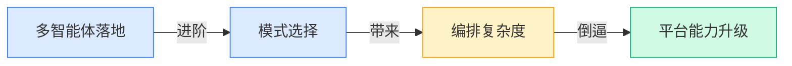
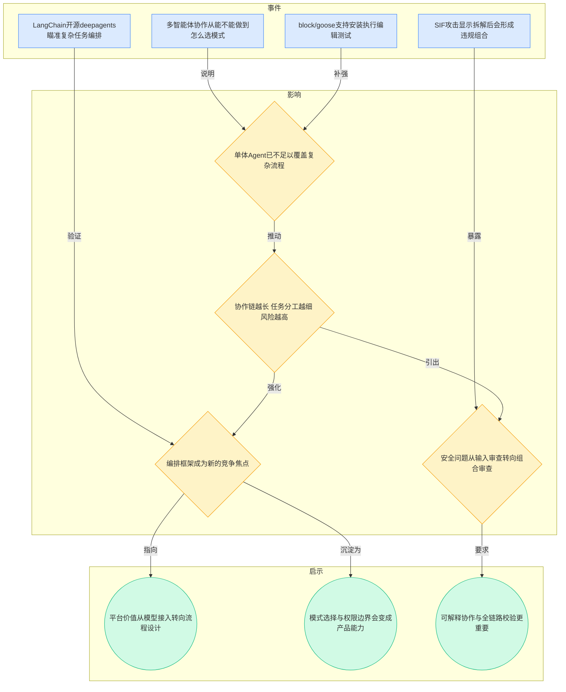
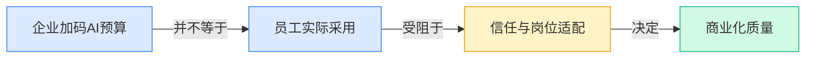
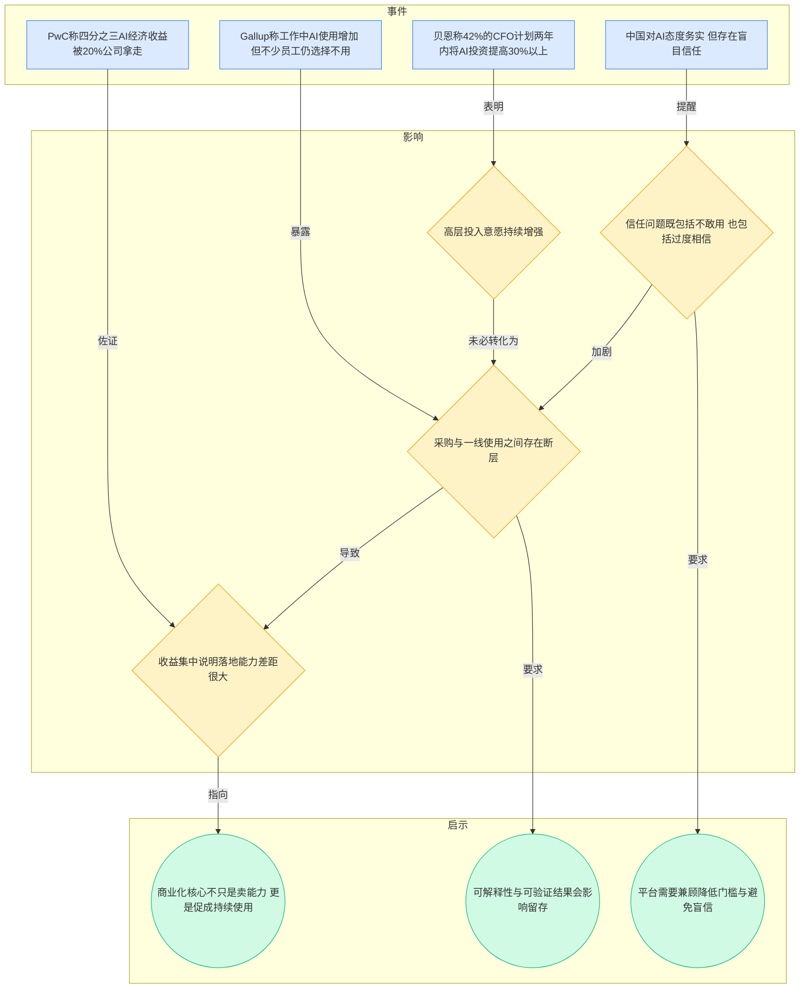
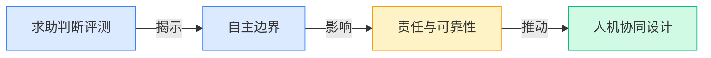
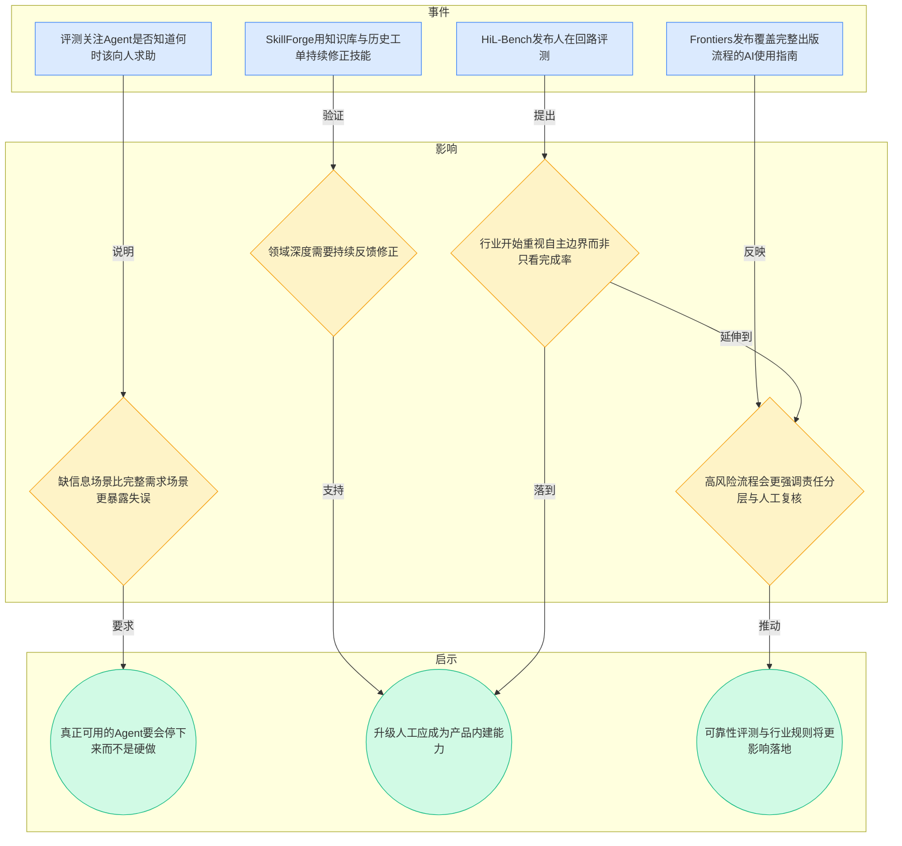
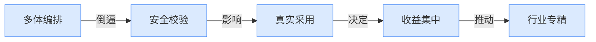
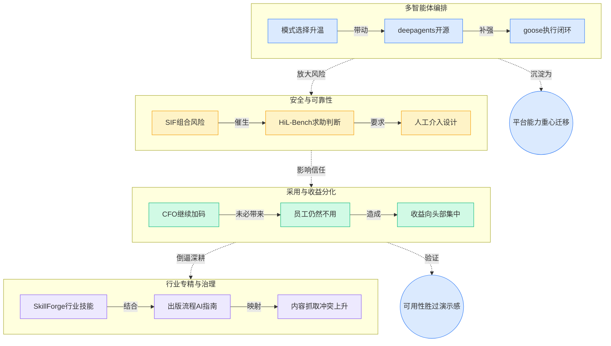

> 2026-04-13 ~ 2026-04-19 | 本周共 1 期日报

**本周日报**: [04-13](/ai-daily-site/2026/2026-04/2026-04-13/)

---

## 本周聚焦

### 从“会不会做”转向“怎么编排”：多智能体进入模式选择期

展开详细图谱

本周最值得重视的主线，是多智能体（多个 Agent 分工协作完成任务）正在从“证明可行”进入“选择打法”的阶段。日报里一方面提到“多智能体协作正在从能不能做走向该怎么选模式”，另一方面又出现了 LangChain 开源 deepagents、block/goose 这类更强调复杂任务编排与执行闭环的项目，说明行业注意力已经从“接入一个大模型”转向“如何把多个能力组织成稳定流程”。

这件事重要，因为它直接改变了 Agent 产品的竞争维度。过去比的是谁能调用更多模型、谁能做出一个看起来聪明的对话助手；现在开始比的是谁能把任务拆解得更合理、让不同角色之间分工更清晰、在失败时能不能补救。也就是说，真正的产品壁垒不再只来自模型本身，而来自流程结构、任务路由（把任务分配给合适能力）、上下文管理（让不同步骤共享必要信息）和结果复核。

对行业而言，这意味着“Agent 平台”会逐渐从模型聚合器，走向工作流基础设施。尤其是对 to C 产品，如果用户只是想“把事办完”，他们不会关心背后有几个模型、几个 Agent，只会关心速度、结果和可信度。谁能把多智能体协作的复杂性藏在产品后面，谁更有机会拿到大众用户。反过来，这也带来新的门槛：SIF 攻击（单条请求本身看似合法，但被多个 Agent 拆开执行后组合成违规结果）提醒行业，协作越强，组合风险越大。未来平台型公司不能只管接模型，还要管任务边界、整体目标一致性和协作链安全。

### AI采用并未自然发生：组织买单，不等于员工愿用

展开详细图谱

第二条关键主线，是 AI 的“买方热情”与“使用现实”之间的裂缝正在扩大。日报里给出两个看似矛盾的信号：一边是贝恩称 42% 的 CFO 计划在两年内把 AI 投资提高 30% 以上，另一边是 Gallup 发现工作中 AI 用得更多了，但不少员工依然选择不用。同时，PwC 又指出，AI 经济收益的四分之三被 20% 的公司拿走。三条放在一起看，结论很清楚：钱会继续进场，但价值不会平均分配，真正的分水岭不在是否采购，而在是否形成日常可持续使用。

这件事重要，因为它决定了未来一批 AI 创业公司的生死。很多产品会在采购环节看起来顺利，但在真实使用中卡在三个位置：第一，岗位适配不足，员工不知道什么时候该用；第二，结果不可解释，用户不敢把关键任务交给 AI；第三，体验断裂，需要用户自己学习一套新逻辑，导致回到旧习惯。也就是说，市场并不缺“可以买的 AI”，缺的是“能融进工作和生活的 AI”。

对行业意味着什么？意味着接下来评估 AI 产品的标准会从“演示效果”转向“真实渗透率”。尤其对 to C 为主的公司，这是一个机会也是警告。机会在于，大厂和企业级方案往往从管理视角出发，而普通用户真正需要的是简单、可信、低学习成本的服务入口；警告在于，如果产品只追求自动化而忽略用户心理安全感，就会同时遭遇两种风险：一部分人完全不用，另一部分人又过度依赖。日报里提到中国市场对 AI 有“务实但也可能盲目信任”的特征，这提示行业，信任建设不是让用户更相信 AI，而是让用户知道什么时候该相信、什么时候该复核。

### “人该何时介入”成为核心能力：可靠性开始压过炫技

展开详细图谱

第三条主线，是行业开始把“知道什么时候不该继续做”当成 Agent 的核心能力。HiL-Bench 不是在测一个智能体能不能把代码写完，而是在测它什么时候应该求助人类。这看似只是评测细节，实际上代表评价标准发生了变化：过去大家奖励“尽量自主”，现在开始重视“在不确定时及时停手”。

这件事重要，是因为 Agent 一旦从演示走向真实任务，错误成本会迅速上升。完整、清晰、低歧义的任务环境本来就不代表现实世界；现实任务往往信息不全、目标模糊、责任不清。一个不会求助的 Agent，短期看像是更自动化，长期看反而更危险。日报中 SkillForge 通过知识库和历史工单持续修正技能，也说明行业正在接受一个现实：真实业务能力不是一次训练出来的，而是在反馈中不断收敛。Frontiers 针对出版全流程发布 AI 指南，则进一步说明，在高责任场景里，规则、审核和人工介入不会消失，只会更系统化。

对行业来说，这意味着可靠性将逐步压过“看起来很聪明”的炫技能力。未来优秀的 Agent 不只是执行者，更像一个知道边界的助手：信息不足时会澄清，风险过高时会暂停，超出权限时会升级。对平台型公司而言，这类能力的产品化空间很大，因为单个模型可能会更强，但“何时转人工、转给谁、保留哪些上下文、如何让用户理解这次转交的原因”仍然需要系统设计。谁能把这件事做成默认体验，谁就更接近真正可用的 Agent 服务。

---

## 信号与噪音

1. 印尼女性零工劳动者的“双重负担”被 AI 放大，说明效率工具未必自动带来公平，反而可能把照护劳动与平台劳动叠加到同一群体身上。对行业的提醒是，AI 产品若只优化任务完成率而不看劳动分配，长期会引发社会层面的反弹与监管关注。

2. Frontiers 发布覆盖完整出版流程的 AI 使用指南，表明 AI 已从“能不能辅助写作”进入“如何嵌入严肃流程”的治理阶段。这类指南的意义不在技术突破，而在说明专业行业开始用制度而不是口头共识来约束 AI 使用。

3. 出版商面临越来越多 AI 爬虫与第三方抓取流量，说明内容行业与模型行业的关系正在从合作叙事转向利益再分配。对创业公司而言，这预示未来数据来源、授权边界与引用透明度会越来越重要，不能默认开放网页就等于可任意吸收。

4. rtk 宣称可把 LLM Token 消耗压缩 60% 至 90%，说明“推理成本优化”仍是开源侧非常活跃的方向。虽然单个项目效果还需验证，但行业已经明确：如果 Agent 要跑复杂链路，成本控制不会是附加项，而是产品成立的前提之一。

5. Google Research 的 TimesFM 继续推进时间序列基础模型（面向销量、库存、需求等连续数据预测），反映基础模型能力仍在向垂直任务外溢。它对普通 AI 助手的直接影响不大，但对未来“Agent + 预测”类产品是个信号：执行与预测可能被打包为同一套服务能力。

6. Anthropic 开源 Claude Cookbooks，集中展示 Claude 的实用玩法，显示头部模型厂商正在通过“最佳实践模板”争夺开发者心智。模型能力相近之后，谁更能提供可复用范式、降低上手成本，谁就更可能成为默认选择。

7. ai-hedge-fund 把“AI 对冲基金团队”做成开源项目，虽然更像实验性展示，但它代表一种持续升温的叙事：把复杂组织角色拆成多个 Agent 进行协同。它的价值未必在金融本身，而在持续教育市场接受“多角色 AI 团队”这一交互想象。

---

## 宏观趋势

展开详细图谱

1. 趋势名称：Agent 竞争从模型能力转向编排能力。本周“多智能体模式选择”、deepagents、goose 与 SIF 攻击一起验证了这一点：问题不再是能否接上模型，而是如何组织多个能力并管住协作风险。未来可能走向是，平台层会把任务拆解、角色分工、权限控制和复核机制做成标准能力。

2. 趋势名称：AI 商业化进入“采用率鸿沟”阶段。贝恩的 CFO 投资意愿、Gallup 的员工不用、PwC 的收益集中，共同说明预算增加不等于价值普及。未来会有更多产品死在“买了但没人持续用”，而真正跑出来的公司会更重视岗位嵌入、解释性和行为习惯重塑。

3. 趋势名称：可靠性与人工介入正在成为主流评价维度。HiL-Bench、SkillForge、Frontiers 指南都在证明，行业开始重视 AI 的边界感，而不只是完成率。未来可能出现更多“何时停手、何时升级、如何记录责任”的评测与行业规范。

4. 趋势名称：行业专精与数据治理同步升温。SkillForge 强调领域技能沉淀，出版商与 AI 爬虫冲突则提示数据来源将更敏感。未来垂直 Agent 会更强，但也更依赖专属知识、授权内容和长期反馈闭环，通用平台想进入深水区必须处理好数据与行业规则。

---

## 对我们的启发

1. 产品方向：要把“何时升级到人工”做成平台内建能力，而不是事后补丁。HiL-Bench 已说明这会成为真实可用性的关键指标；对普通用户来说，可信的中断比不可信的自动完成更重要。

2. 产品方向：多 Agent 平台不能只强调可组合，还要强调“可解释的组合”。SIF 这类风险说明，平台若无法展示任务被如何拆分、为什么这样拆分，就很难建立长期信任。

3. 竞争策略：我们更适合把自己定义成“帮用户选对 AI 方案并给出可信结果”的平台，而不是单纯的模型入口。因为本周多个信号都表明，未来价值更靠编排、评价、复核和行业技能沉淀，而不只是谁接了更多模型。

4. 时机判断：市场热度仍在，预算也在增长，但真实采用还远未完成教育。这意味着现在仍是抢占产品心智和交互范式的窗口期；同时也意味着不能被融资热度误导，短期更该盯住复用率、留存和用户是否真的愿意交付任务。

---

## 本周思考

如果未来用户真正需要的不是“最强 AI”，而是“最会在关键时刻停下来的 AI”，那么 Agent 平台的核心竞争力，究竟是更高的自动化率，还是更成熟的边界感？
