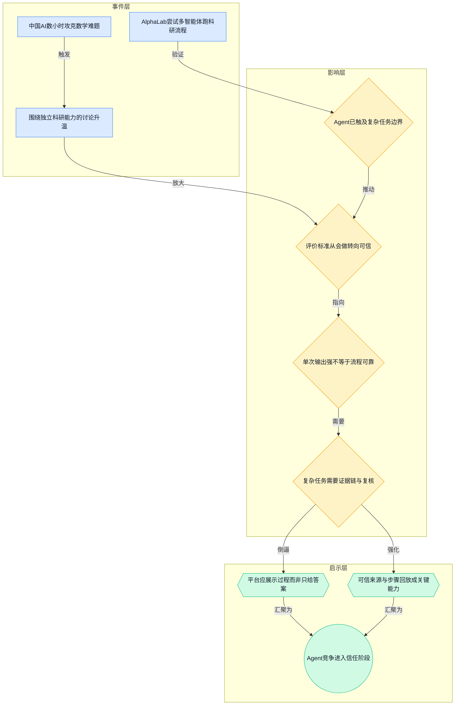
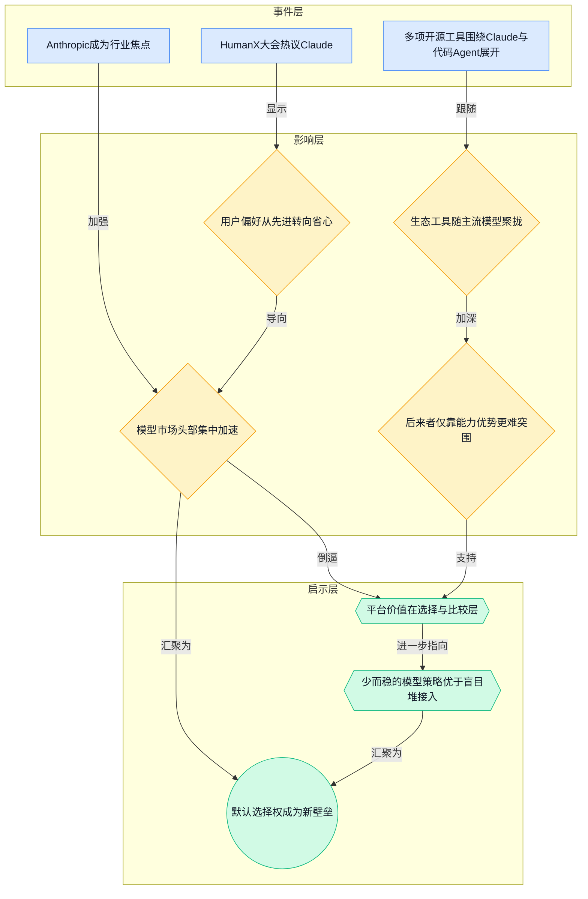
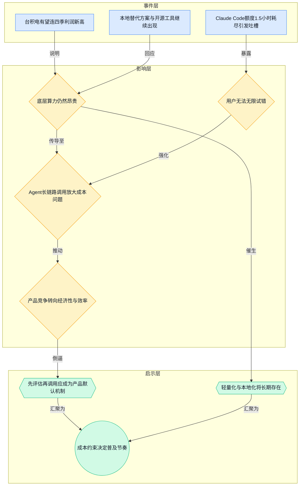
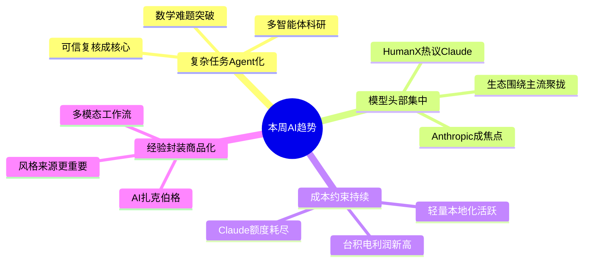

> 2026-04-13 ~ 2026-04-19 | 本周共 1 期日报

**本周日报**: [04-13](/ai-daily-site/2026/2026-04/2026-04-13/)

---

## 本周聚焦

### 1. Agent 开始触碰“复杂流程”，但真正的分水岭不是能不能做，而是能不能被信任
本周最值得重视的主线，是两条看似分散、实则高度相关的消息同时出现：一是“中国 AI 数小时攻克十年数学难题”，引发“机器能否独立科研”的讨论；二是 AlphaLab 想让多智能体（多个 AI 分工协作的系统）自动跑完整科研实验。表面上看，这都是“AI 更强了”的新闻；但更深一层，它们共同把 Agent 的竞争从“会不会做任务”推进到“能不能完成复杂流程，并让人相信结果”。

为什么这件事重要？因为简单问答、单轮生成、局部辅助，已经越来越难形成真正壁垒。真正拉开差距的，是 AI 是否能在一个长流程里持续推进：拆解目标、调用工具、尝试路径、纠错迭代、给出结论。如果 AI 真的开始进入科研、数学、实验设计这类高复杂度场景，那么行业评价标准就会改变。过去大家比的是模型参数、跑分、单次输出质量；接下来更关键的，是过程透明度、证据链完整性、失败可追踪性、结果可复核性。

这对行业意味着什么？第一，Agent 平台的核心价值会从“接入多少模型”转向“如何管理复杂任务的可信执行”。用户未必在乎背后是一个模型还是多个 Agent 协作，但一定会在乎：为什么得出这个答案、用了哪些依据、有没有走偏、失败时能不能定位问题。第二，所谓“独立科研”短期内更可能是一种营销叙事，而不是可直接交付的稳定能力。原因并不神秘：复杂任务里，任何一步判断失真、工具调用错误、上下文污染，都可能把最终结论带偏。第三，谁能把复杂流程产品化，谁才更接近下一阶段入口。这里的产品化，不是做一个更炫的聊天框，而是让普通人也能看懂任务是怎么被完成的。

对我们这类面向普通用户的 Agent 调度与进化平台来说，这一周的信息很直接：平台不能只展示结果，更要展示“结果是怎么来的”。尤其当 Agent 被用于高价值决策时，可信来源、步骤回放、依据标注、版本比较，会比单纯模型效果更重要。换句话说，Agent 正在从“工具”走向“代理人”，而代理人一旦介入复杂流程，信任机制就必须先行。

### 2. 模型市场正在头部集中，用户购买的不是“最强”，而是“最省心”
本周另一条非常清晰的线索，来自 HumanX 大会对 Claude 的集中讨论，以及“Anthropic 正在成为行业焦点”的报道。与此同时，开源侧也出现了一批围绕 Claude Code、qwen-code、agent-skills、claude-code-local 的项目和讨论。这说明一个现实：行业表面上仍在谈模型能力创新，但市场实际购买决策，已经越来越偏向“稳定、熟悉、低心智负担”的头部产品。

为什么这件事重要？因为这意味着模型层创业的窗口继续变窄，而应用层、平台层的机会却更明确了。用户并不总是追逐榜单第一，他们更在乎：这个东西是不是大家都在用、是否容易上手、在关键场景会不会掉链子、出了问题有没有成熟经验可参考。Claude 成为大会焦点，不只是因为它“强”，更因为它在很多专业用户心中形成了某种“可预期”。而一旦这种认知形成，后来者即便局部能力更强，也很难只靠性能优势撬动迁移。

对行业意味着什么？第一，基础模型正在快速品牌化。未来竞争不仅是参数和推理能力的竞争，也是“默认选择权”的竞争。第二，开源项目大量围绕头部模型生态生长，说明开发者和用户会顺着主流能力搭建工具链，而不是平均分布到每个新模型上。第三，这会进一步加速平台型产品的重要性：当底层模型头部集中时，真正可竞争的价值不在“你是否自研模型”，而在“你能否帮用户在主流模型之上做更好的选择、编排、比较和沉淀”。

对我们来说，启示很现实。我们不应该假设用户愿意频繁试用十几个模型，也不该把“模型多”直接等同于“平台强”。平台更像一个决策与信任层：帮用户在少数主流能力之间快速判断哪个更适合当前任务，记录历史表现，形成可迁移的使用经验。用户要的往往不是无限选择，而是低风险地做对选择。

### 3. AI 很热，但“可无限使用”的时代还没来，成本会重塑产品设计
本周还有一组很有张力的信号：一边是台积电有望连续四个季度创利润新高，显示 AI 需求仍在强力拉动半导体景气；另一边是 Claude Code 用户抱怨 Pro Max 五倍额度 1.5 小时就耗尽。这组信息放在一起看，结论并不复杂：AI 需求很旺，但底层算力（用于训练和运行 AI 的芯片与计算资源）依然昂贵，用户端体验仍受制于成本，不存在“想怎么用就怎么用”的普及状态。

为什么重要？因为很多团队容易被行业热度误导，以为用户会天然接受高频试错、长链路调用、多轮探索。但只要成本还高，用户就会变得更谨慎，也会对“每一次调用值不值”更敏感。尤其在 Agent 场景里，一个任务往往不是一次生成，而是多步推理、多模型协作、多工具尝试。如果平台没有良好的前置评估与策略控制，用户很快就会觉得贵、慢、不可控。

对行业意味着什么？第一，算力约束会抑制一部分“看起来很酷但没有产出效率”的玩法，真正能活下来的产品，必须让成本与结果之间有清晰对应关系。第二，开源、本地化、轻量化会继续活跃，例如本周出现的 claude-code-local，就反映出一部分用户和开发者正在寻找替代云端高成本使用的路径。第三，Agent 产品会进入“经济性竞争”：谁能在可接受成本下，把任务完成率、速度与可解释性同时做得更好，谁就更有机会穿越泡沫。

对我们而言，这不是坏消息，反而是产品设计机会。因为当成本高、选择多、结果不稳定时，用户更需要一个中间层，先帮他们判断任务难度、预估调用代价、选择更合适的方案，再决定是否执行。换句话说，在昂贵时代，好的 Agent 平台不只是“帮你做事”，更要“帮你少花冤枉钱”。

---

## 信号与噪音

1. 研究者给“世界模型”下定义，指出文生视频还不算。点评：这提醒行业不要把“生成得像”误判为“真正理解世界并可推演因果”，概念边界一旦被澄清，相关创业叙事也会被重新估值。

2. 谷歌 AI 广告机器改写搜索规则，品牌称营收最高可增 80%。点评：AI 对互联网入口的改造已经不止于聊天产品，而是直接进入商业分发系统；对平台公司来说，谁控制推荐与决策链路，谁就更接近收入核心。

3. Meta 被曝打造“AI 扎克伯格”与员工互动。点评：这不是一个单纯噱头，它指向“经验人格化复制”这条路径——企业未必最想买万能 AI，而更可能想买“某个优秀角色的稳定替身”。

4. 苹果 AI 眼镜曝光，或将以多种风格对标 Meta。点评：硬件入口竞争仍在继续，但短期看决定性因素不是外形，而是是否有足够稳定、低延迟、可持续使用的 AI 能力支撑日常场景。

5. QwenLM/qwen-code 被描述为“住在终端里的开源 AI Agent”，同时 agent-skills 试图补上工程化能力。点评：开源社区正从“能聊天”转向“能干活”，尤其在开发者场景，工具调用、流程复用、技能封装开始比纯模型对话更重要。

6. OpenMontage 想把 AI 编码助手扩展成视频制作工作室，JoyAI-Image 则强调统一多模态图像基础模型。点评：多模态能力继续向具体工作流下沉，未来竞争不只是模型会不会看图生成视频，而是谁能把跨模态能力包装成可交付结果。

7. 《AI 裁员陷阱》关注企业用 AI 替代人力的潜在反噬，另有研究称经验回放有望降低强化学习（通过试错优化模型行为的方法）成本。点评：前者说明组织改造不能只算短期人效，后者说明行业仍在努力降低训练与使用成本；一冷一热放在一起，体现出 AI 商业化会长期在“效率诱惑”和“实际摩擦”之间摇摆。

---

## 宏观趋势

1. 复杂任务 Agent 化加速。本周由“AI 数小时攻克数学难题”和 AlphaLab 多智能体科研实验共同验证，说明 Agent 正从执行单点任务走向推进长流程任务。未来走向是：不仅要完成任务，还要提供过程证据、可复核记录和责任边界。

2. 模型层头部集中，平台层价值上升。HumanX 大会热议 Claude、Anthropic 成焦点，再加上一批围绕 Claude 与代码 Agent 的工具出现，都说明用户正把“省心”和“稳定”放在更高位置。未来走向是：基础模型品牌化更强，应用平台需要承担选择、组合、评估和迁移的角色。

3. AI 成本约束仍然强，经济性会决定普及速度。台积电利润创新高与 Claude Code 配额快速耗尽，构成了供需两侧的直接证据。未来走向是：轻量模型、本地方案、前置评估与成本控制，会成为产品体验的一部分，而不是后台问题。

4. AI 从通用能力展示走向“经验封装”。Meta 的“AI 扎克伯格”以及多模态工作流工具，都在说明一个趋势：用户越来越愿意为可复制的做事方式、特定角色经验和可预期输出买单。未来走向是：人格、风格、行业方法论将成为 Agent 商品化的重要维度。

### 趋势全景图

---

## 对我们的启发

产品方向上，第一，必须把“过程可见、依据可查、结果可复核”做成平台基础能力，而不是高级选项；复杂任务越多，用户越不会只接受一个答案。第二，要强化“先评估再执行”的体验，例如先判断任务类型、预估可能成本与成功率，再推荐最合适的 Agent 或方案。

竞争策略上，没必要追求接入最多模型，更重要的是围绕少数主流模型做出更稳定的选择层、比较层和经验沉淀层。用户更需要“帮我选对”，而不是“给我看花”。同时，可以提前布局“人格化/风格化 Agent”与“可信来源标签”，因为经验复制正在变成需求。

时机判断上，现在还不是算力无限、用户愿意无限试错的阶段，因此节制调用、提升命中率、减少无效探索，反而能构成真实优势。市场并未晚，真正的窗口正在从模型能力竞赛，切到可信与经济性的产品竞赛。

---

## 本周思考

如果未来用户真正依赖的不是“最强 AI”，而是“最可信、最像某种经验的人机组合”，那我们的平台到底是在分发模型，还是在分发可被信任的做事方式？
