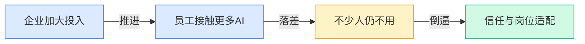
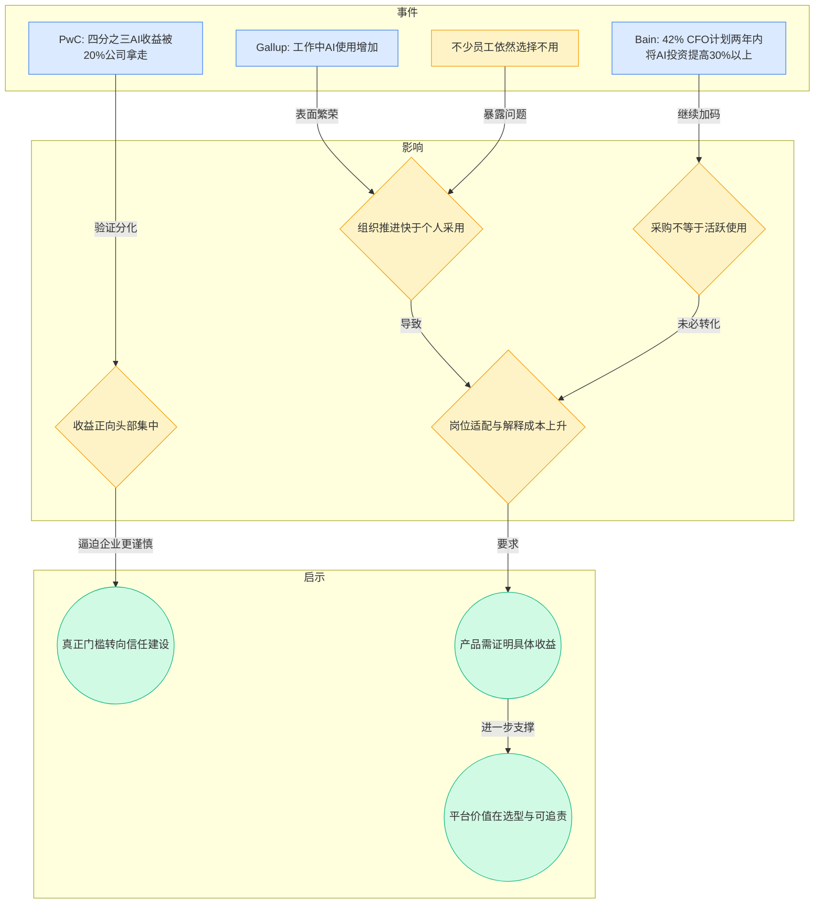
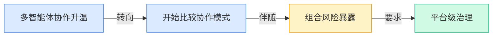
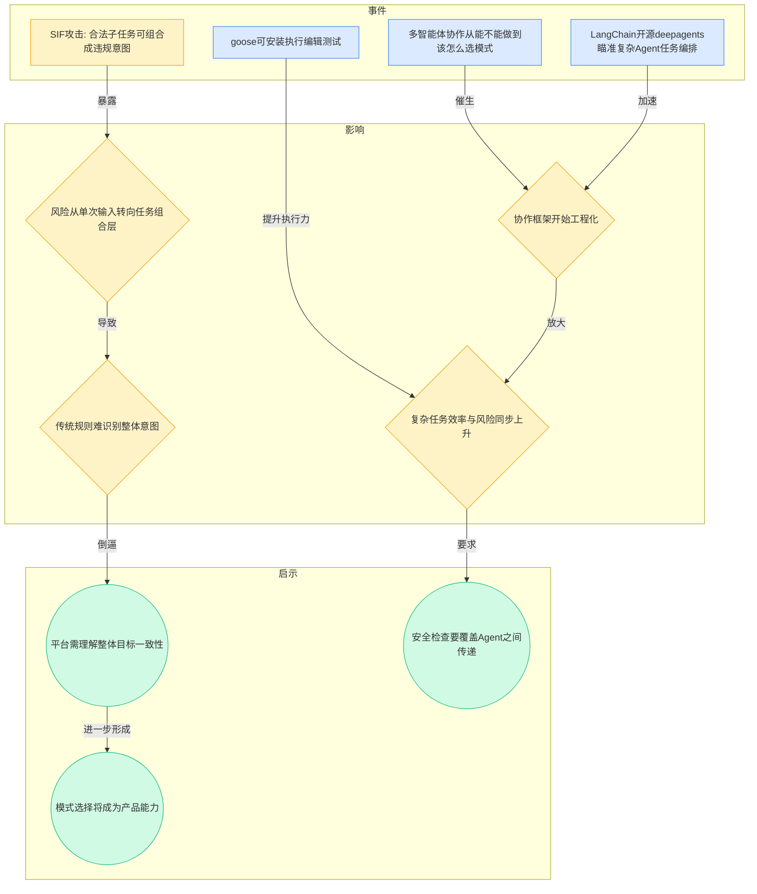
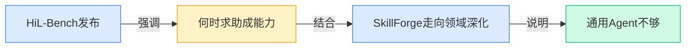
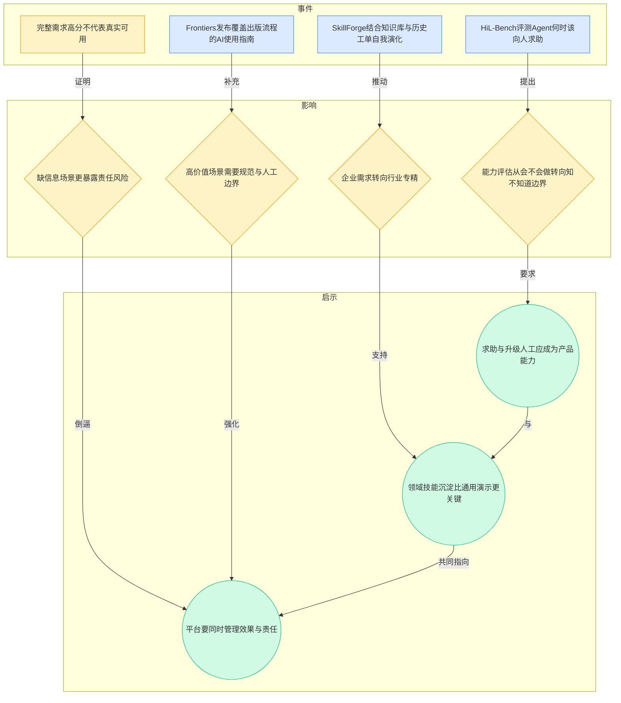
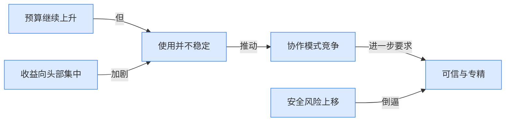
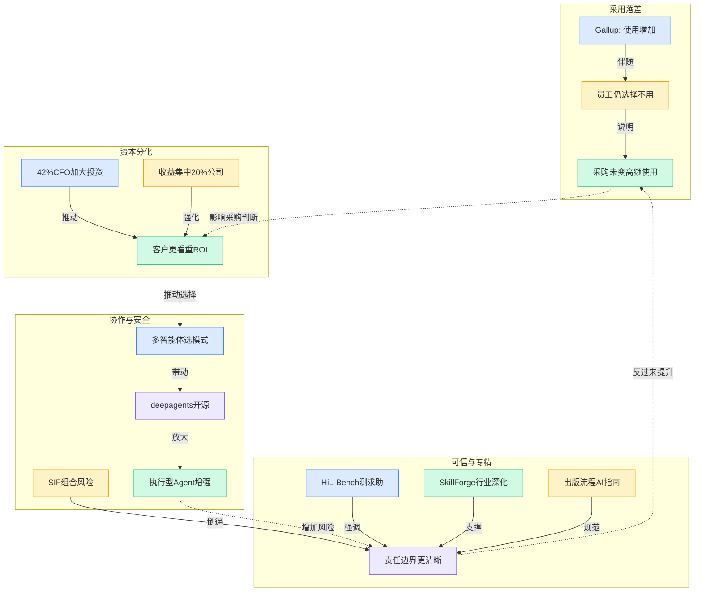

> 2026-04-13 ~ 2026-04-19 | 本周共 1 期日报

**本周日报**: [04-13](/ai-daily-site/2026/2026-04/2026-04-13/)

---

## 本周聚焦

### AI 采用在加速，但真正稳定使用的人并没有同步变多

展开详细图谱

本周最值得重视的，不是“AI 还热不热”，而是“热度是否真的转成稳定使用”。日报里至少有三条信息互相咬合：Gallup 说企业里的 AI 使用更多了，但不少员工仍然选择不用；贝恩说 42% 的 CFO（首席财务官）计划在两年内把 AI 投资提高 30% 以上；PwC 又补了一刀——AI 经济收益的四分之三，被 20% 的公司拿走了。把这三件事放在一起看，行业正在进入一个比“有没有部署”更难的阶段：预算在增加，接触面在扩大，但真实价值只在少数组织里被稳定兑现。

为什么这件事重要？因为它直接说明，AI 商业化的主矛盾正在从模型能力不足，转向组织吸收能力不足。很多员工不是完全反对 AI，而是看不到它在自己岗位上的确定收益，也不确定出了错算谁的责任，更不知道什么时候该信、什么时候该复核。对老板来说，采购一个系统是决策；对员工来说，每天是否愿意用它，是另一套完全不同的成本收益判断。前者看的是战略，后者看的是麻烦会不会变少、风险会不会变高。只要这两套判断不能对齐，“公司上了 AI”就不等于“组织真的用了 AI”。

对行业意味着什么？第一，未来一段时间里，简单的“接入大模型”会越来越难构成壁垒，真正稀缺的是把 AI 嵌进具体岗位流程、并让人愿意持续使用的能力。第二，收益向少数公司集中，意味着市场会更偏好那些能证明结果、能解释过程、能嵌入业务细节的产品，而不是只展示通用能力的产品。第三，这种分化还会抬高客户的选择门槛：买家会更关心“是否适合自己团队”，而不是“行业里谁最火”。对一家面向普通人和企业的 Agent 平台来说，这其实是机会：如果平台能把“哪个 Agent 适合什么任务、为什么给出这个结果、何时应该交还给人”讲清楚，就有可能在一片能力相似的产品里建立信任优势。反过来说，如果平台只是把模型能力堆在前台，用户很可能试一次就走，因为他们缺的不是一个更强的回答器，而是一个更可用、更可判断、更能承担责任边界的系统。

### 多智能体进入“选模式”阶段，但安全问题开始从单点变成组合问题

展开详细图谱

本周另一个关键变化，是多智能体（多个 AI 分工协作完成任务）的话题正在从“酷不酷”变成“怎么设计更靠谱”。日报中一边是“多智能体协作正在从能不能做走向该怎么选模式”，另一边是 LangChain 开源 deepagents，明确瞄准复杂 Agent 任务编排；与此同时，行业洞察里提到 SIF 攻击（Semantic Intent Fragmentation，语义意图碎片化攻击）：单条请求本身都合法，但被拆给多个 Agent 后，组合起来却可能形成违规结果。也就是说，协作越强，风险也越不再只是“某个模型答错”，而是“整个任务链条在局部都正确的情况下，整体却偏航了”。

为什么重要？因为这意味着 Agent 平台的竞争，不再只是比谁接更多模型、谁能调用更多工具，而是比谁能组织好协作关系。一个任务什么时候适合单 Agent 直做，什么时候需要规划者加执行者，什么时候又要引入审核者、求助节点或人工确认，这些都开始成为产品能力的一部分。过去大家默认“多几个 Agent 就更聪明”，现在行业逐渐意识到，协作结构本身就是风险结构。分工越细，链条越长，局部合理但全局错误的概率就越高。尤其当 Agent 已经具备“安装、执行、编辑、测试”这类更强的行动能力时，错误不再停留在文本层，而可能直接进入操作层。

对行业意味着什么？第一，多智能体会继续推进，但“编排能力”会比“单点能力”更值钱。第二，安全边界会从输入审查，扩展到任务拆解、目标传递、结果合成这几个环节。第三，未来优秀的平台不只是提供 Agent 市场，还要提供协作模式选择、目标一致性校验和过程追踪。对于你们这样的 Agent 调度与进化平台，这件事几乎是正中核心：用户真正不懂的，往往不是“有没有 AI”，而是“这件事应该让几个 AI 怎么配合做”。谁能把这种复杂性藏在后台，同时把关键风险显性化，谁就更可能赢得用户信任。

### 行业开始重视“知道何时求助”和“做深一个领域”，通用 Agent 神话被现实校正

展开详细图谱

第三条主线，是行业对“Agent 能做什么”的判断正在变得更克制、更成熟。HiL-Bench 发布了 Human-in-the-Loop Benchmark（人在回路评测），专门测编码智能体何时该向人求助；SkillForge 则展示了另一种方向：不是追求万能，而是面向云技术支持这类具体场景，把知识库和历史工单沉淀进技能框架，让 Agent 能持续修正。再加上 Frontiers 针对完整出版流程发布 AI 使用指南，可以看到一个共同信号：高价值场景越来越不接受“它大致能做”，而是要求“它知道自己什么时候不能做、在哪些流程必须受约束”。

为什么重要？因为这实际上在重写 Agent 的评判标准。过去看的是任务完成率，现在开始看边界感、求助时机、领域理解和责任可归属。一个在完整信息条件下表现优秀的 Agent，并不代表在现实里可用；现实工作的常态恰恰是信息不完整、目标会变、责任要落到人。能否及时暴露不确定性，往往比盲目完成任务更重要。另一方面，SkillForge 所代表的“行业专精”也说明，企业对 Agent 的期待正在从玩具化演示转向业务化落地。通用模型可以提供底座，但真正被付费的，常常是那些懂领域术语、历史案例、异常流程和组织规则的能力。

对行业意味着什么？第一，评测体系会继续从“能力上限”转向“真实场景可靠性”。第二，通用 Agent 的叙事会被削弱，垂直场景、专门技能包、标准化流程约束会变得更重要。第三，平台型产品如果想建立长期价值，不能只做入口，还要成为“能力边界管理者”：既帮助用户找到最适合的 Agent，也帮助用户知道何时该相信它、何时该人工接手。这对早期公司是好消息，也是压力：好消息是，巨头的通用能力优势未必直接等于场景优势；压力是，你们必须尽早把“求助机制、解释机制、领域技能沉淀”做进产品骨架，而不是后面再补。

---

## 信号与噪音

1. 印尼女性零工劳动者承受 AI 带来的“双重负担”，说明技术红利并不会自动公平分配，反而可能把效率压力转嫁给更弱势的人群。对任何面向大众的 AI 产品来说，这提醒我们不能只看任务完成速度，也要看用户是否因此承担更多隐性劳动。

2. 中国对 AI 的整体态度被概括为务实，但也存在对技术的“盲目信任”，这意味着市场教育不是单纯教大家去用，而是教大家如何判断该不该信。短期看这有利于 adoption（采用），长期看如果缺少边界教育，反而容易透支信任。

3. Frontiers 发布覆盖完整出版流程的 AI 使用指南，表明传统知识行业开始从“要不要用 AI”进入“哪些环节怎么用、责任如何划分”的阶段。规范一旦先在高风险行业形成，其他行业后续也会参考类似路径。

4. 出版商正面临越来越多 AI 爬虫与第三方抓取流量，说明内容行业与模型之间的关系正从合作想象转向利益博弈。对平台公司而言，这预示未来可被调用的优质内容、工具和数据接口不一定会越来越开放，反而可能更贵、更受限。

5. block/goose 这类可安装、执行、编辑和测试的开源 Agent 持续出现，表明开源社区正把 Agent 从“会聊天”推向“会动手”。这会抬高用户对 Agent 实际执行能力的预期，也会同步抬高大家对失败后果的敏感度。

6. rtk 宣称可把 LLM Token（模型处理文本的计量单位）消耗压缩 60%-90%，虽然具体效果还需要更多验证，但它反映出成本优化正在成为基础设施层的重要战场。随着模型能力逐渐接近，谁能把复杂任务做得更省，谁在商业上就更有持续性。

7. Anthropic 开源 Claude Cookbooks、Google Research 推出 TimesFM、开源项目 ai-hedge-fund 继续扩展，说明开发者生态仍在快速释放模板化能力。好处是行业试错成本下降，坏处是“演示级创新”会更快同质化，真正能留下来的将是与场景、流程和信任绑定的产品。

---

## 宏观趋势

展开详细图谱

1. 采用率与价值兑现脱钩。Gallup 显示员工接触 AI 更多，但不少人仍不用；贝恩与 PwC 的数据则说明预算在上升、收益却集中在少数公司。未来市场会更看重“持续使用率”和“岗位适配度”，而不是单次部署数量。

2. 多智能体竞争转向协作设计。多智能体协作模式选择成为话题，deepagents 等开源项目推动复杂编排落地，SIF 攻击又证明协作链本身会制造新风险。接下来谁能把模式选择、安全校验和过程追踪做成产品化能力，谁就更有优势。

3. Agent 评测从能力炫技转向边界管理。HiL-Bench 把“何时求助”提到核心位置，说明真实可用性开始压过实验室高分。未来评估标准会更关注不确定性表达、人工接管时机和责任清晰度。

4. 领域专精比通用叙事更有商业穿透力。SkillForge 代表行业知识沉淀路线，Frontiers 指南代表流程规范路线，两者都在说明高价值场景更需要懂行业的 Agent。后续平台若能沉淀垂直技能包和场景模板，会比泛化能力展示更容易建立收入。

---

## 对我们的启发

产品方向上，第一，应把“何时升级人工”做成平台基础能力，而不是某个场景里的例外分支；HiL-Bench 已说明，用户真正需要的是边界清晰的可靠系统。第二，要在多 Agent 协作层加入整体目标校验与结果解释，不能只展示任务被拆分了，还要解释为什么这样拆、风险在哪里。

竞争策略上，第一，不要跟着行业去卷“万能 Agent”叙事，应优先沉淀几个高频、可验证的场景模板与技能包，让用户看到可复用的成功路径。第二，面对开源编排与执行能力快速普及，我们的差异化更应放在选择、评估、信任和责任边界，而不是单纯拼接模型与工具数量。

时机判断上，当前仍是早期窗口：预算在涨，但采用与价值兑现之间还有明显断层，这给中立型平台留下了位置。但窗口不会一直开着，一旦大客户形成固定流程和供应商偏好，后进入者会更难替换。

---

## 本周思考

如果未来用户真正愿意付费的，不是“最强的 Agent”，而是“最知道自己何时不该继续做的 Agent”，那我们的产品核心指标是不是也该重新定义？
