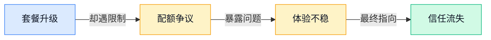
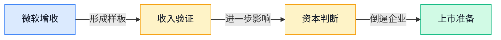
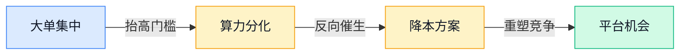
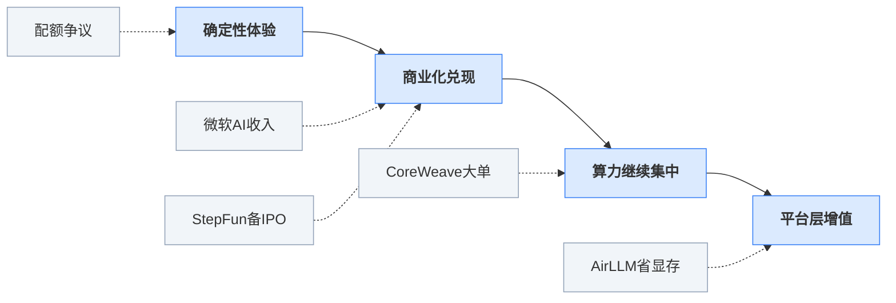

> 2026-04-13 ~ 2026-04-19 | 本周共 1 期日报

**本周日报**: [04-13](/ai-daily-site/2026/2026-04/2026-04-13/)

---

## 本周聚焦

### 配额争议背后：AI 产品竞争从“能不能用”转向“能稳定用多久”

本周最值得重视的一条线索，不是某个模型又刷新了能力上限，而是 OpenAI 员工回应新版 ChatGPT Pro 套餐使用限制，同时 Claude Code 用户也反馈，所谓 Pro Max 的 5 倍配额能在 1.5 小时内烧完。两件事放在一起看，说明市场矛盾已经从“AI 强不强”转移到“付费之后还能不能放心依赖”。

这件事重要，是因为 AI 产品正在越过尝鲜阶段，进入“用户拿它做事”的阶段。对普通用户来说，买会员不是为了拥有某个抽象的模型资格，而是为了获得一种确定性：我今天要写方案、做分析、跑代码、做语音内容时，它能不能稳定完成。如果平台宣传很强，但真实使用中频繁碰到额度模糊、消耗过快、失败原因不清，用户就会迅速从“觉得先进”转为“觉得不靠谱”。在软件行业里，能力上限决定传播，稳定下限决定续费；AI 也开始进入这个规律。

对行业来说，这意味着竞争标准在升级。过去，厂商靠排行榜、演示视频和少量惊艳案例就能吸引注意力；现在，真正影响口碑的是更朴素的几个问题：一次任务平均要花多少配额？长任务会不会中途掉线？同样的钱能完成多少件事？失败时能不能解释为什么失败？这些问题看似不性感，但它们决定的是商业化留存，而不是流量热度。

更深一层看，配额争议还暴露了 AI 产品的一个结构性问题：底层成本依然高且波动大，前端又试图用订阅制承诺“高级体验”，两者之间天然紧张。尤其当多轮推理、代码任务、语音与图像等高消耗场景变多，过去那种模糊的“更多访问权”描述很容易失效。接下来，行业大概率会出现两种变化：一类公司继续做高溢价但强限制的会员；另一类公司则会把消耗、速度、成功率讲得更透明，用“可预期”换信任。后者未必更炫，但更接近成熟市场。

对我们这样的 Agent 平台方向，这条线索尤其关键。用户未来不会只问“你接了哪些模型”，而会问“我这个任务到底能不能稳定做完，失败了怎么补救，为什么推荐这个方案”。这也说明，真正有价值的并不是替别人卖模型，而是把额度、质量、成功率、失败解释这些原本分散且不透明的成本，转化成用户能理解、能比较、能信任的产品体验。

### 商业化与资本市场回归现实：讲故事的窗口在收窄

第二条主线，是微软已经被市场视为少数真正把 AI 变成收入的大厂，同时中国 AI 创企 StepFun 拟拆除离岸架构，为 IPO（首次公开募股）铺路。这两个事件一个来自成熟巨头，一个来自创业公司，但共同指向同一件事：AI 行业正在从“远景想象”转向“财务兑现”。

为什么这件事重要？因为过去两年，AI 行业里最值钱的是叙事能力：谁更像下一代平台，谁更像基础设施入口，谁更接近 AGI（通用人工智能，指能完成广泛任务的更通用智能）。但当资本市场开始重新要求收入、利润率、合规结构和上市路径时，单靠宏大叙事就不够了。微软之所以被高看，不是因为它最会讲未来，而是因为它已经证明，AI 能嵌进现有产品和销售体系，变成客户愿意持续付钱的业务。StepFun 调整架构，则说明创业公司也感受到同样压力：如果未来要进入公开市场，仅有技术亮点不够，公司结构、资本路径和商业证明都要提前准备。

这对行业意味着一个明显变化：估值逻辑正在分层。第一层是能不能真正收钱，第二层是收入是不是可持续，第三层才是未来想象力。也就是说，不能自证商业化的公司，即使模型能力不错，也可能越来越难拿到高溢价；反过来，那些未必掌握最强基础模型、但能把 AI 嵌入真实流程并形成稳定付费的公司，地位会迅速提升。

还有一个常被忽视的信号：这会加速“中间层”的价值重估。因为不是每家公司都能像微软那样拥有分发渠道，也不是每家公司都适合押注自研大模型。于是，帮助用户完成模型选择、效果比较、成本控制、结果验证的那一层，会变得更有现实意义。资本市场越来越关心“你到底解决了什么问题”，这其实对平台型机会是利好——前提是平台真的降低了决策成本，而不是只做模型列表页。

换句话说，本周这条线索提醒我们，AI 创业接下来要拼的不只是技术前沿，还有商业解释力：为什么客户需要你，为什么不是直接买大厂 API（应用程序接口，指软件之间的调用方式），为什么你的位置不会被上游吞掉。谁能把这些问题答清楚，谁才更接近下一阶段的胜出者。

### 算力集中与降本创新并行：AI 基础设施进入“又贵又省”的双轨时代

第三条主线，是 CoreWeave 靠 Meta 和 Anthropic 大单坐上 AI“房东”位置，英伟达与 Cadence 加深合作，显示芯片设计链条继续抱团；与此同时，开源侧又出现 AirLLM 这类单张 4GB 显卡也能跑 70B 大模型推理的方案，研究侧还有树状稀疏前馈层（通过只激活部分计算路径来降低算力消耗的结构改进）瞄准 Transformer（当前主流大模型架构）算力瓶颈。表面看，一边是巨头继续囤资源，一边是社区拼命省资源，似乎矛盾；其实这恰恰是当前行业的真实状态。

重要性在于，AI 的基础设施竞争已经不再只是“谁有更多卡”，而是进入“谁能拿到稀缺资源，谁又能把资源用得更省”的双轨博弈。CoreWeave 的崛起说明，最优质算力正在向少数大客户和大平台集中，资源获取本身就成了壁垒。英伟达与 Cadence 的合作则进一步表明，从芯片设计到部署软件，产业链正在更紧地绑定，强者会更强。

但另一边，AirLLM、caveman 这类项目，以及节省前馈层计算的研究，都说明全行业都在寻找“便宜可用”的替代路径。原因很简单：不是所有需求都值得用最贵的推理方式完成。很多真实场景要的不是极限性能，而是足够好、足够快、足够便宜。于是，行业不会只朝着更大的模型走，也会朝着更精细的资源分配走。

这对行业的意义很大。首先，基础模型能力的差距可能继续拉大，因为头部玩家拿得到更好的训练和推理资源；但其次，应用层并不会因此失去机会，反而更需要“成本意识强”的平台来决定什么任务该用高配模型，什么任务该用轻量方案，什么任务能通过提示词（给模型的文字指令）优化、缓存、分步执行来省掉大量成本。真正成熟的 AI 产品，不是永远给用户上最强模型，而是以最合适的资源交付最稳定的结果。

因此，本周最大的行业现实不是单一方向的乐观或悲观，而是一个更复杂但也更清晰的格局：上游资源继续集中，中游产品必须证明收入，下游用户开始在乎确定性。谁能把这三件事串起来，谁就更接近下一阶段的护城河。

---

## 信号与噪音

1. CoreWeave 拿下 Meta 和 Anthropic 大单，被进一步视为 AI 时代的“房东”。点评：这说明稀缺算力正在继续向少数服务商集中，应用公司若把竞争力建立在“能租到模型”上，未来会越来越被动。

2. 英伟达与 Cadence 深化合作，把 AI 芯片设计链条绑得更紧。点评：这不是普通合作新闻，而是上游生态进一步封闭和协同的信号，意味着硬件优势会更快传导成产品优势。

3. Palantir CEO 直言 AI“将摧毁”文科类岗位。点评：这类表态有夸张成分，但反映出一个现实——AI 对知识工作者的替代讨论，正在从效率提升转向岗位重构，社会情绪会持续放大。

4. 研究者重新给“世界模型”下定义，并明确文生视频不算。点评：行业正在给热门概念降温，避免把所有多模态生成都包装成同一种能力；这有助于市场回到更清晰的技术边界。

5. OmniVoice 开源，支持 600 多种语言的高质量语音克隆 TTS（文本转语音）。点评：多语言语音能力门槛正在明显下降，未来语音 Agent 不再只是英语和普通话市场的游戏，小语种与跨语种交互会更快普及。

6. OpenAI 开源 codex-plugin-cc，让 Claude Code 也能调用 Codex。点评：这说明头部厂商之间并非只有封闭竞争，也开始出现围绕开发工作流的互联；真正的战场正在从单模型走向工具链入口。

7. JoyAI-Image、AirLLM、caveman 等开源项目同时出现，分别指向统一多模态图像、低显存推理和 Token（文本消耗单位）节省。点评：开源社区本周没有出现单点爆款，但密集释放出一个信号：大家都在补“可用性”和“成本”这两门课，而不只是追求参数规模。

---

## 宏观趋势

1. 从能力崇拜转向体验确定性。本周 OpenAI 回应 ChatGPT Pro 限额、Claude Code 用户吐槽配额过快耗尽，都说明用户开始按“是否稳定完成任务”评判 AI 产品。未来厂商会更重视可解释的消耗规则、任务成功率与服务分层。

2. 商业化证明正在成为新的估值底线。微软被视为少数将 AI 变成真实收入的大厂，StepFun 也开始为 IPO 调整架构，验证了资本市场正在重新按收入与合规来定价。未来纯叙事型项目会承压，能嵌入真实业务流程的平台更容易被高看。

3. 算力继续集中，但降本技术同步加速。CoreWeave、英伟达与 Cadence 显示头部资源更集中；AirLLM、树状稀疏前馈层、caveman 又说明全行业都在找更省的办法。未来会形成“头部吃高端、应用层拼优化”的长期格局。

4. 开源竞争正从模型本身扩散到工具与接口层。OmniVoice、codex-plugin-cc、JoyAI-Image 等事件表明，开源不只是在复刻模型，而是在补齐语音、多模态、开发工作流的拼图。未来真正有价值的开源能力，可能更多体现在组合效率，而不是单项跑分。

---

## 对我们的启发

产品方向上，第一，不要只展示“可接多少模型”，而要把任务成功率、消耗预估、失败原因、替代方案推荐做成前台能力，因为本周最清晰的行业信号就是用户开始为“确定性”买单。第二，平台评测不应只测一次性表现，应加入“换说法是否仍稳定完成”的鲁棒性（指不同表达下仍能稳定工作的能力）测试。

竞争策略上，第一，别把自己定义成模型搬运层；上游算力和模型都在集中，我们更该占据“选择、比较、验证、信任”这一层。第二，可以优先整合便宜但足够好的模型与开源能力，把“高配模型留给高价值任务”的策略做成产品优势。

时机判断上，第一，资本和市场都在从讲故事转向看收入与留存，这对早期团队是压力，也是窗口：只要能证明真实需求，就比空泛叙事更有说服力。第二，当前行业尚未形成稳定的用户体验标准，谁先把 Agent 使用中的透明度和可预期性做好，谁就有机会抢到心智。

---

## 本周思考

当用户真正把 Agent 当成“替我完成任务的人”而不是“陪我聊天的模型”时，平台最核心的护城河会是更强的能力，还是更可验证的可靠性？
