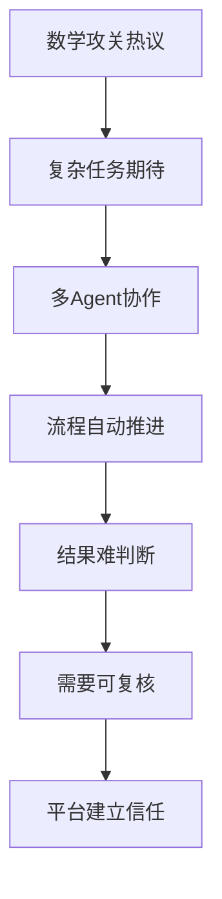
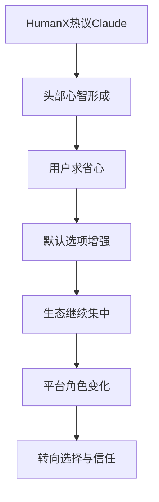
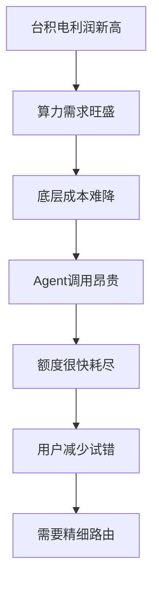
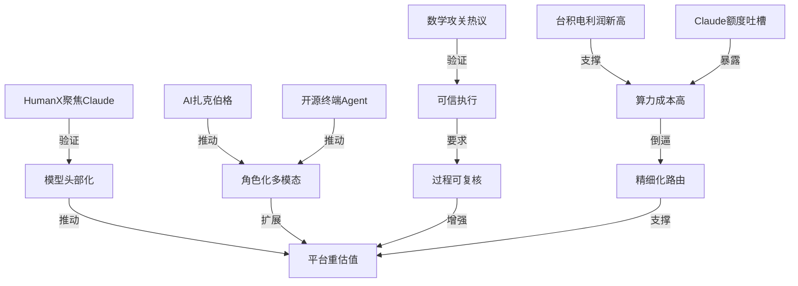

> 2026-04-13 ~ 2026-04-19 | 本周共 1 期日报

**本周日报**: [04-13](/ai-daily-site/2026/2026-04/2026-04-13/)

---

## 本周聚焦

### 1. Agent 正从“执行工具”走向“复杂流程代理”，但可信度开始成为真正门槛
本周最值得关注的主线，是两条看似分散、其实高度相关的消息同时出现：一是“中国 AI 数小时攻克十年数学难题”，引发“机器能否独立科研”的讨论；二是 AlphaLab 想让多智能体自动跑完整科研实验，行业洞察也明确指出，Agent 正从“帮人干活”走向“替人推进复杂流程”。这说明行业关注点正在变化：过去大家更在意模型会不会写、会不会答、会不会生成；现在开始追问，AI 能不能在一个长链条、高不确定性的任务里持续推进，并最终交付一个可用结果。

为什么这件事重要？因为它改变了 Agent 产品的竞争标准。一个能完成复杂流程的 Agent，不再只是“把提示词包装得更好”的界面层，而是要具备任务拆解、状态记忆、工具调用、结果回看和异常修正的能力。尤其是在科研、分析、开发、内容生产这些多步骤场景里，用户最终不只看结果快不快，而是看这个结果能不能被解释、能不能被复核、能不能被重复得到。数学难题这类事件会放大市场期待，但也会同步抬高怀疑门槛：到底是模型真的理解了问题，还是在高密度试错中碰巧命中？如果平台无法回答这个问题，能力越强，用户反而越不敢信。

对行业意味着什么？意味着 Agent 平台的价值中心正在从“会不会做”转向“能不能证明自己做对了”。这会直接影响下一阶段产品设计：第一，过程可见性会变成必要能力，而不是面向专业用户的附加项；第二，结果的证据链会成为新的产品资产，比如引用来源、推理路径摘要、关键决策点和失败分支；第三，多 Agent 协作会越来越常见，但用户不会天然相信“多个 Agent 一起做”就更可靠，平台必须把分工关系和交叉验证机制讲清楚。对我们这类 Agent 调度与进化平台来说，这不是边缘问题，而是核心问题：如果未来用户是像点外卖一样调用 AI，那么平台最重要的职责不是只把“最快的骑手”派出去，而是让用户知道这单为什么值得信任。

### 2. 模型市场加速头部集中，“省心”正在超过“最强”成为购买理由
本周 HumanX 大会几乎都在聊 Claude，Anthropic 成为会场焦点，这是另一个必须重视的信号。行业洞察点得很直接：模型市场正在加速头部集中，大家选的不是“最先进”，而是“最省心”。这意味着模型层竞争已经从单次能力榜单，转向更综合的组织使用体验，包括稳定性、一致性、接口成熟度、品牌信任、社区口碑和案例扩散速度。

为什么这件事重要？因为这会压缩后来者靠“单点性能领先”切入市场的空间。很多企业和团队并不想持续比较每家模型最新分数，他们要的是一个低决策成本的答案：谁最稳、谁最少出幺蛾子、谁被最多同行采用、谁的生态已经足够成熟。Claude 在大会中的关注度，本质上不是某一项指标的胜利，而是“默认选项”地位正在形成。默认选项一旦形成，会带来很强的正反馈：更多用户使用，更多开发者适配，更多案例传播，进一步强化“省心”的品牌印象。

对行业意味着什么？第一，模型层会更像基础设施，真正拉开差距的地方会转移到上层产品与工作流整合。第二，平台型公司不能把自己的护城河建立在“我接了最新模型”上，因为用户迟早会发现接模型越来越容易。第三，头部模型集中会让中间层平台的角色更清晰：不是替代模型，而是帮助用户在不同任务、预算、风险要求之间做选择，并把选择过程产品化。对我们来说，这反而是机会。因为当底层模型趋于头部化，用户更需要一层“可信中介”来做方案编排、质量评价和来源说明。简单说，模型头部化不一定让平台失去价值，前提是平台别只做分发入口，而要做“选择机制”和“信任机制”。

### 3. AI 很热，但“随便用”的时代还没到，成本约束仍决定产品形态
本周还有一条容易被情绪化叙事掩盖、但对创业公司极其现实的主线：台积电有望连四季创利润新高，说明 AI 需求仍在强力拉动半导体景气；与此同时，Claude Code 用户反馈 Pro Max 5 倍额度 1.5 小时就耗尽，直接暴露出高频 Agent 使用场景下的成本压力。两件事放在一起看，结论非常明确：行业热度建立在昂贵算力之上，短期内成本不会自然消失。

为什么这件事重要？因为很多 AI 产品今天最大的问题，不是演示效果不好，而是商业上难以成立。尤其是 Agent 类产品，一旦进入真实工作流，就会频繁调用模型、反复试错、多轮规划，还可能串联搜索、代码执行、图像处理等外部工具。演示时看起来聪明，账单出来时才发现不可持续。Claude Code 的额度吐槽，本质上不是一个套餐设计问题，而是提醒大家：凡是需要长链思考、上下文记忆和多步尝试的 Agent，都天然是“高消耗物种”。

对行业意味着什么？第一，成本效率会重新成为产品竞争力，而不是后台运营指标。谁能在同样预算下给出更靠谱结果，谁就更可能赢。第二，平台不能默认用户愿意无限试错，必须在正式调用前增加预估、筛选和轻量验证机制。第三，商业模式会更偏向“高价值任务优先”，而不是盲目追求日活。对我们这类平台来说，这个信号尤其关键：用户不会长期为不确定结果支付高昂调用成本，因此“先评估再调用”“低成本路由（把简单任务派给便宜模型，把高风险任务派给强模型）”“结果复用”和“历史方案评分”会比单纯提升调用量更重要。换句话说，成本不是增长之后再优化的问题，它正在定义什么样的 Agent 产品有资格活到下一轮竞争。

---

## 信号与噪音

1. 谷歌 AI 广告机器改写搜索规则，品牌称营收最高可增 80%。点评：这说明 AI 对流量分发的改造已经进入商业变现深水区，搜索不再只是“找答案”，而是更强地介入“把谁推到用户面前”；但对普通品牌和中小内容方来说，平台黑箱（外部无法清楚知道内部排序逻辑的系统）可能进一步加重。

2. 研究者给“世界模型”下定义，认为文生视频还不算。点评：这是一次重要的概念校准，提醒行业不要把“生成得像”误当成“理解了世界运行规律”；对创业团队来说，这种定义之争虽然抽象，但会影响未来资本和市场如何判断技术路线是否有长期价值。

3. QwenLM/qwen-code 被称为“住在终端里的开源 AI Agent”。点评：开源社区正在把 Agent 从聊天界面推向更真实的工作环境，尤其是开发者日常使用的终端；这有利于 Agent 形成可执行、可组合、可持续操作的能力，但也会让用户更快形成对“工程化细节”的高预期。

4. agent-skills 试图给 AI 编码助手补上工程化真本事。点评：这说明行业已经意识到，编码 Agent 的短板不在“会写几行代码”，而在理解项目结构、遵守规范、处理依赖和完成端到端任务；Agent 要进入生产场景，靠基础模型本身远远不够。

5. OpenMontage 把 AI 编码助手扩展成视频制作工作室。点评：这代表 Agent 正在跨出纯文本和代码场景，进入多模态创作链路；但视频工作流通常步骤长、角色多、审美主观，短期更像效率增强工具，而不是完全替代人的自动流水线。

6. JoyAI-Image 作为统一多模态图像基础模型被京东开源。点评：大厂继续把基础能力开源，既是生态占位，也是降低开发者采用门槛；对平台公司而言，底层图像能力越来越难成为独特卖点，更需要考虑如何把模型能力嵌入完整任务和可评价方案中。

7. Meta 被曝在做“AI 扎克伯格”，让员工和扎克伯格的数字分身互动。点评：这条消息虽然带有话题性，但背后指向的是“把组织里的最佳经验复制给更多人”的需求；企业愿意买单的，也许不是一个泛化万能助手，而是一个能稳定输出某种判断风格和决策框架的角色型 Agent。

---

## 宏观趋势

1. 可信执行正在超过炫技生成。数学攻关事件、AlphaLab 多智能体科研实验设想，以及“世界模型”定义之争，共同验证了行业开始从“能生成什么”转向“能否稳定推进复杂任务并证明结果可靠”。未来，具备过程展示、依据说明和结果复核能力的 Agent 产品会更容易建立长期信任。

2. 模型头部化加速，上层平台价值重估。HumanX 大会对 Claude 的集中关注验证了模型市场正在形成默认选项。未来底层模型差异仍会存在，但多数用户会优先选择“省心”的头部供给，这会推动平台把价值从接入模型，转向任务分发、方案比较、质量评价和风险控制。

3. 算力成本继续塑造产品边界。台积电利润创新高与 Claude Code 额度快速耗尽，一起证明 AI 的底层繁荣建立在高成本之上。未来一段时间，真正能跑通的产品不会是“无限调用型”，而是能够做预算控制、任务分层和成本收益匹配的系统。

4. Agent 从单点助手走向角色化、工程化、多模态。Qwen-code、agent-skills、OpenMontage 以及 Meta 的数字分身消息，共同验证 Agent 正在同时向三个方向延伸：更贴近真实工具链、更像具备稳定风格的角色、也更能处理跨媒介任务。未来胜负不只看模型聪不聪明，还看是否能在具体场景中形成稳定可复用的工作方式。

### 趋势全景图

---

## 对我们的启发

产品方向上，第一，我们要把“结果可复核”前置成核心能力，而不是事后补一个日志页；用户调用 Agent，不只要答案，还要知道它依据了什么、在哪些步骤不确定。第二，要强化“先评估再调用”的体验，比如先给出任务复杂度、预算预估、成功率判断，再决定是否进入高成本执行。

竞争策略上，第一，不要把自己定义成“接更多模型的平台”，而要定义成“帮用户挑对方案、信对结果的平台”；模型头部化越明显，中间层越要做出选择机制。第二，要重视角色型 Agent 与风格化经验包，把“某种靠谱做事方式”沉淀成可复用单元，而不只是提供一个通用助手壳。

时机判断上，当前仍不是押注“用户无限调用”的阶段，成本约束会持续存在；但正因为行业还没进入随便用时代，谁先把预算控制、可信展示和方案评价做好，谁就更有机会在下一轮普及期占住入口。

---

## 本周思考

当 Agent 逐渐能替人推进复杂流程时，用户真正购买的到底是“能力”，还是“可以把责任托付出去的信任感”？如果后者更重要，我们该如何把信任设计成产品本身的一部分？
