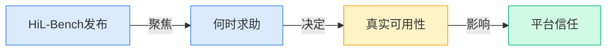
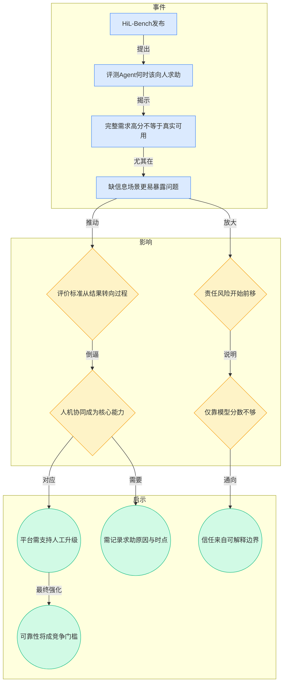
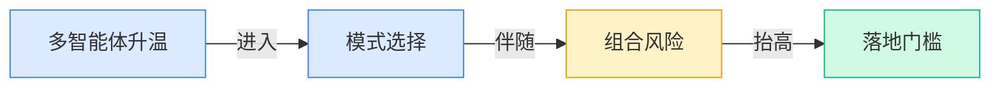
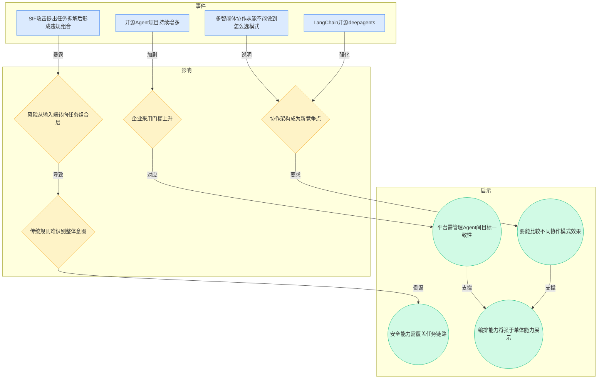
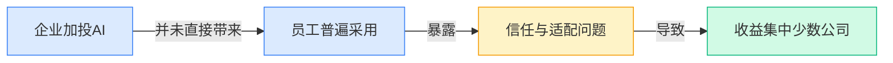
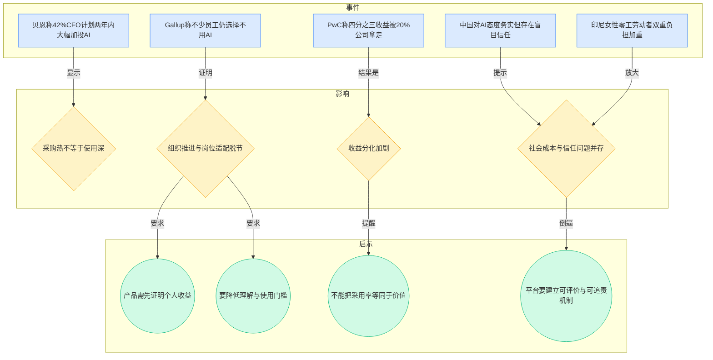
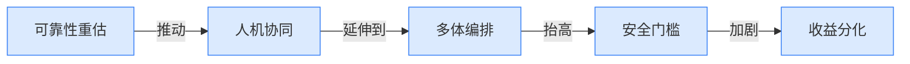
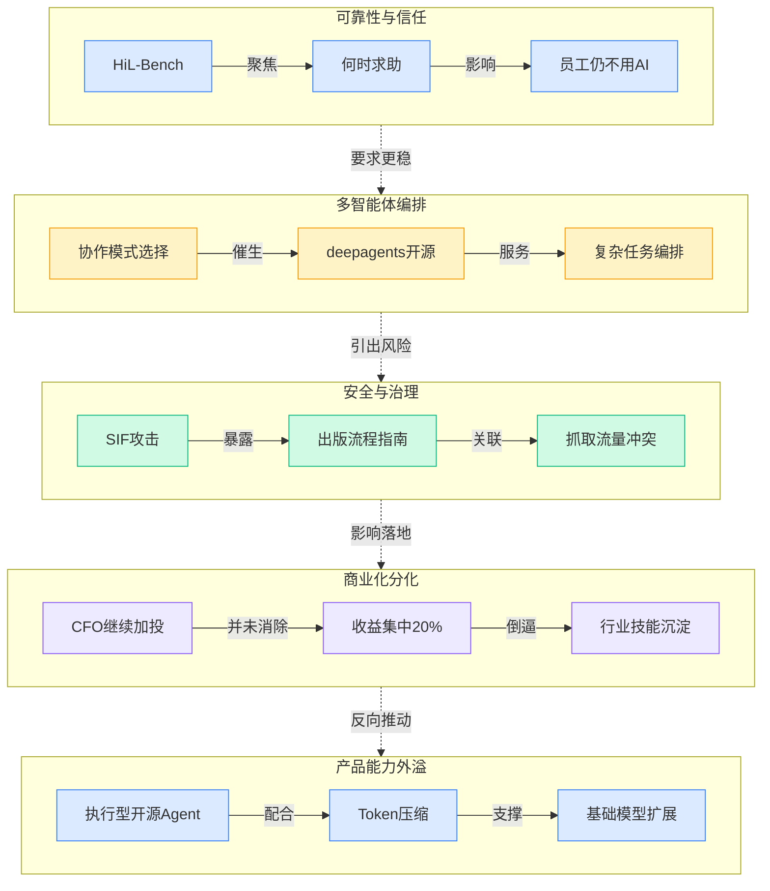

> 2026-04-13 ~ 2026-04-19 | 本周共 1 期日报

**本周日报**: [04-13](/ai-daily-site/2026/2026-04/2026-04-13/)

---

## 本周聚焦

### 从“能做事”到“知道何时求助”：Agent 可靠性的评价标准在变

展开详细图谱

本周最值得重视的变化，不是又多了一个 Agent（智能体）项目，而是行业开始更认真地追问：一个 Agent 不只是要把事做出来，还要知道什么时候自己不该继续做、应该转给人。HiL-Bench 这类“人在回路评测”（Human-in-the-Loop Benchmark，专门测试系统何时应该请求人工介入）把焦点从“答案对不对”转向“边界感对不对”。这意味着，Agent 产品的核心竞争力正在从能力上限，转向能力边界的管理。

为什么这件事重要？因为现实业务里，最危险的往往不是完全不会做，而是“半懂不懂还继续做”。日报里已经点出：完整需求下拿高分，并不代表真实可用；一旦信息缺失、目标模糊、上下文冲突，系统如果不知道求助，就容易在错误方向上越走越远。对普通用户来说，他未必能判断一个 Agent 是“能力不足”还是“误判形势”，但只要结果不可靠，信任就会迅速崩塌。对企业来说，这还会变成责任问题：谁决定继续执行，谁承担后果。

对行业意味着什么？第一，评测体系会变。未来不只是比谁成功率高，还要比谁“知道自己什么时候不该继续”。第二，产品设计会变。人机协作不再是补丁，而是主流程的一部分。第三，平台价值会变。谁能把“升级到人工”的条件、证据、时点、原因做成标准化能力，谁就更可能在真实场景里获得信任。对于一个面向大众的 Agent 平台来说，这比单纯追逐更强模型更接近长期壁垒：用户真正愿意持续使用的，不是最会表演聪明的系统，而是最能把风险讲清楚、把边界处理好的系统。

### 多智能体进入“模式选择”阶段：协作红利与组合风险同时上升

展开详细图谱

本周另一条主线，是多智能体协作正在从“能不能做复杂任务”进入“该用什么协作模式”的阶段。日报中一边出现了 LangChain 开源 deepagents，瞄准复杂 Agent 任务编排；另一边，行业观察又提示多智能体已经开始面对模式选择问题。这说明行业共识正在形成：复杂任务不是多堆几个 Agent 就能自动变好，关键在于怎么分工、怎么传递上下文、怎么判断是否继续拆解。

但协作能力增强的同时，风险也一起升级。SIF 攻击（Semantic Intent Fragmentation，可理解为“语义意图碎片化攻击”）说明了一个很现实的问题：单看每个子任务都合法，但组合起来可能指向违规目标。也就是说，过去很多安全规则盯的是“用户说了什么”，未来更要盯“系统被拆解后实际在做什么”。这对平台型产品尤其关键，因为平台往往不是单个 Agent 执行，而是多个组件、多个工具、多个角色共同完成任务。

为什么重要？因为这直接决定落地门槛。对外行用户而言，他不会研究你用了几层编排框架；但只要系统在复杂链路中出现目标漂移、重复调用、前后矛盾、甚至越界执行，他感受到的就是“这个平台不稳”。对企业客户而言，风险更实际：如果无法解释每个子任务为什么被触发、是否偏离原始意图，就很难进入严肃场景。

对行业意味着什么？第一，Agent 竞争正在从单模型能力转向编排能力。第二，安全治理的重点正在从输入审核，转向任务链路审核。第三，未来平台之间的差异，可能不在“能不能做”，而在“同样一件事，谁更知道该用哪种协作模式、谁更能防止链路失控”。这对你们所处的赛道是直接利好，但也意味着门槛提高：平台如果只是聚合能力，却不能管理多 Agent 之间的目标一致性和责任边界，很容易停留在演示层面。

### AI 采用正在分化：投入继续加码，但真正用起来的人并没有同步增加

展开详细图谱

如果说前两件事讨论的是“AI 能不能更可靠地工作”，那这一件讨论的是“即便能工作，为什么很多人还是不用”。本周的数据很有代表性：一边是贝恩说 42% 的 CFO（首席财务官）计划在两年内把 AI 投资提高 30% 以上，说明预算仍在继续流入；另一边是 Gallup 指出，虽然工作中 AI 用得更多了，但不少员工依然选择不用。再叠加 PwC 的判断——AI 经济收益的四分之三被 20% 的公司拿走——一个更清晰的现实浮现出来：AI 并没有平均地改变所有组织，而是在快速拉大“会用”和“不会用”的差距。

为什么这件事重要？因为它直接提醒早期团队，不要把“市场很热”误判成“产品自然会被用”。预算增加只代表管理层愿意试，员工持续使用才代表价值真正落地。很多团队会高估模型能力本身，低估岗位适配、流程重构、培训成本和心理信任。日报里关于中国“务实但存在盲目信任”的表述，以及印尼女性零工劳动者“双重负担”加重，也在提醒同一件事：AI 既可能提高效率，也可能把新的负担和风险转嫁给最弱势、最缺乏议价能力的人群。

对行业意味着什么？第一，未来的竞争不是“谁先接入 AI”，而是“谁先形成可持续使用”。第二，采用率会比发布量更重要，留存会比演示更重要。第三，收益会继续向那些能把 AI 嵌入具体岗位、建立信任反馈、让普通人真正感到省时省力的公司集中。对 to C 为主的团队而言，这尤其关键：消费者不会因为你技术先进就留下，只会因为你让他更省事、更放心、更容易判断哪个方案值得信任才留下。

---

## 信号与噪音

1. Frontiers 发布覆盖完整出版流程的 AI 使用指南。点评：这说明 AI 治理正在从“能不能用”走向“在哪些环节、以什么方式用”，规范化将从高风险行业向更多内容与知识行业扩散。

2. 出版商正面临越来越多 AI 爬虫与第三方抓取流量。点评：内容供给侧与模型需求侧的矛盾继续加深，未来高质量数据的授权、计量和分成机制会更受重视，免费抓取模式的空间可能收窄。

3. block/goose 这类可安装、执行、编辑和测试的开源 AI Agent 持续出现。点评：开源 Agent 正在从聊天助手升级为“能实际动手”的工具型系统，这会抬高用户对 Agent 平台的基本预期，不再满足于只会回答问题。

4. rtk 宣称可把 LLM Token（大模型文本处理消耗单位）压缩 60%-90%。点评：不管具体效果最终是否稳定成立，行业都已明确把成本优化视为产品竞争力的一部分，尤其对高频、长链路任务影响更大。

5. Anthropic 开源 Claude Cookbooks，集中展示 Claude 的实用玩法。点评：头部模型厂商正在把竞争从模型能力延伸到“最佳实践传播”，谁更容易被普通开发者和团队学会，谁就更容易扩大生态影响力。

6. SkillForge 面向云技术支持提出自我演化技能框架，结合知识库与历史工单持续修正技能。点评：这再次验证企业场景里真正有价值的不是通用回答，而是围绕具体行业流程不断积累、修正和沉淀能力，但代价是迁移性会下降。

7. Google Research 的 TimesFM 继续推进时间序列预测基础模型。点评：这提醒我们，AI 热点虽集中在对话与 Agent，但大量垂直价值仍来自非聊天类任务；未来平台若只围绕对话组织能力，可能错过更高价值的预测与决策辅助场景。

---

## 宏观趋势

展开详细图谱

1. 可靠性竞争正在替代“单次效果竞争”。本周 HiL-Bench 验证了行业开始重视 Agent 何时求助，Gallup 关于员工不用 AI 也说明，用户真正关心的是稳定可信而非偶尔惊艳。未来，能否解释失败、能否及时升级人工，会成为平台级产品的基础能力。

2. 多智能体进入架构分化期。多智能体协作从“能不能做”转向“怎么选模式”，deepagents 的出现进一步强化了编排层的重要性；同时 SIF 攻击表明风险已进入任务组合层。未来，协作模式评估、安全校验和链路可视化会成为编排平台的重要卖点。

3. AI 商业化出现明显两极分化。CFO 持续加投 AI，但员工采用并未同步提升，PwC 又指出收益集中在少数公司，说明“买了 AI”与“用出价值”之间还有巨大断层。未来，真正受益者将是那些能把 AI 嵌入岗位流程、降低理解成本并建立信任反馈的团队。

4. 行业化与治理同步升温。SkillForge、Frontiers 指南、出版抓取争议共同说明，AI 落地不再只是模型问题，而是行业知识、规则边界与利益分配问题。未来，垂直深度会带来更强价值，但也要求产品同时具备治理能力和生态协调能力。

---

## 对我们的启发

产品方向上，第一，应把“何时转人工、为什么转人工”做成平台内建能力，而不是事后补救；这会直接影响用户对 Agent 结果的信任。第二，多智能体不应只展示能完成复杂任务，更要能让用户理解不同方案为何被选择、链路是否偏离目标。

竞争策略上，第一，不要只和单个模型比聪明，而要突出“可评价、可比较、可追责”的平台能力，这正对应本周暴露出的采用与安全痛点。第二，可以优先围绕少数高频场景沉淀行业技能，而不是追求一开始覆盖所有任务类型。

时机判断上，当前市场仍在加投，但真正形成使用闭环的团队不多，这意味着窗口还在；不过收益正加速向少数能把信任和流程做扎实的公司集中，留给“只会拼接能力”的平台时间并不多。

---

## 本周思考

如果未来用户真正信任的不是“最强 AI”，而是“最知道自己何时不该继续的 AI”，那我们的平台核心资产，究竟应该是能力上限，还是边界管理能力？
