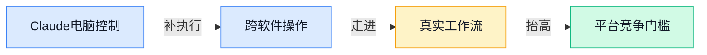
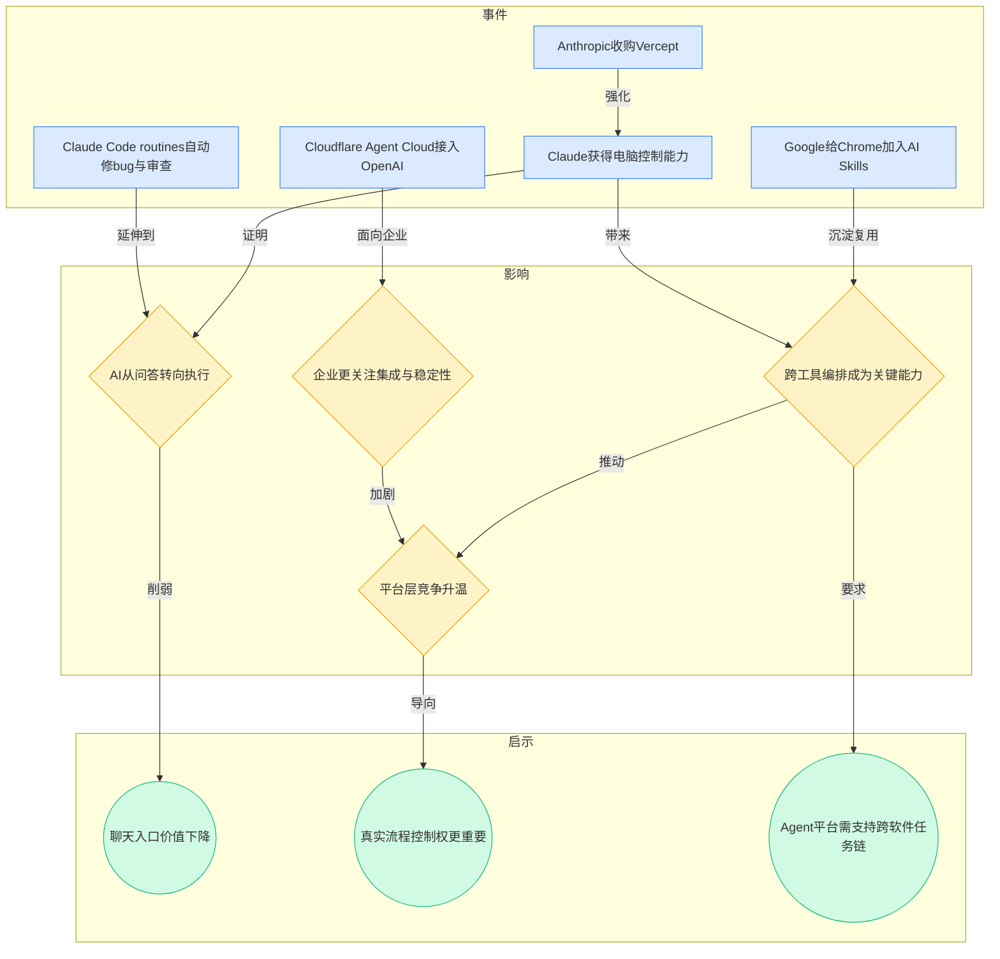
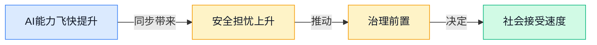
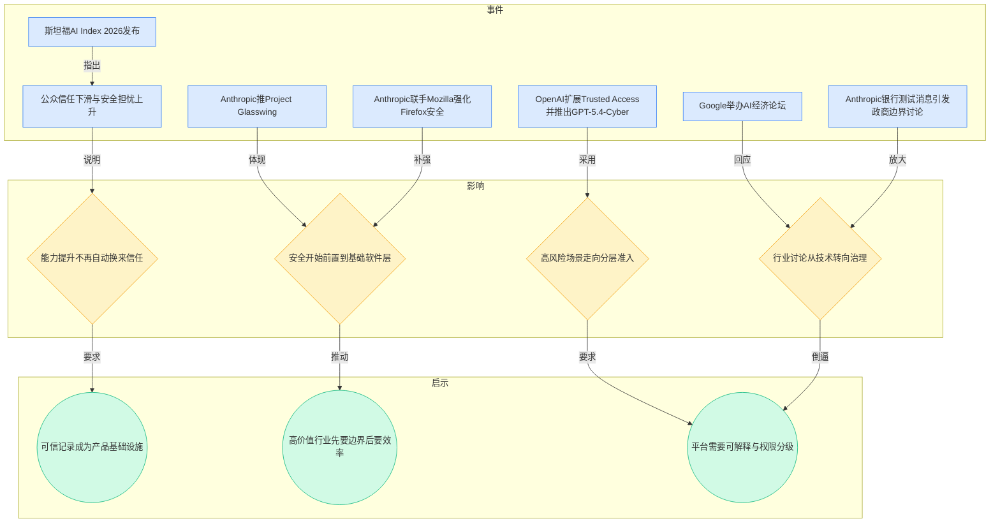
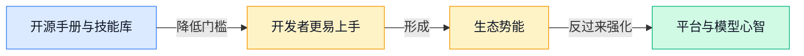
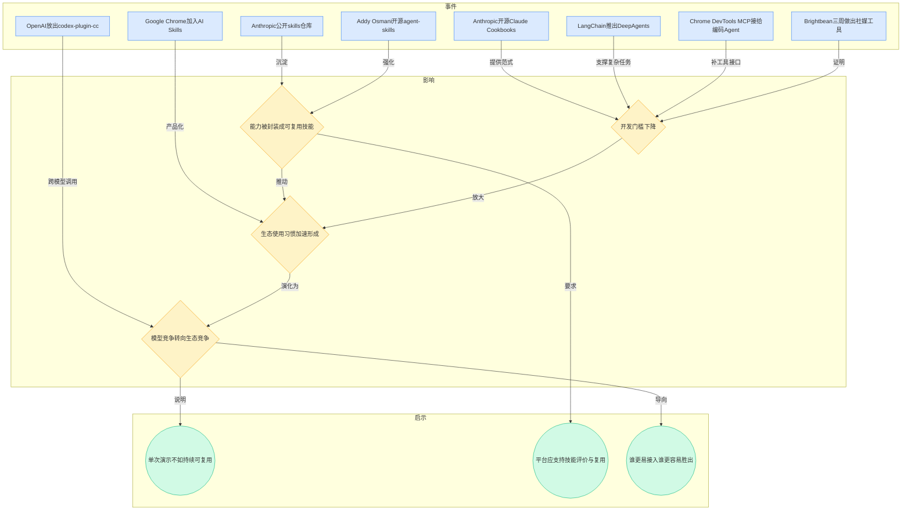
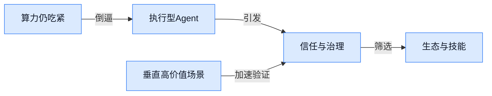
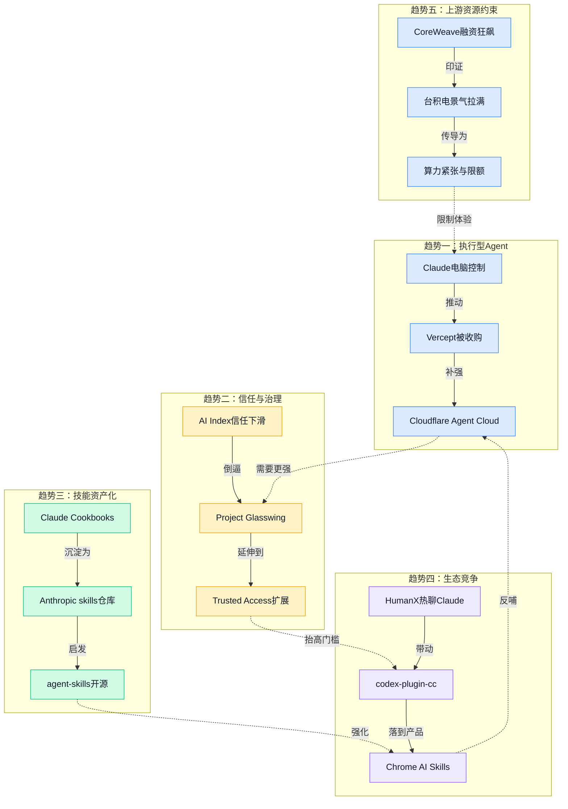

> 2026-04-13 ~ 2026-04-19 | 本周共 3 期日报

**本周日报**: [04-13](/ai-daily-site/2026/2026-04/2026-04-13/) | [04-14](/ai-daily-site/2026/2026-04/2026-04-14/) | [04-15](/ai-daily-site/2026/2026-04/2026-04-15/)

---

## 本周聚焦

### 从“会回答”到“能执行”：AI 正在进入真实工作流

展开详细图谱

本周最清晰的一条主线，是头部厂商不再满足于让模型“回答得更像人”，而是在全力补齐“替人把事情做完”的最后一公里。具体事件非常集中：4 月 14 日 Anthropic 收购 Vercept，继续强化 Claude 的电脑操作能力；同日和次日，Claude 打通 Office 场景、获得“电脑控制”能力，Claude Code routines 又开始自动修 bug、做代码审查；Google 给 Chrome 加入 AI Skills，把常用提示词和流程保存复用；Cloudflare Agent Cloud 接入 OpenAI，强调企业级 Agent 工作流更快可落地。

为什么这件事重要？因为这标志着竞争单位正在从“单次对话质量”切换到“整段任务链完成率”。普通用户过去感知 AI，主要是聊天、写文案、生成图片；但一旦 AI 能点按钮、切窗口、调用工具、填写表格、检查结果，它就不只是一个回答系统，而是开始接近“数字员工”。这会直接改变用户判断标准：不再只问哪个模型更聪明，而会问哪个系统更可靠、更会接软件、更知道失败时怎么停下来。

对行业意味着什么？第一，入口价值下降，流程控制价值上升。单一聊天框的吸引力会逐渐被“能不能跨软件办事”取代。第二，平台层的重要性提高。因为真实工作流天然是多工具、多模型、多权限混杂的，谁能把不同 Agent、不同技能包、不同软件连接起来，谁就更接近实际价值。第三，执行能力越强，信任问题越突出。一个会写摘要的 AI 出错，代价可能只是内容不准；一个会直接操作电脑的 AI 出错，代价可能是误发信息、误改数据、误触发关键流程。于是“执行力”与“可控性”会被同时考核，而不是先有一个再补另一个。

对于我们关注的 Agent 调度平台来说，这条线索尤其重要。因为头部模型厂商正在争夺“执行层”，但他们并不天然等于“最好用的平台”。当市场进入真实工作流阶段，用户将越来越需要一个中立层去比较：哪个 Agent 适合哪类任务，什么时候该自动执行，什么时候该人工确认，失败后怎么回滚（撤销到上一步），以及同一任务在不同 Agent 之间怎么切换。换句话说，本周不是简单地说明“Claude 很强”或“OpenAI 在扩张”，而是在提醒我们：行业重点已从展示能力，转向争夺任务链的组织权。

### 信任赤字扩大：安全、治理与公众接受度成为主战场

展开详细图谱

如果说上一条主线讲的是“AI 更能做事了”，那本周另一条 equally important（同样重要）的主线就是：越能做事，外界越不放心。4 月 14 日和 15 日连续出现斯坦福 AI Index 2026 的相关结论——AI 进步飞快，但安全担忧上升、公众信任下滑，而且 AI 圈内人与普通公众之间的认知鸿沟正在扩大。与此同时，Google 在华盛顿举办“AI for the Economy Forum”，主动把政界、商界和学界拉到一张桌上；Anthropic 推出 Project Glasswing，并与 Mozilla 合作提升 Firefox 安全；OpenAI 扩展 Trusted Access（经审核的可信开放机制）并推出 GPT-5.4-Cyber；更早一天，Anthropic 的 Mythos 模型进入银行测试的消息也再次引发政商边界讨论。

为什么这件事重要？因为行业已经进入一个新阶段：技术进步本身不再足以推动落地，公众信任、监管接受度、组织内部风控能力，正在共同决定 AI 能走多远。过去大家常以为“模型再强一点，应用自然会起来”；但现在现实是，模型更强后，很多机构反而更谨慎。原因很简单：AI 开始进入金融、安全、浏览器、企业主流程这些高风险系统，一旦出错，后果不再是“内容尴尬”，而可能是合规问题、资产风险、信息安全问题。

对行业意味着什么？第一，安全正在从附属模块变成基础能力。本周值得注意的是，安全不再只体现在“给模型加个免责声明”，而是进入浏览器、关键软件、网络安全准入等基础层。第二，高敏感场景会出现更明显的分层开放。OpenAI 的 Trusted Access 就说明，不是所有强能力都面对所有用户平铺开放，而是根据资格、场景、机构属性分层供给。第三，治理能力将成为新的竞争门槛。未来不是只有“谁模型更强”，还包括“谁能让董事会、法务、合作伙伴和普通用户都放心”。

这也意味着，很多看似“慢”的能力，其实会比“更聪明一点”更有商业价值。例如可解释记录（让人知道 AI 为什么这么做）、权限分级（不同任务给不同执行边界）、人工接管点（关键步骤必须确认）、失败可追溯（知道错误发生在哪一步）。对 Agent 平台来说，这不是装饰层，而是决定能否进入高价值场景的门票。如果行业正在从“炫技”转向“可信落地”，那么平台的核心任务就不是把 Agent 排名做得更花哨，而是把信任结构搭出来。

### 技能资产化与生态势能：谁更容易被用起来，谁就更强

展开详细图谱

第三条值得深拆的主线，是“技能资产化”正在迅速成为行业共识。4 月 13 日 Anthropic 开源 Claude Cookbooks，系统整理 Claude 用法示例；4 月 15 日又公开 skills 仓库；同日 Addy Osmani 开源 agent-skills，给 AI 编程助手补“工程化技能包”；LangChain 推出 DeepAgents，面向复杂任务；Chrome DevTools MCP 让编码 Agent 更会“看浏览器”；OpenAI 放出 codex-plugin-cc，让 Claude Code 也能调用 Codex；而 Brightbean Studio 用 Claude 和 Codex 在 3 周内做出社媒管理工具，则给这种趋势提供了一个鲜活案例。

为什么重要？因为这说明行业正在从“靠天赋的单次聪明”转向“靠资产的持续复用”。所谓技能资产化，简单说就是把原本隐含在提示词、经验、脚本和人工流程里的能力，整理成可调用、可复用、可评估的模块。它的意义在于：一旦能力被模块化，使用门槛会显著下降，团队协作会更容易，平台分发也会更高效。用户不需要每次从零写提示词，而是直接调用一套被验证过的技能组合。

对行业意味着什么？第一，生态势能比单次模型发布更持久。HumanX 大会上“人人都在聊 Claude”，并不只是因为模型一时强，而是因为 Anthropic 同时在手册、技能库、开发实践上持续铺设基础设施。第二，跨模型与跨工具协作会越来越常见。OpenAI 的插件让 Claude Code 调用 Codex，本身就说明生态边界在变得更现实——大家不再追求单一闭环，而是在争夺“谁是默认工作台”。第三，平台的价值会从“收录多少模型”转向“能否管理多少技能资产”。因为最终用户感受到的不是底层参数，而是能不能快速找到一套靠谱方案，并在类似任务中反复复用。

对我们来说，这条线索很关键。Agent 平台如果只收集 Agent 名称和评分，很容易沦为资讯页；但如果能把“任务—技能—Agent—结果”串起来，把技能模块沉淀成可比较、可组合、可继承的资产，就更有可能形成真正的网络效应（越多人使用，平台上可复用方案越丰富，后来的用户越容易成功）。本周这些开源与产品更新其实都在提醒同一件事：未来不会是“一个最强 Agent 吃掉所有场景”，而更像是“许多技能化 Agent 在不同任务链中被编排和复用”。

---

## 信号与噪音

1. CoreWeave 数百亿美元级融资、台积电被预期连四季利润创新高，说明资本仍在大规模押注算力与芯片。点评：短期行业资源仍向上游集中，应用层创业不能假设模型成本会快速低到失去差异，反而要准备在高成本环境里证明自己的单位经济性（单个用户或单次服务是否划算）。

2. HumanX 大会上“人人都在聊 Claude”，同时 Anthropic 连续开源 Cookbooks、skills 仓库和实战手册。点评：这不是单一发布会热度，而是开发者心智正在向 Claude 聚拢；模型竞争正在从“谁更强”转向“谁更容易被用起来”。

3. Claude Code 出现额度争议，Pro Max 5 倍额度被指 1.5 小时就耗尽，而同周又出现算力紧张、限额和 GPU 涨价。点评：用户对 AI 工具的不满，很多时候不是能力不够，而是能力虽强却不稳定、不可预期；这会直接伤害用户对工作流型产品的信任。

4. OpenAI 收购 Hiro，连续两天被解读为补上“个人 AI CFO（个人财务助手）”能力。点评：头部公司已经不满足于通用助手叙事，而是在寻找高价值、强信任、强决策属性的垂直切口，金融会是最早验证商业模式的一批场景之一。

5. Google 举办“AI for the Economy Forum”，把政、商、学放在同一张桌上讨论 AI。点评：这表明 AI 已被当作经济基础设施议题，而不只是科技行业话题；未来影响产品落地速度的，除了技术成熟度，还包括政策语言是否跟得上。

6. OpenAI 推出 GPT-5.4-Cyber 并扩展 Trusted Access，能力先向审核后的防御机构开放。点评：高敏感能力不会全面平权开放，分级供给会越来越常见；这意味着很多“强能力”会先以受限方式进入市场，而不是像普通聊天模型那样直接普及。

7. Gemini Robotics-ER 1.6 提升机器人空间理解与操作能力，研究团队也在推进超长流程自主科研工程。点评：虽然离大规模消费级落地还有距离，但这说明 Agent 的边界已经从屏幕内延伸到物理世界和长流程工程，行业评价标准会越来越看重持续执行，而不是单步表现。

---

## 宏观趋势

展开详细图谱

1. 趋势名称：AI 从内容生成走向任务执行。验证事件包括 Claude 获得电脑控制能力、Vercept 被收购、Claude Code routines 自动修 bug、Cloudflare Agent Cloud 接入 OpenAI。未来走向是：聊天式入口会继续存在，但真正的竞争焦点会转向跨软件执行、任务拆解和失败恢复能力。

2. 趋势名称：信任与治理前置化。验证事件包括斯坦福 AI Index 指出安全担忧上升与公众信任下滑、Google 举办 AI 经济论坛、Anthropic 推 Project Glasswing、OpenAI 推 Trusted Access 与 GPT-5.4-Cyber。未来走向是：高价值场景会越来越依赖权限分级、可解释记录和人工确认机制，先被信任的产品比先变强的产品更容易进入核心流程。

3. 趋势名称：技能资产化正在替代一次性提示工程。验证事件包括 Claude Cookbooks、Anthropic skills 仓库、agent-skills、DeepAgents、Chrome AI Skills。未来走向是：平台会越来越像“技能分发市场”而不是“模型陈列柜”，可复用、可评价、可组合的技能模块将成为新的竞争单位。

4. 趋势名称：生态竞争强于单点模型竞争。验证事件包括 HumanX 上 Claude 热度集中、OpenAI 插件让 Claude Code 调用 Codex、Brightbean 用多家模型快速做产品。未来走向是：跨模型协作会更常见，赢家未必是单模型最强者，而可能是最容易接入现有工具链、最容易形成开发者习惯的一方。

---

## 对我们的启发

产品方向上，第一，我们应优先把“跨软件任务链”与“人工接管点”做成平台基础能力，而不是把重点放在聊天入口外观上；本周头部厂商已证明，用户真正愿意为之买单的是把事办完的能力。第二，技能资产层要尽早设计，不只是接 Agent，还要沉淀模板、技能包、失败案例和适用边界，让复用能力成为平台护城河。

竞争策略上，第一，不要与单一模型厂商正面比“谁更聪明”，而要比“谁更中立地帮用户选对 Agent、看清过程、控制风险”。第二，可以优先切入高信任但流程明确的场景，如办公、个人财务辅助、标准化运营任务，用评价体系而非模型参数做差异化。

时机判断上，当前窗口仍然存在：大厂在补能力，但市场对可信执行、技能复用、跨模型协同的产品形态还没有定型。坏消息是，基础能力会越来越快被头部吸收；好消息是，真正把多 Agent 组织成可靠服务的中间层，仍没有明显赢家。

---

## 本周思考

当 Agent 越来越会“替你做事”时，用户真正购买的到底是能力，还是可放心托付的控制权？如果后者更重要，我们的平台最核心的产品单元会不会不是 Agent，而是“可被信任的任务协议”？
