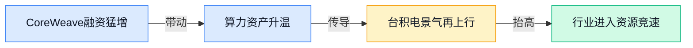
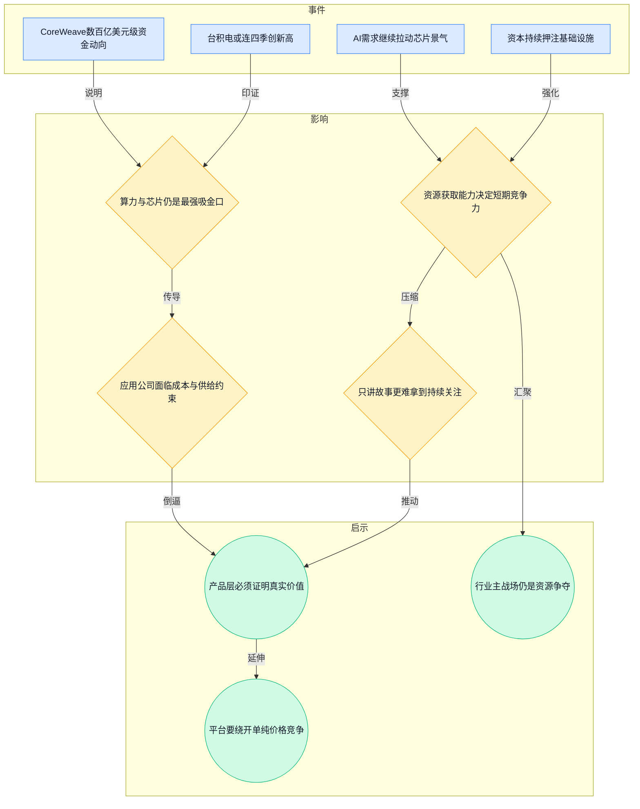
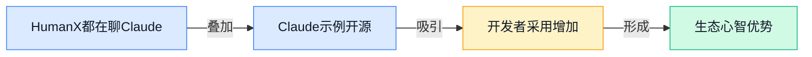
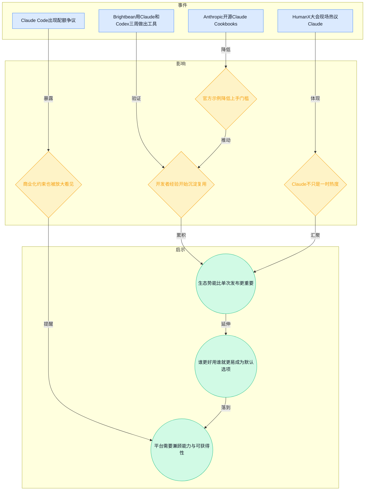
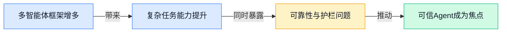
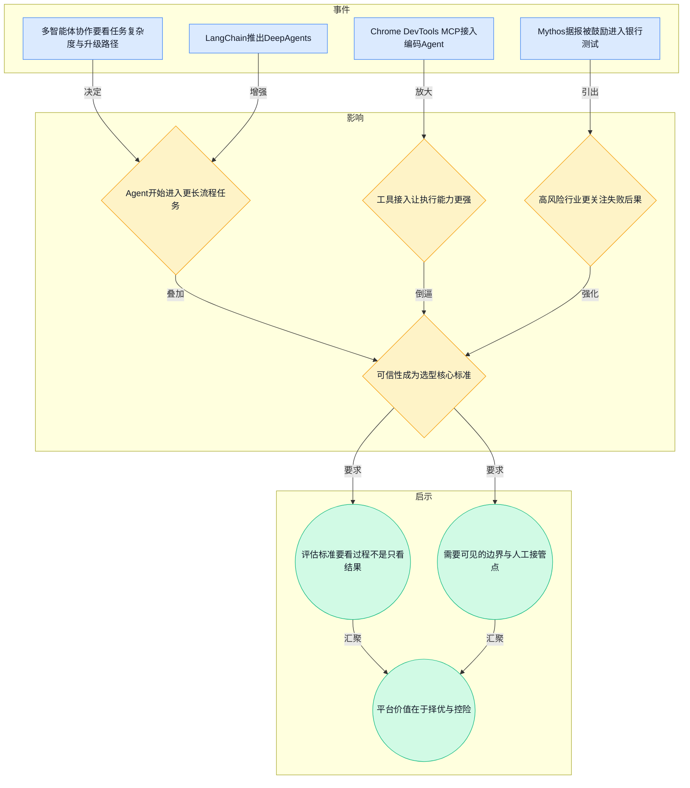
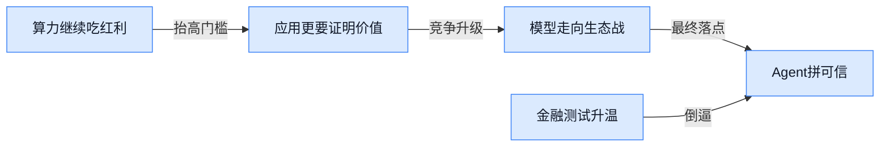
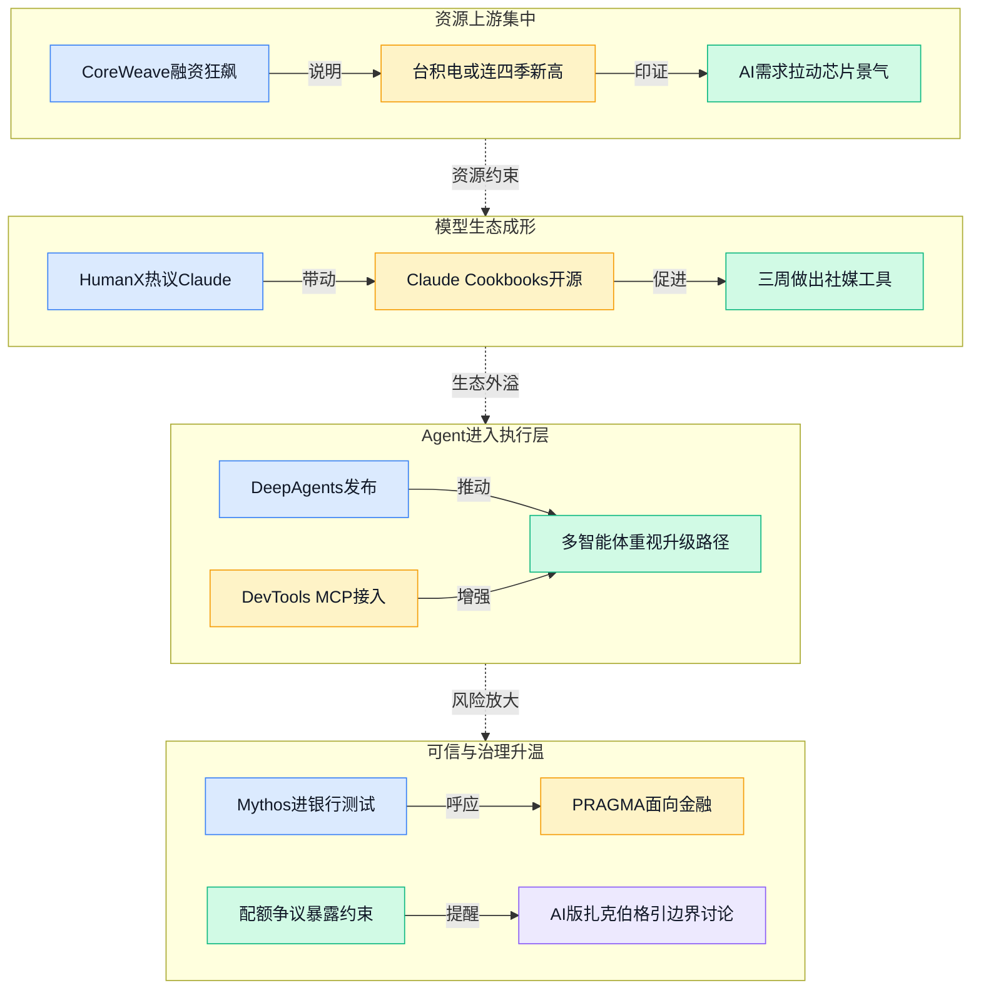

> 2026-04-13 ~ 2026-04-19 | 本周共 1 期日报

**本周日报**: [04-13](/ai-daily-site/2026/2026-04/2026-04-13/)

---

## 本周聚焦

### 算力与芯片继续吸金，行业短期主战场仍是资源争夺

展开详细图谱

本周最硬的一条主线，不是哪个新模型刷新了榜单，而是资金和产业链继续向底层基础设施集中。日报里提到，CoreWeave 在极短时间内拿到数百亿美元级别的资金动向，台积电也被预期连续四个季度创出新高。这两条放在一起看，信号非常明确：AI 的短期竞争，还没有进入“资源不再稀缺、应用自由生长”的阶段，反而仍停留在“谁能先拿到算力、芯片、供应链优先级，谁就更有发言权”的阶段。

为什么这件事重要？因为它决定了未来一段时间行业价值分配的重心。很多人会把 AI 竞争想象成“模型能力竞赛”或者“爆款产品竞赛”，但本周信息表明，更底层的限制条件没有松动。算力仍贵，先进芯片仍紧，需求还在往上冲。只要这一点不变，上游基础设施公司就会持续获得资本溢价，而下游应用公司则必须更谨慎地证明自己不是“靠烧资源换体验”。这对创业团队尤其现实：如果你不能掌握资源，就必须掌握资源的使用效率与决策效率。

对行业意味着什么？第一，行业会继续分层。上游是算力、芯片、云资源，拿走大部分资本注意力；中间是模型和工具链，争夺开发者与分发入口；下游应用若想活得好，必须回答一个更尖锐的问题：在资源昂贵的情况下，你到底替用户节省了什么、提高了什么、降低了什么风险。第二，市场会对“平台”提出更高要求。平台不能只说自己接了很多模型、支持很多 Agent（智能体），而要证明自己能在高成本环境里做出更优选择。第三，行业叙事正在从“AI 很神奇”转向“AI 很贵，所以必须值得”。这会让真正解决任务分发、效果评估、失败兜底的平台，更有长期意义。

### Claude 从模型热度走向生态势能，开发者心智开始积累

展开详细图谱

本周另一条非常值得重视的线索，是 Claude 正在从“一个受关注的模型”变成“一个有生态势能的默认选择”。日报里提到，HumanX 大会上“人人都在聊 Claude”，Anthropic 又开源了 Claude Cookbooks（官方示例合集），同时还有开发者案例显示，团队用 Claude 和 Codex 在三周内做出了社媒管理工具。几条信息拼起来看，核心不是 Claude 又赢了一次舆论，而是围绕 Claude 的学习材料、使用经验、成功案例，正在形成可复制的开发者心智。

为什么这件事重要？因为在 AI 行业，真正能形成壁垒的，往往不只是模型参数和榜单成绩，而是“有多少人会用、敢用、愿意继续用”。当官方示例越来越完整，开发者社区开始沉淀“怎么提示、怎么接入、怎么避坑”的共识时，这个模型就更容易成为组织里的默认方案。尤其对不懂技术的决策者来说，他们未必能区分模型细节，但会明显感知到：哪个方案资料更多、案例更多、人才更容易招、风险更可控。

但本周信息也不是一边倒利好。Claude Code 的配额争议同样值得看，它提醒我们，生态势能不等于没有摩擦。用户一旦把工作流建立在某个模型之上，就会对配额、价格、稳定性、权限边界更加敏感。也就是说，模型生态成熟的同时，商业化约束会被更清楚地暴露出来。

对行业意味着什么？第一，模型竞争正在进入“生态化竞争”，不是只比谁更强，而是比谁更容易成为默认工具。第二，开发者体验的重要性进一步上升，文档、示例、接口稳定性，这些过去被当作配套的东西，实际上会直接影响采用率。第三，对平台型公司来说，不能只看“最强模型是谁”，还要看“哪个模型的可接入性、可复用性、团队熟悉度最高”。未来真正有价值的平台，不是把所有模型平铺展示，而是帮助用户在能力、成本、可用性之间做出稳妥选择。

### Agent 竞争从“看起来会做”转向“失败时能不能收住”

展开详细图谱

第三条主线，是 Agent 赛道开始明显从“能力演示”走向“可信落地”。日报里提到，多智能体协作怎么选，关键看任务复杂度与升级路径；LangChain 推出面向复杂任务的 DeepAgents；Chrome DevTools MCP（把浏览器开发者工具接给编码 Agent）让 Agent 获得更强的执行环境；与此同时，Anthropic 的 Mythos 模型据报被鼓励进入银行测试，又把高风险场景下的边界问题推到台前。

为什么这件事重要？因为 Agent 正在从“会聊天、会生成”走向“会连续做事、会调用工具、会跨步骤执行”。一旦流程变长、权限变大，行业评判标准就会变化。过去一个模型答对一道题，已经足够制造传播；现在一个 Agent 要想被企业或普通用户真正采用，关键不是它最好的时候多惊艳，而是它出错时能不能被看见、被限制、被接管。特别是金融等高风险行业，哪怕模型能力足够强，如果没有清晰的责任边界和过程可追踪性，也很难建立信任。

对行业意味着什么？第一，Agent 框架会越来越多，但“多 Agent”本身不会自动产生价值，任务拆分逻辑、升级路径、工具权限管理，才是决定成败的部分。第二，接入真实工具会让 Agent 的实用性上升，也会让失误成本同步放大。第三，平台化机会正在出现：当市场上 Agent 越来越多、能力越来越像，真正稀缺的将不是“又一个能做事的 Agent”，而是“一个能告诉你何时该用谁、为什么信它、失败后怎么办的系统”。这也是本周所有线索汇总后最关键的判断：Agent 时代，信任不是附属品，而是产品本体的一部分。

---

## 信号与噪音

1. 阶跃星辰据称调整离岸架构，为 IPO 铺路。点评：这说明国内头部 AI 公司正在把“技术叙事”转成“资本市场叙事”，行业进入从拼增长故事到拼公司治理与合规结构的阶段。

2. Meta 打造“AI 版扎克伯格”与员工互动。点评：角色化 AI（模拟特定身份的 AI）正在从娱乐概念走向组织内部应用，但越接近真人替身，越容易引发身份边界、误导和责任归属问题。

3. PRAGMA：Revolut 提出面向金融场景的基础模型家族。点评：垂直行业模型并没有因为通用大模型变强而失去意义，尤其在金融这种高合规、高精度要求场景，行业专用模型仍有现实空间。

4. Google Research 开源 TimesFM，主打时间序列预测。点评：不是所有 AI 进展都围着聊天和 Agent 打转，面向预测类任务的基础模型也在推进，说明“AI 做决策辅助”仍是重要支线。

5. Chrome DevTools MCP 把浏览器开发者工具接给编码 Agent。点评：这类工具层打通的意义很大，它让 Agent 不只是生成代码，而是能进入真实操作环境；但也意味着产品设计必须更重视权限范围和错误可见性。

6. Brightbean Studio 用 Claude 和 Codex 三周做出社媒管理工具。点评：小团队借助现成模型快速做出实用品，继续验证“AI 压缩原型期”已成现实；但这更像降低起跑线，不等于建立长期壁垒。

7. Sam Altman 回应《纽约客》争议报道。点评：AI 行业头部人物的个人舆论风险仍在放大，创始人形象、公司治理和公众信任已深度绑定，未来品牌风险管理会越来越影响商业合作与监管态度。

---

## 宏观趋势

展开详细图谱

1. 资源继续向上游集中。本周 CoreWeave 融资狂飙、台积电景气被继续看高，验证了资本仍优先奖励算力和芯片。未来一段时间，应用层公司会更被要求证明“资源使用效率”，而不是只讲功能想象力。

2. 模型竞争进入生态竞争。HumanX 大会 Claude 热度高、Anthropic 开源 Cookbooks、开发者案例增多，都说明模型护城河正在从能力扩展到文档、案例、社区和默认心智。未来谁更容易被团队学会、复用、采购，谁就更有机会成为事实标准。

3. Agent 正从演示走向可控执行。DeepAgents、DevTools MCP 和银行测试相关信息共同表明，行业不再满足于“Agent 看起来会做事”，而开始要求它在复杂流程里稳定、可解释、可中断。未来可靠性设计会成为选型核心，而非加分项。

4. 高风险场景会倒逼可信框架成熟。无论是 Mythos 进入银行测试，还是金融模型家族 PRAGMA，都在提醒市场：一旦 AI 进入金融、组织决策、身份代理等场景，护栏、审计、责任边界就必须前置。未来真正能穿越周期的产品，更可能来自“能力+治理”并重的路线。

---

## 对我们的启发

产品方向上，最重要的不是再接入更多 Agent，而是把“为什么推荐这个 Agent、失败后怎么办、何时需要人工接手”做成平台默认能力。用户未必关心模型名称，但会非常在意任务是否靠谱、过程是否透明。

竞争策略上，不要把自己放进“谁更快更便宜”的正面战场。本周算力与芯片信号说明，上游成本短期不会友好；我们更适合争夺“选择权”和“信任权”，也就是帮用户在多个 Agent、多个模型、多个任务路径之间做更稳妥的判断。

时机判断上，Agent 平台的窗口并未关闭，反而更清晰了。原因不是行业已经成熟，而是市场开始意识到：单个模型再强，也不足以解决复杂任务中的选择、组合、追责与信任问题。越是进入复杂和高风险场景，平台层越有机会成为必要基础设施。

---

## 本周思考

当市场上每个 Agent 都声称自己“能完成任务”时，用户最终会依据什么建立信任：结果、过程、品牌，还是失败时的可控性？如果信任才是最稀缺资源，我们的产品究竟是在卖能力，还是在卖可放心地使用能力的方式？
