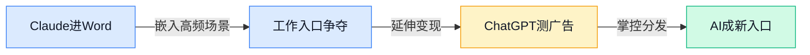
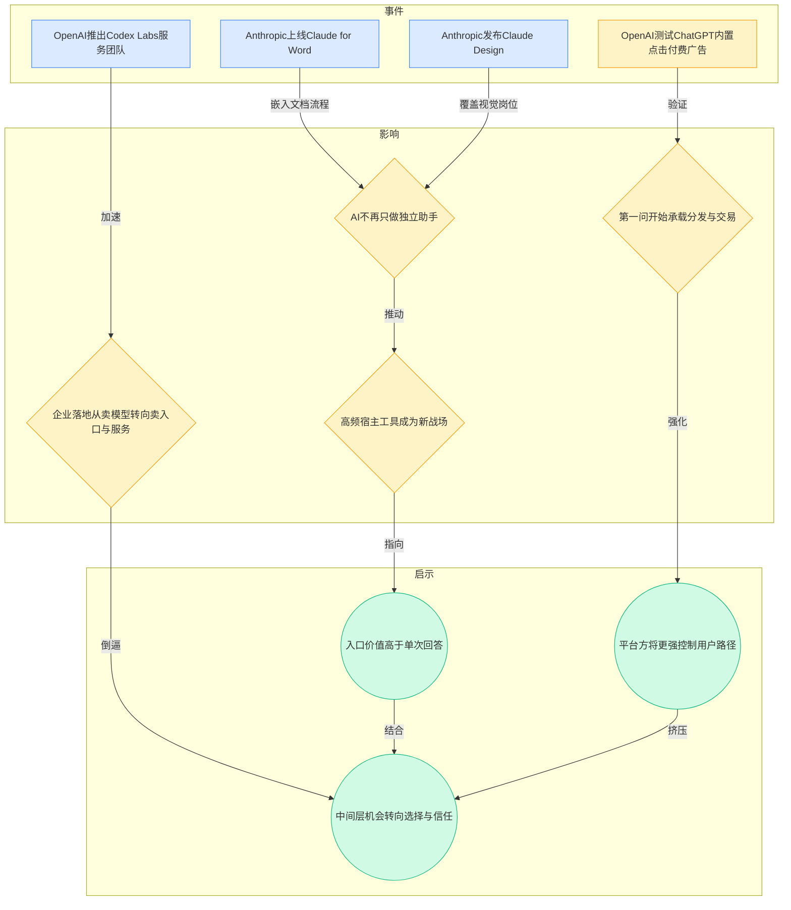
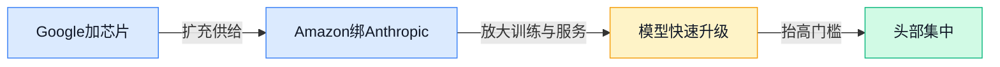
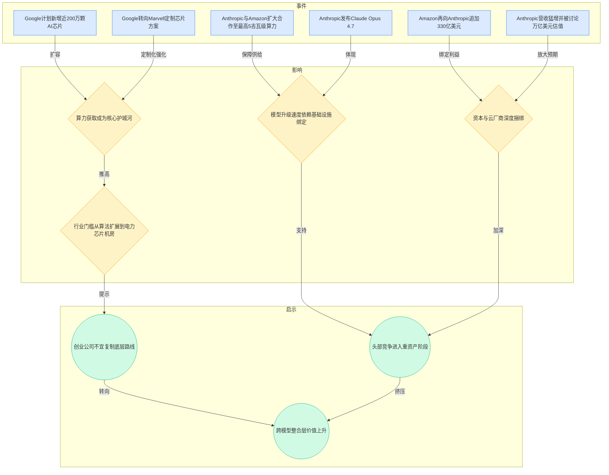
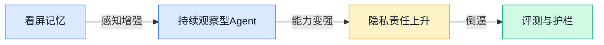
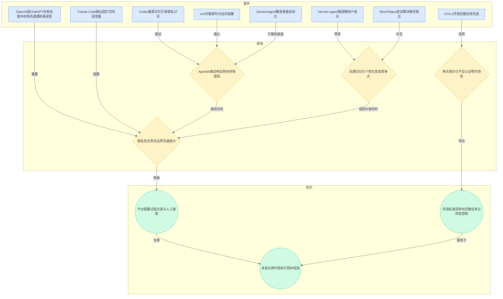
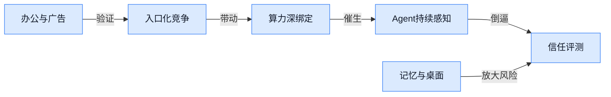
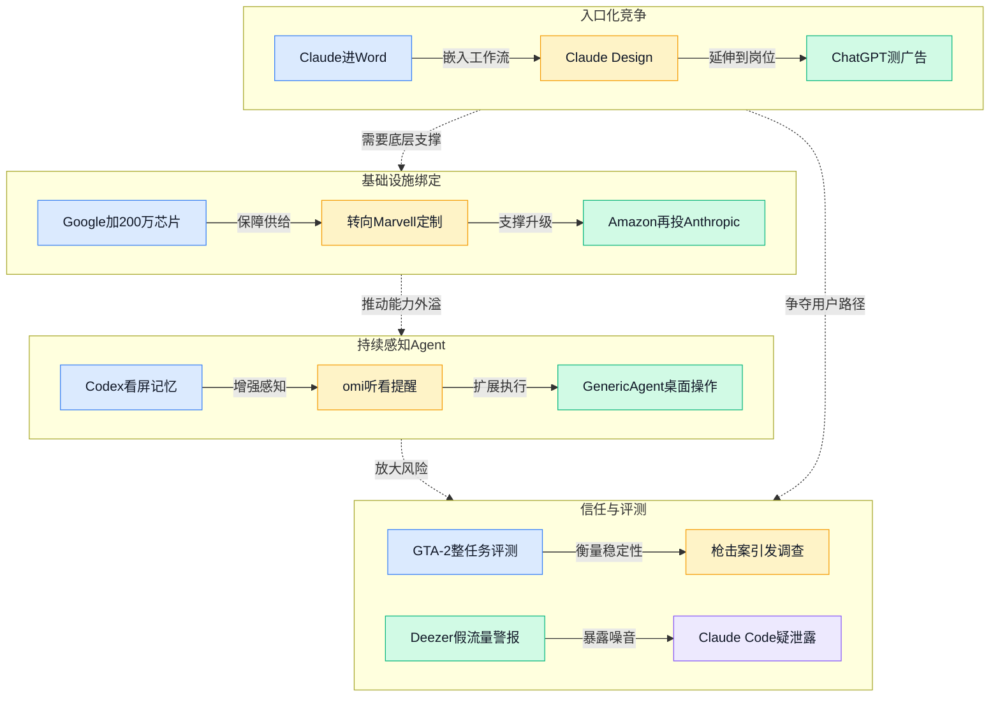

> 2026-04-20 ~ 2026-04-26 | 本周共 3 期日报

**本周日报**: [04-20](/ai-daily-site/2026/2026-04/2026-04-20/) | [04-21](/ai-daily-site/2026/2026-04/2026-04-21/) | [04-22](/ai-daily-site/2026/2026-04/2026-04-22/)

---

## 本周聚焦

### 入口争夺从“聊天窗口”升级到“工作入口”与“商业入口”

展开详细图谱

本周最清晰的一条主线，是大厂不再满足于做“一个会回答问题的聊天机器人”，而是在抢占用户真正工作的入口。4 月 20 日，Anthropic 连续推出 Claude for Word 和 Claude Design，前者直接进入 Word 文档场景，后者把能力延伸到视觉创作与排版。4 月 22 日，OpenAI 又测试 ChatGPT 内置点击付费广告，同时推出 Codex Labs，帮助企业把 Codex 接进研发流程。这几件事放在一起看，说明竞争已经从“谁回答得更好”转向“谁更早出现在用户工作流里”。

为什么这件事重要？因为入口决定使用频率，使用频率决定数据回流、习惯形成和付费概率。独立 AI 助手再强，也可能只是用户偶尔打开的一次性工具；但如果 AI 已经嵌进 Word、设计流程、企业研发流程，用户很多决策就会默认在它提供的界面和建议内完成。再加上 ChatGPT 测试广告，这意味着 AI 对话框正在从“工具界面”长成“分发界面”——谁控制用户第一问，谁就有机会控制后续推荐、交易、广告位，甚至影响用户最终选择什么产品和方案。

对行业意味着什么？一是上游大厂会越来越像“超级入口平台”，不是只卖模型能力，而是同时卖工作入口、内容分发和企业服务。二是中间层产品会被迫回答一个更尖锐的问题：如果上游已经包进办公软件、设计环节和企业流程，你的独立产品还剩什么价值？对很多创业公司来说，单纯“接个模型做个壳”会越来越难；但反过来，跨模型比较、结果验证、任务编排（把多个 AI 和工具组织成一条可执行流程）、可信评价这些能力会更值钱，因为它们不是单一入口天然擅长的。尤其对我们这种 Agent 调度与进化平台方向，真正的机会不是抢“第一问”，而是当用户已经进入某个入口后，帮他判断“该让谁做、怎么做、做得靠不靠谱”。

### 算力与资本绑定，头部竞争正在变成“重工业”

展开详细图谱

第二条主线是，头部玩家的竞争越来越不像互联网，反而更像“重工业”。4 月 21 日，Google 计划新增近 200 万颗 AI 芯片，并转向 Marvell 的定制方案；同日，Anthropic 与 Amazon 扩大合作，瞄准最高 5 吉瓦级算力。4 月 22 日，Amazon 再向 Anthropic 追加 330 亿美元。与此同时，Anthropic 又在产品层和模型层密集更新，包括 Claude Opus 4.7、Claude Design 等。

这背后的关键变化是：模型能力不再只是研究团队的聪明程度问题，而是越来越受制于谁能长期稳定拿到芯片、电力、机房和云资源。过去行业讨论护城河，常常聚焦模型参数、推理能力、榜单成绩；但本周这些事件说明，真正的护城河正在下沉到更硬的层面。没有足够算力，模型训练迭代会慢；没有云和资本联盟，产品放量后成本结构会吃不消；没有基础设施保障，模型即便短期领先，也很难维持升级速度。

对行业意味着什么？第一，头部集中趋势会继续加强。算力和资本绑定越深，后发者越难从底层正面挑战。第二，市场会对“模型公司”给出更接近基础设施公司的估值逻辑，因为投资人押注的已不只是单个产品，而是未来多年持续升级的能力。第三，创业公司的生存空间不会消失，但会更明确地转向应用层、中间层和可信层，而不是幻想复制一个通用大模型巨头。对我们而言，这周信息再次提醒：不要把自己想成“另一个模型”，而应把位置放在跨模型调度、成本控制、结果兜底和可信评价。因为上游越重、越集中，市场越需要一个相对中立的选择层，帮用户在不同模型、不同 Agent、不同价格与风险之间做判断。

### Agent 从“会调用工具”走向“持续感知”，但信任赤字也同步放大

展开详细图谱

第三条主线，是 Agent 的能力边界在快速外扩：它们不再只是在对话框里等命令，而是在尝试“持续观察、持续记忆、持续行动”。4 月 22 日，Codex 的“看屏记忆”引发隐私讨论，开源项目 omi 甚至能看屏幕、听对话并给出提醒，GenericAgent 则瞄准桌面自动化。更早在 4 月 20 日和 21 日，hermes-agent、MemPalace、evolver、openai-agents-python 等项目都在推动长期记忆、多 Agent 协作（多个 AI 分工合作）和自我进化。与此同时，GTA-2 这类评测基准开始从单次操作转向“整套任务完成”。

为什么这件事重要？因为真正有商业价值的 Agent，从来不是只会答一句话，而是能持续理解上下文、记住历史偏好、跨工具执行整套流程。问题在于，能力增强和风险增强几乎同步发生。看屏、听对话、长期记忆，本质上都意味着更深的数据接触；而本周 OpenAI 因 ChatGPT 在枪击案中的角色遭遇刑事调查，Claude Code 又疑似因打包失误泄露，都在提醒市场：当 AI 从“说点建议”升级到“持续参与现实决策”，责任边界会被迅速放大。

对行业意味着什么？首先，未来赢家未必是“最像人”的 Agent，而更可能是“最可控”的 Agent。其次，评测体系会从模型跑分转向过程可查、失败可回退、风险可拦截。GTA-2 的意义就在这里：企业和用户最终关心的不是某个步骤是否漂亮，而是整套任务能不能稳定完成。最后，信任机制会从附属功能变成核心产品。Deezer 说 44% 新歌由 AI 生成且多数播放量可疑，这虽然发生在音乐行业，但本质是同一个问题：当 AI 供给爆发后，稀缺的将不是生成能力，而是验证、评价和防刷。对我们这样的 Agent 平台，这不是外围问题，而是产品定义本身。

---

## 信号与噪音

1. Anthropic 定价表面不变，但 Opus 4.7 被曝实际使用成本更高。点评：这说明用户判断模型优劣不能只看官方单价，还要看真实任务中的 token（模型处理文本的计量单位）消耗、上下文长度和失败重试成本，成本透明会成为采购中的新摩擦点。

2. Cursor 融资传闻再起，AI 编程赛道估值继续冲高。点评：资本仍愿意为高频、强留存的 AI 应用买单，但也意味着市场对“能不能成为入口级产品”的要求更高，普通工具型产品估值分化会加剧。

3. 德国法院裁定，AI 改编成漫画风格不一定侵犯原照片版权。点评：这对生成式内容行业是偏积极信号，说明部分司法体系开始区分“风格转化”和“直接复制”，但跨地区标准仍不统一，商业化时不能把单一判例当成普遍安全区。

4. AI 生成网红大量涌入社交平台，政治传播进入“批量伪真人”时代。点评：这不是单纯的内容创新，而是信任基础设施被削弱的信号；未来平台如果没有身份标注、来源说明和异常传播识别，用户会越来越难区分真实影响力和合成操盘。

5. Deezer 称 44% 新上传歌曲由 AI 生成，且多数播放量涉嫌造假。点评：这进一步验证了“供给爆发后，稀缺的是筛选与验证”——一旦平台缺少防刷和可信评价机制，内容繁荣会迅速演变成噪音堆积。

6. Spot 四足机器人与 Gemini Robotics 瞄准待办事项自动化。点评：机器人方向看似离多数互联网产品较远，但它释放出的信号很明确：Agent 正在从数字世界走向物理执行，未来“会计划”与“会动手”之间的接口价值会提升。

7. 开源侧同时出现 openclaude、openai-agents-python、manifest、evolver、claude-skills 等项目。点评：这说明 Agent 生态正在进入“模块化拼装”阶段，能力供给会更快爆发，结果是创新提速，但同质化也会更严重，平台层的筛选、整合和可信排序价值随之上升。

---

## 宏观趋势

展开详细图谱

1. 入口化竞争加速验证。Claude for Word、Claude Design、ChatGPT 广告测试、Codex Labs 都在说明，AI 正从独立工具转向工作入口、分发入口和企业入口。未来可能走向是：更多 AI 会嵌入办公、设计、研发等高频场景，单独 App 的生存空间被压缩。

2. 头部护城河向基础设施下沉。Google 扩芯片、转定制方案，Amazon 继续重金绑定 Anthropic，验证了算力、电力、云资源正在替代单纯模型能力，成为更深层壁垒。未来可能走向是：模型层更集中，应用层和中间层更分化。

3. Agent 从“回答”走向“持续感知与执行”。Codex 看屏记忆、omi、GenericAgent、MemPalace、hermes-agent 共同证明，Agent 正尝试记忆用户、理解环境、跨工具操作。未来可能走向是：长期记忆和自动执行会更常见，但默认授权、暂停、回看和人工接管会成为必要设计。

4. 信任与评测从加分项变成主战场。GTA-2、枪击案调查、Claude Code 泄露、Deezer 假流量等事件共同验证，行业问题已不是“能不能生成”，而是“能不能稳定、可查、可追责”。未来可能走向是：结果评价、过程记录、防刷机制和高风险拦截会成为平台标配。

---

## 对我们的启发

产品方向上，第一，优先把“整套任务完成率”而不是单次回答质量做成核心指标，用 GTA-2 这类思路定义评测体系。第二，把过程记录、失败回退、人工接管、授权与暂停做成默认能力，因为持续感知型 Agent 的风险已不是边缘问题。

竞争策略上，第一，不与模型厂正面比拼底层能力，继续强化跨模型调度、成本分流（把不同任务分配给更合适的模型）和结果兜底。第二，尽早建立可信评价、防刷和来源说明机制；Deezer 的内容污染说明，一旦平台供给上来，没有信任层就会失控。

时机判断上，第一，入口争夺已很激烈，做“另一个聊天框”窗口期在缩短，但做“入口背后的选择层、验证层、协作层”仍有空间。第二，企业和普通用户都将更在意可控与责任边界，这对强调可信执行的平台是利好，但也意味着我们要更早把规则和边界产品化。

---

## 本周思考

当上游大厂掌握入口、算力和模型后，独立 Agent 平台真正能长期占据的价值位置，到底是“更会做事”，还是“更值得信任”？如果后者成立，我们应该先把哪一层信任做成不可替代？
